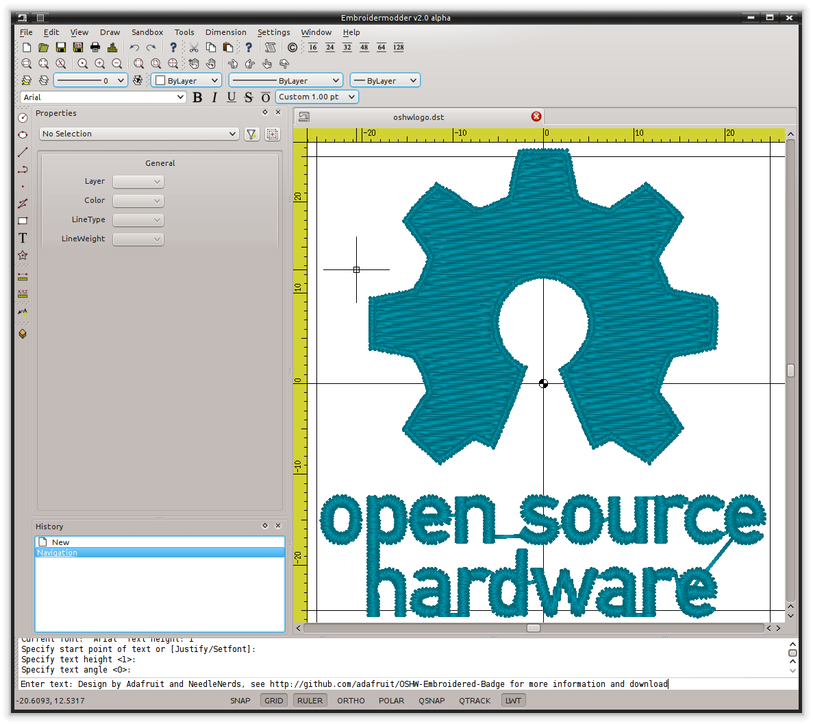

# Embroidermodder 2.0.0-alpha

( IN ALPHA DEVELOPMENT: NOT READY FOR SERIOUS USE. )

Embroidermodder is a free machine embroidery software program.
The newest version, Embroidermodder 2 can:

- edit and create embroidery designs
- estimate the amount of thread and machine time needed to stitch a design
- convert embroidery files to a variety of formats
- upscale or downscale designs
- run on Windows, Mac and Linux

For more in-depth information, see [our website](http://www.libembroidery.org).

To try out the software in alpha see our current
[alpha pre-release](https://github.com/Embroidermodder/Embroidermodder/releases).

Various sample embroidery design files can be found in
the embroidermodder2/samples folder.

## Screenshots

If you use multiple operating systems, it's important to choose software that works on all of them.

Embroidermodder 2 runs on Windows, Linux and Mac OS X. Let's not forget the [Raspberry
Pi](http://www.raspberrypi.org).


### Realistic Rendering

(This feature is currently broken.)

It is important to be able to visualize what a design will look like when stitched and our
pseudo ``3D'' realistic rendering helps achieve this.

Realistic rendering sample \#1:



Realistic rendering sample \#2:


Realistic rendering sample \#3:


Various grid types and auto-adjusting rulers

Making use of the automatically adjusting ruler in conjunction with the grid will ensure your
design is properly sized and fits within your embroidery hoop area.

Use rectangular, circular or isometric grids to construct your masterpiece!

Multiple grids and rulers in action:


### Many measurement tools

Taking measurements is a critical part of creating great designs. Whether you are designing
mission critical embroidered space suits for NASA or some other far out design for your next
meet-up, you will have precise measurement tools at your command to make it happen. You can
locate individual points or find distances between any 2 points anywhere in the design!

Take quick and accurate measurements:


### Add text to any design

Need to make company apparel for all of your employees with individual names on them? No sweat.
Just simply add text to your existing design or create one from scratch, quickly and easily.
Didn't get it the right size or made a typo? No problem. Just select the text and update it
with the property editor.

Add text and adjust its properties quickly:


### Supports many formats

Embroidery machines all accept different formats. There are so many formats available that it
can sometimes be confusing whether a design will work with your machine.

Embroidermodder 2 supports a wide variety of embroidery formats as well as several vector
formats, such as SVG and DXF. This allows you to worry less about which designs you can use.

### Batch Conversion

(Currently this being ported to the `embroider` command line program.)

Need to send a client several different formats? Just use libembroidery-convert, our command
line utility which supports batch file conversion.

There are a multitude of formats to choose from:


### Scripting API

The GUI works by emitting internal text commands, so if you want to alter
or add features to the program that aren't as low level as these commands then you
can chain them together in simple scripts. This allows more control over the program than
the GUI can offer.

A (no longer current) Embroidermodder 2 command excerpt:


## Building

To build Embroidermodder 2 from source you will need at least:
- [Embroidermodder 2](https://github.com/Embroidermodder/Embroidermodder)
- [Qt](http://www.qt-project.org) (version >= 6.0).

You will also need the git submodules, which can be collected by running these lines
from the embroidermodder source directory:

```
git submodule init
git submodule update
```

Optionally, you may want to add:

- [KDE](http://www.kde.org) for thumbnailer
- [Valgrind](http://www.valgrind.org) for debugging

Ubuntu repository packages:
The Qt, KDE and Valgrind build dependencies can be installed easily by
opening a terminal and issuing this command:

```
sudo apt-get install git build-essential qt4-dev-tools libqt4-opengl-dev kdelibs5-dev valgrind
```

Fedora repository packages:
The Qt, KDE and Valgrind build dependencies can be installed easily
by opening a terminal and issuing this command:

```
sudo yum install git gdb gcc-c++ qt-devel kdelibs-devel valgrind
```

### CMake

The more capable build is the CMake one, which is what we use to make the installers as
well.

To use it read the output of the helper script like this:

```
bash build.sh --help
```

If you don't have bash, the following commands should build the software:

```sh
mkdir build
cd build
cmake ..
cmake --build .
mv embroidermodder* ../embroidermodder2
```

or load the cmake build in Visual Studio Code.

When building the thumbnailer do the same but in the appropriate subfolder.
Libembroidery is now maintained as a repository unto itself.

When building for Windows:
If you are using Qt/Mingw, substitute mingw32-make for make.
If you are using Qt/MSVC, substitute nmake for make.
You may need to add the directory where those executables are located to your system path.
It is recommended that when targeting Windows, that you should omit the -j switch completely,
otherwise build errors may occur unless you are building an individual pro file.

## Install/Uninstall

To install, build one of the installers.

On Windows, install WIX and then run cpack with

```
./build.sh --package
```

Then double click the `.msi` file in the `build/build` subdirectory.

On Debian, the same command will build the `.deb` package which you can then
install using the aptitude package manager like this:

```
./build.sh --package
dpkg -i build/build/embroidermodder*.deb
```

to uninstall you can remove it using the name of the package.
