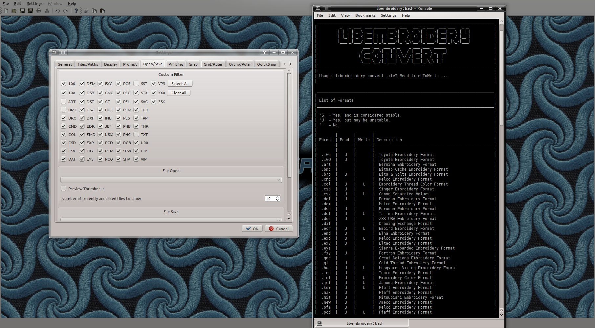

# What is Embroidermodder ?

(UNDER MAJOR RESTRUCTURING, PLEASE WAIT FOR THE BETA TEST BUILDS.)

[](https://github.com/Embroidermodder/Embroidermodder/actions/workflows/gnu-linux.yml)
[](https://github.com/Embroidermodder/Embroidermodder/actions/workflows/macos.yml)
[](https://github.com/Embroidermodder/Embroidermodder/actions/workflows/windows.yml)

http://www.libembroidery.org

Embroidermodder is a free machine embroidery software program.
The newest version, Embroidermodder 2 can:

- edit and create embroidery designs
- estimate the amount of thread and machine time needed to stitch a design
- convert embroidery files to a variety of formats
- upscale or downscale designs
- run on Windows, Mac and Linux

Embroidermodder and associated projects are built by _The Embroidermodder Team_ (see [CREDITS.md](CREDITS.md)).

## Screenshots

These screenshots are from the original Qt version.

### Cross Platform

If you use multiple operating systems, it's important to choose software that works on all of them.

Embroidermodder 2 runs on Windows, Linux and Mac OS X. Let's not forget the Raspberry Pi (\url{http://www.raspberrypi.org}).


### Realistic Rendering

It is important to be able to visualize what a design will look like when stitched and our pseudo ``3D'' realistic rendering helps achieve this.

Realistic rendering sample \#1:


Realistic rendering sample \#2:


Realistic rendering sample \#3:


Various grid types and auto-adjusting rulers

Making use of the automatically adjusting ruler in conjunction with the grid will ensure your design is properly sized and fits within your embroidery hoop area.

Use rectangular, circular or isometric grids to construct your masterpiece!

Multiple grids and rulers in action:


### Many measurement tools

Taking measurements is a critical part of creating great designs. Whether you are designing mission critical embroidered space suits for NASA or some other far out design for your next meet-up, you will have precise measurement tools at your command to make it happen. You can locate individual points or find distances between any 2 points anywhere in the design!

Take quick and accurate measurements:


### Add text to any design

Need to make company apparel for all of your employees with individual names on them? No sweat. Just simply add text to your existing design or create one from scratch, quickly and easily.
Didn't get it the right size or made a typo? No problem. Just select the text and update it with the property editor.

Add text and adjust its properties quickly:


### Supports many formats

Embroidery machines all accept different formats. There are so many formats available that it can sometimes be confusing whether a design will work with your machine.

Embroidermodder 2 supports a wide variety of embroidery formats as well as several vector formats, such as SVG and DXF. This allows you to worry less about which designs you can use.

### Batch Conversion

Need to send a client several different formats? Just use libembroidery-convert, our command line utility which supports batch file conversion.

There are a multitude of formats to choose from:



## Current Development Screenshots

We're using ImGui with a GLFW backend for the current build to make a more lightweight build with hopefully more understandable code.
However, the design remains the same, so any features planned for the Qt version should carry over.

### Stitch Simulation

Watch the design you've loaded as a simulation in approximately real time which you can tune to match the speed of your specific model.


### Auto-Stitch

### Photo-fit

## Documentation and Community

For more information, see [our website](http://www.libembroidery.org) where the manuals are hosted. Embroidermodder 2 is
built on top of our own [libembroidery](https://github.com/Embroidermodder/libembroidery) C library: if you need an
automated solution you'll be better served by the command line tools there.

We don't have a forum so if you have any issues with following the build described here, feel free to post it as a github issue.
If this becomes unworkable we'll set one up.

#### Sample Files

Various sample embroidery design files can be found in
the assets/samples folder.

## Dependencies

We're working on moving to the lighter Dear ImGui with GLFW backend, so you'll just need a basic CMake build environment which is detailed below if you're new to that build method.

All other dependencies are included into the source code in the `extern/` directory.

(Note that this doesn't cover the thumbnailer, which requires KDE.)

#### Windows

We currently use the following tools, but any equivalent CMake build environment should work:

1. [MinGW Build Environment](https://www.mingw-w64.org/downloads/) for g++, make etc.
2. [Git for Windows](https://gitforwindows.org/) for version control.
3. [CMake](https://cmake.org/download/).
4. A good text edtior. For Windows I'd recommend [Notepad++](https://notepad-plus-plus.org/downloads/) or [Visual Studio Code](https://code.visualstudio.com/).

Make sure all these tools are in your `PATH`, this may be managed by your installers or you can use the `setx` command as an administrator to alter it.

#### MacOS

_We need someone with a MacBook to test this._

Install XCode, CMake and git.

#### Ubuntu/Debian

The build dependencies can be installed easily by opening a terminal and issuing this command:

     sudo apt-get install git build-essential cmake libgl1-mesa-dev valgrind

#### Fedora

The build dependencies can be installed easily by opening a terminal and issuing this command:

    sudo yum install git gdb gcc-c++ valgrind cmake

## Building

Embroidermodder uses a CMake build, we recommend on Windows to use the script:

     .\build.bat

with the dependencies installed (see below). On all other systems use:

     sh build.sh

## Run and Install/Uninstall

### Linux

To run the build without installing enter the `build/` directory and use:

    ./embroidermodder

To install, open a terminal in the `build/` subfolder (after building) and type:

    sudo cmake --install .

To uninstall, open a terminal in the `build/` subfolder and type:

    sudo cmake --uninstall .

Then you'll be able to run `embroidermodder` from the command line with the command:

    embroidermodder

### Windows

To Embroidermodder 2, enter the `build/` directory and double-click the executable.

On Windows the install commands are the same, however you need to use a `cmd` terminal with admin priviledges and without `sudo`.

Then you'll be able to run `embroidermodder` from the command line with the command:

    embroidermodder.exe

## Guide to Contributing to Embroidermodder 2

To find ways to help with the project, read:

1. The "To Do" below.
2. The GitHub Issues page.
3. The design section later in this README/manual (to find missing items from the "To Do").
4. The User Manual (to find undocumented features).

### Code Style

Embroidermodder 2 is written in C++, in a style similar to Python's
[PEP7 style guide](https://peps.python.org/pep-0007/),
which we follow for the C code of `libembroidery`.

### Recieving Credit

Add your name or handle to the end of the [CREDITS.md](CREDITS.md) bulleted list, followed by your GitHub username, a description of your contribution type like "Bug fixes" and an optional quote.

### To Do

#### For 2.0.0-alpha1

* WIP - Statistics from 1.0, needs histogram
* WIP - Saving DST/PES/JEF (varga)
* WIP - Saving CSV/SVG (rt) + CSV read/write UNKNOWN interpreted as COLOR bug

#### For 2.0.0-alpha2

* TODO - Notify user of data loss if not saving to an object format.
* TODO - Import Raster Image
* TODO - SNAP/ORTHO/POLAR
* TODO - Layer Manager + LayerSwitcher DockWidget
* TODO - Reading DXF

#### For 2.0.0-alpha3

* TODO - Writing DXF
* DONE - Up and Down keys cycle thru commands in the command prompt
* TODO - Amount of Thread & Machine Time Estimation (also allow customizable times for setup, color changes, manually trimming jump threads, etc...that way a realistic total time can be estimated)
* TODO - Otto Theme Icons - whatsthis icon doesn't scale well, needs redone
* TODO - embroidermodder2.ico 16 x 16 looks horrible

#### For 2.0.0-alpha4

* WIP - CAD Command: Arc (rt)
* TODO - automate changelog and write to a javascript file for the docs: git log --pretty=tformat:'<a href="https://github.com/Embroidermodder/Embroidermodder/commit/%H">%s</a>'

#### For 2.0.0-beta1

* TODO - Custom Filter Bug - doesn't save changes in some cases
* TODO - Cannot open file with # in name when opening multiple files (works fine when opening the single file)
* TODO - Closing Settings Dialog with the X in the window saves settings rather than discards them
* WIP - Advanced Printing
* TODO - Filling Algorithms (varga)
* TODO - Otto Theme Icons - beta (rt) - Units, Render, Selectors

#### For 2.0.0-rc1

* TODO - QDoc Comments
* TODO - Review KDE4 Thumbnailer
* TODO - Documentation for libembroidery & formats
* TODO - HTML Help files
* TODO - Update language translations
* TODO - CAD Command review: line
* TODO - CAD Command review: circle
* TODO - CAD Command review: rectangle
* TODO - CAD Command review: polygon
* TODO - CAD Command review: polyline
* TODO - CAD Command review: point
* TODO - CAD Command review: ellipse
* TODO - CAD Command review: arc
* TODO - CAD Command review: distance
* TODO - CAD Command review: locatepoint
* TODO - CAD Command review: move
* TODO - CAD Command review: rgb
* TODO - CAD Command review: rotate
* TODO - CAD Command review: scale
* TODO - CAD Command review: singlelinetext
* TODO - CAD Command review: star
* TODO - Clean up all compiler warning messages, right now theres plenty :P

#### For 2.0 release

* TODO - tar.gz archive
* TODO - zip archive
* TODO - Debian Package (rt)
* TODO - NSIS Installer (rt)
* TODO - Mac Bundle?
* TODO - press release

#### For 2.x/Ideas

* TODO - libembroidery.mk for MXE project (refer to qt submodule packages for qmake based building. Also refer to plibc.mk for example of how write an update macro for github.)
* TODO - libembroidery safeguard for all writers - check if the last stitch is an END stitch. If not, add an end stitch in the writer and modify the header data if necessary.
* TODO - Cut/Copy - Allow Post-selection
* TODO - CAD Command: Array
* TODO - CAD Command: Offset
* TODO - CAD Command: Extend
* TODO - CAD Command: Trim
* TODO - CAD Command: BreakAtPoint
* TODO - CAD Command: Break2Points
* TODO - CAD Command: Fillet
* TODO - CAD Command: Chamfer
* TODO - CAD Command: Split
* TODO - CAD Command: Area
* TODO - CAD Command: Time
* TODO - CAD Command: PickAdd
* TODO - CAD Command: Product
* TODO - CAD Command: Program
* TODO - CAD Command: ZoomFactor
* TODO - CAD Command: GripHot
* TODO - CAD Command: GripColor & GripCool
* TODO - CAD Command: GripSize
* TODO - CAD Command: Highlight
* TODO - CAD Command: Units
* TODO - CAD Command: Grid
* TODO - CAD Command: Find
* TODO - CAD Command: Divide
* TODO - CAD Command: ZoomWindow (Move out of view.cpp)
* TODO - Command: Web (Generates Spiderweb patterns)
* TODO - Command: Guilloche (Generates Guilloche patterns)
* TODO - Command: Celtic Knots
* TODO - Command: Knotted Wreath
* TODO - Lego Mindstorms NXT/EV3 ports and/or commands.
* TODO - native function that flashes the command prompt to get users attention when using the prompt is required for a command.
* TODO - libembroidery-composer like app that combines multiple files into one.
* TODO - Settings Dialog, it would be nice to have it notify you when switching tabs that a setting has been changed. Adding an Apply button is what would make sense for this to happen. 
* TODO - Keyboard Zooming/Panning
* TODO - G-Code format?
* TODO - 3D Raised Embroidery
* TODO - Gradient Filling Algorithms
* TODO - Stitching Simulation
* TODO - RPM packages?
* TODO - Reports?
* TODO - Record and Playback Commands
* TODO - Settings option for reversing zoom scrolling direction
* TODO - Qt GUI for libembroidery-convert
* TODO - EPS format? Look at using Ghostscript as an optional add-on to libembroidery...
* TODO - optional compile option for including LGPL/GPL libs etc... with warning to user about license requirements.
* TODO - Realistic Visualization - Bump Mapping/OpenGL/Gradients?
* TODO - Stippling Fill
* TODO - User Designed Custom Fill
* TODO - Honeycomb Fill
* TODO - Hilburt Curve Fill
* TODO - Sierpinski Triangle fill
* TODO - Circle Grid Fill
* TODO - Spiral Fill
* TODO - Offset Fill
* TODO - Brick Fill
* TODO - Trim jumps over a certain length.
* TODO - FAQ about setting high number of jumps for more controlled trimming.
* TODO - Minimum stitch length option. (Many machines also have this option too)
* TODO - Add 'Design Details' functionality to libembroidery-convert
* TODO - Add 'Batch convert many to one format' functionality to libembroidery-convert
* TODO - EmbroideryFLOSS - Color picker that displays catalog numbers and names.

#### For Arduino

* TODO - Fix emb-outline files
* TODO - Fix thread-color files
* TODO - Logging of Last Stitch Location to External USB Storage(commonly available and easily replaced) ...wait until TRE is available to avoid rework
* TODO - inotool.org - seems like the logical solution for Nightly/CI builds
* TODO - Smoothieboard experiments

#### libembroidery-tests

* TODO - looping test that reads 10 times while running valgrind. See embPattern_loadExternalColorFile() Arduino leak note for more info.

# Old Manual

# Embroidermodder 2.0.0 Alpha

(UNDER MAJOR RESTRUCTURING, PLEASE WAIT FOR VERSION 2)

http://www.libembroidery.org

Embroidermodder is a free machine embroidery application.
The newest version, Embroidermodder 2 can:

- edit and create embroidery designs
- estimate the amount of thread and machine time needed to stitch a design
- convert embroidery files to a variety of formats
- upscale or downscale designs
- run on Windows, Mac and Linux

Embroidermodder 2 is very much a work in progress since we're doing a ground
up rewrite to an interface in C using the GUI toolkit SDL2.
The reasoning for this is detailed in the issues tab.

For a more in-depth look at what we are developing read
our [website](https://www.libembroidery.org) which includes these docs as well as the up-to date printer-friendly versions.
These discuss recent changes, plans and has user and developer guides for all the Embroidermodder projects.

To see what we're focussing on right now, see the [Open Collective News](https://opencollective.com/embroidermodder).

[The current printer-friendly version of the manual.](https://www.libembroidery.org/embroidermodder_2.0.0-alpha_manual.pdf)

## License

The source code is under the terms of the zlib license: see `LICENSE.md` in this directory.

Permission is granted to copy, distribute and/or modify this document
under the terms of the GNU Free Documentation License, Version 1.3
or any later version published by the Free Software Foundation;
with no Invariant Sections, no Front-Cover Texts, and no Back-Cover Texts.

A copy of the license is included in the section entitled "GNU Free Documentation License".

## The Embroidermodder Project and Team

The _Embroidermodder 2_ project is a collection of small software utilities for
manipulating, converting and creating embroidery files in all major embroidery
machine formats. The program _Embroidermodder 2_ itself is a larger graphical
user interface (GUI) which is at the heart of the project.

The tools and associated documents are:

* This manual.
* The website ([`www.libembroidery.org`](https://www.libembroidery.org)), which is maintained [here](https://github.com/Embroidermodder/embroidermodder.github.io).
* Mobile embroidery format viewers and tools (`iMobileViewer`, `MobileViewer`).
* The core library of functions (`libembroidery`) and its manual.
* The Python version of the library of functions (`libembroidery-python`) which is part of [libembroidery](https://github.com/Embroidermodder/libembroidery).
* The CLI (`embroider`) which is part of [libembroidery](https://github.com/Embroidermodder/libembroidery).
* Specs for an open hardware embroidery machine called Embroiderbot (not started yet) which is part of [libembroidery](https://github.com/Embroidermodder/libembroidery) and its manual.
* The GUI (`embroidermodder`), this repository.

They all tools to make the standard
user experience of working with an embroidery machine better without expensive
software which is locked to specific manufacturers and formats. But ultimately
we hope that the core _Embroidermodder 2_ is a practical, ever-present tool in
larger workshops, small cottage industry workshops and personal hobbyist's
bedrooms.

Embroidermodder 2 is licensed under the zlib license and we aim to keep all of
our tools open source and free of charge. If you would like to support the
project check out our [Open Collective](https://opencollective.com/embroidermodder) group. If you would like to help, please
join us on GitHub. This document is written as developer training as well
helping new users (see the last sections) so this is the place to learn how
to start changing the code.

The Embroidermodder Team is the collection of people who've submitted
patches, artwork and documentation to our three projects.
The team was established by Jonathan Greig and Josh Varga.
The full list is actively maintained below.

### Credits for Embroidermodder 2, libembroidery and all other related code

If you have contributed and wish to be added to this list, alter the [README on Embroidermodder github page](https://github.com/Embroidermodder/Embroidermodder) and we'll copy it to the libembroidery source code since that is credited to "The Embroidermodder Team".

#### Embroidermodder 1

The Embroidermodder Team is also inspired by the original Embroidermodder that was built by
Mark Pontius and the same Josh Varga on SourceForge which unfortunately appears to have died from linkrot.
We may create a distribution on here to be the official "legacy" Embroidermodder code but likely in a seperate
repository because it's GNU GPL v3 and this code is written to be zlib (that is, permissive licensed) all the way down.

One reason why this is useful is that the rewrite by Jonathan Greig, John Varga and Robin Swift for Embroidermodder 2
should have no regressions: no features present in v1 should be missing in v2.


### Problems to be fixed before the Beta Release

1. Realistic Visualization - Bump Mapping/OpenGL/Gradients?
2. Get undo history widget back (BUG).
3. Mac Bundle, .tar.gz and .zip source archive.
4. NSIS installer for Windows, Debian package, RPM package
5. GUI frontend for embroider features that aren't supported by embroidermodder: flag selector from a table
6. Update all formats without color to check for edr or rgb files.
7. Setting for reverse scrolling direction (for zoom, vertical pan)
8.  Keyboard zooming, panning
9.  New embroidermodder2.ico 16x16 logo that looks good at that scale.
10. Saving dst, pes, jef.
11. Settings dialog: notify when the user is switching tabs that the setting has been changed, adding apply button is what would make sense for this to happen.
12. Update language translations.
13. Replace KDE4 thumbnailer.
14. Import raster image.
15. Statistics from 1.0, needs histogram.
16. SNAP/ORTHO/POLAR.
17. Cut/copy allow post-selection.
18. Layout into config.
19. Notify user of data loss if not saving to an object format.
20. Add which formats to work with to preferences.
21. Cannot open file with \# in the name when opening multiple files but works with opening a single file.
22. Closing settings dialog with the X in the window saves settings rather than discarding them.
23. Otto theme icons: units, render, selectors, what's this icon doesn't scale.
24. Layer manager and Layer switcher dock widget.
25. Test that all formats read data in correct scale (format details should match other programs).
26. Custom filter bug -- doesn't save changes in some cases.
27. Tools to find common problems in the source code and suggest fixes to the developers. For example, a translation miss: that is, for any language other than English a missing entry in the translation table should supply a clear warning to developers.
28. Converting Qt C++ version to native GUI C throughout.
29. OpenGL Rendering: ``Real`` rendering to see what the embroidery looks like, Icons and toolbars, Menu bar.
30. Libembroidery interfacing: get all classes to use the proper libembroidery types within them. So `Ellipse` has `EmbEllipse` as public data within it.
31. Move calculations of rotation and scaling into `EmbVector` calls.
32. GUI frontend for embroider features that aren't supported by embroidermodder: flag selector from a table
33. Update all formats without color to check for edr or rgb files.
34. Setting for reverse scrolling direction (for zoom, vertical pan)
35. Keyboard zooming, panning
36. Better integrated help: I don't think the help should backend to a html file somewhere on the user's system. A better system would be a custom widget within the program that's searchable.
37. New embroidermodder2.ico 16x16 logo that looks good at that scale.
38. Settings dialog: notify when the user is switching tabs that the setting has been changed, adding apply button is what would make sense for this to happen.

#### Get the Development Build going

> When we switch to releases we recommend using them, unless you're reporting a bug in which case you can check the development build for whether it has been patched. If this applies to you, the current development build is:
>
> * [Linux](https://github.com/Embroidermodder/Embroidermodder/suites/8882922866/artifacts/406005099)
> * [Mac OS](https://github.com/Embroidermodder/Embroidermodder/suites/8882922866/artifacts/406005101)
> * [Windows](https://github.com/Embroidermodder/Embroidermodder/suites/8882922866/artifacts/406005102)

### Problems to be fixed during Beta and before 2.0.0

1. Libembroidery 1.0.
2. Better integrated help: I don't think the help should backend to a html file somewhere on the user's system. A better system would be a custom widget within the program that's searchable.
3. EmbroideryFLOSS - Color picker that displays catalog numbers and names.
4. Custom filter bug -- doesn't save changes in some cases.
5. Advanced printing.
6. Stitching simulation.

### Problems to be fixed eventually

1. User designed custom fill.

## Build and Install Advice

Assuming you already have the SDL2 libraries you can proceed to using the fast build, which assumes you want to build and test locally.

The fast build should be:

     bash scripts/build.sh

or, on Windows:

     .\scripts\build.bat

Then run using the `run.bat` or `run.sh` scripts in the build/ directory.

Otherwise, follow the instructions below.

If you plan to install the dev version to your system (we recommend you wait for the official installers and beta release first) then use the CMake build instead.


### Install on Desktop

We recommend that if you want to install the development version you use the CMake
build. Like this:

    git submodule init
    git submodule update

    mkdir build
    cd build
    cmake ..
    cmake --build .
    sudo cmake --install .

These lines are written into the file:

    .\scripts\build_install.sh

On Windows use the next section.


## Development

If you wish to develop with us you can chat via the contact email
on the [website](https://embroidermodder.org) or in the issues tab on the
[github page](https://github.com/Embroidermodder/Embroidermodder/issues).
People have been polite and friendly in these conversations and I (Robin)
have really enjoyed them.
If we do have any arguments please note we have a
[Code of Conduct](CODE_OF_CONDUCT.md) so there is a consistent policy to
enforce when dealing with these arguments.

The first thing you should try is building from source using the [build advice](#build)
above. Then read some of the [manual](https://embroidermodder.org/docs/documentation) to get the general
layout of the source code and what we are currently planning.

### Testing

To find unfixed errors run the tests by launching from the command line with:

    $ embroidermodder --test

then dig through the output. It's currently not worth reporting the errors, since
there are so many but if you can fix anything reported here you can submit a PR.

### Contributing

#### Funding

The easiest way to help is to fund development (see the Donate button above),
since we can't afford to spend a lot of time developing and only have limited
kit to test out libembroidery on.

#### Programming and Engineering

Should you want to get into the code itself:

* Low level C developers are be needed for the base library `libembroidery`.
* Low level assembly programmers are needed for translating some of `libembroidery` to `EmbroiderBot`.
* Hardware Engineers to help design our own kitbashed embroidery machine `EmbroiderBot`, one of the original project aims in 2013.
* Scheme developers and C/SDL developers to help build the GUI.
* Scheme developers to help add designs for generating of custom stitch-filled emblems like the heart or dolphi. Note that this happens in Embroidermodder not libembroidery (which assumes that you already have a function available).

#### Writing

We also need people familiar with the software and the general
machine embroidery ecosystem to contribute to the
[documentation](https://github.com/Embroidermodder/docs).

We need researchers to find references for the documentation: colour tables,
machine specifications etc. The history is murky and often very poorly maintained
so if you know anything from working in the industry that you can share: it'd be
appreciated!

### Design

These are key bits of reasoning behind why the software is built the way it is.

## Features

Embroidermodder 2 has many advanced features that enable you to create awesome designs quicker, tweak existing designs to perfection, and can be fully customized to fit your workflow.

A summary of these features:

* Cross Platform
* Realistic rendering
* Various grid types and auto-adjusting rulers
* Many measurement tools
* Add text to any design
* Supports many formats
* Batch Conversion
* Scripting API

### Cross Platform

If you use multiple operating systems, it's important to choose software that works on all of them.

Embroidermodder 2 runs on Windows, Linux and Mac OS X. Let's not forget the Raspberry Pi (\url{http://www.raspberrypi.org}).


### Realistic Rendering

It is important to be able to visualize what a design will look like when stitched and our pseudo ``3D'' realistic rendering helps achieve this.

Realistic rendering sample \#1:


Realistic rendering sample \#2:


Realistic rendering sample \#3:


Various grid types and auto-adjusting rulers

Making use of the automatically adjusting ruler in conjunction with the grid will ensure your design is properly sized and fits within your embroidery hoop area.

Use rectangular, circular or isometric grids to construct your masterpiece!

Multiple grids and rulers in action:


### Many measurement tools

Taking measurements is a critical part of creating great designs. Whether you are designing mission critical embroidered space suits for NASA or some other far out design for your next meet-up, you will have precise measurement tools at your command to make it happen. You can locate individual points or find distances between any 2 points anywhere in the design!

Take quick and accurate measurements:


### Add text to any design

Need to make company apparel for all of your employees with individual names on them? No sweat. Just simply add text to your existing design or create one from scratch, quickly and easily.
Didn't get it the right size or made a typo? No problem. Just select the text and update it with the property editor.

Add text and adjust its properties quickly:


### Supports many formats

Embroidery machines all accept different formats. There are so many formats available that it can sometimes be confusing whether a design will work with your machine.

Embroidermodder 2 supports a wide variety of embroidery formats as well as several vector formats, such as SVG and DXF. This allows you to worry less about which designs you can use.

### Batch Conversion

Need to send a client several different formats? Just use libembroidery-convert, our command line utility which supports batch file conversion.

There are a multitude of formats to choose from:


### Scripting API

If you've got programming skills and there is a feature that isn't currently available that you absolutely cannot live without, you have the capability to create your own custom commands for Embroidermodder 2. We provide an QtScript API which exposes various application functionality so that it is possible to extend the application without requiring a new release. If you have created a command that you think is worth including in the next release, just <a href=``contact.html``>contact us</a> and we will review it for functionality, bugs, and finally inclusion.

An Embroidermodder 2 command excerpt:


### Translation of the user interface.

In a given table the left column is the default symbol
and the right string is the translation. If the translate
function fails to find a translation it returns the default
symbol.

So in US English it is an empty table, but in UK English
only the dialectical differences are present.

Ideally, we should support at least the 6 languages
spoken at the UN. Quoting www.un.org:

> "There are six official languages of the UN.
> These are Arabic, Chinese, English, French,
> Russian and Spanish."

We're adding Hindi, on the grounds that it is one of
the most commonly spoken languages and at least one
of the Indian languages should be present.

Written Chinese is generally supported as two different
symbol sets and we follow that convension.

English is supported as two dialects to ensure that
the development team is aware of what those differences
are. The code base is written by a mixture of US and UK
native English speakers meaning that only the variable
names are consistently one dialect: US English. As
for documentation: it is whatever dialect the
writer prefers (but they should maintain consistency
within a text block like this one).

Finally, we have "default", which is the dominant language
of the internals of the software. Practically, this is
just US English, but in terms of programming history this
is the "C locale". 

### Old action system notes

NO LONGER HOW ACTION SYSTEM WORKS, MOVE TO DOCS.

Action: the basic system to encode all user input.

This typedef gives structure to the data associated with each action
which, in the code, is referred to by the action id (an int from
the define table above).

### DESCRIPTION OF STRUCT CONTENTS

#### label

What is called from Scheme to run the function.
It is always in US English, lowercase,
seperated with hyphens.

For example: new-file.

#### function

The function pointer, always starts with the prefix scm,
in US English, lowercase, seperated with underscores.

The words should match those of the label otherwise.

For example: scm_new_file.

#### flags

The bit based flags all collected into a 32-bit integer.

| bit(s) | description                                |
|--------|--------------------------------------------|
| 0      | User (0) or system (1) permissions.        |
| 1-3    | The mode of input.                         |
| 4-8    | The object classes that this action        |
|        | can be applied to.                         |
| 9-10   | What menu (if any) should it be present in.|
| 11-12  | What                                       |

#### description

The string placed in the tooltip describing the action.

## Contributing

### Version Control

Being an open source project, developers can grab the latest code at any time
and attempt to build it themselves. We try our best to ensure that it will build smoothly
at any time, although occasionally we do break the build. In these instances,
please provide a patch, pull request which fixes the issue or open an issue and
notify us of the problem, as we may not be aware of it and we can build fine.

Try to group commits based on what they are related to: features/bugs/comments/graphics/commands/etc...

See the coding style [here](#coding-style)

## Tutorials

## Introduction

## Basic Features

### Move a single stitch in an existing pattern

1. In the `File' menu, click `Open...'. When the open dialog appears find
  and select your file by double clicking the name of the file. Alternatively,
  left click the file once then click the `Open` button.
2.
3. In the `File' menu

TIP: For users who prefer

### Convert one pattern to another format

1. In the `File` menu, click `Open...`.
2. The 
3. In the dropdown menu within the save dialog select the 

## Advanced Features


### Planning

To see what's planned open the [Projects](https://github.com/Embroidermodder/Embroidermodder/projects/1) tab which sorts all of the GitHub Issues into columns.

### Format Support

| FORMAT | READ | WRITE | NOTES |
|---|---|---|---|
| `10o` | YES   |  | read (need to fix external color loading) (maybe find out what ctrl\| code flags of 0x10, 0x08, 0x04, and 0x02 mean) |
| `100` |  |  | none (4 byte codes) 61 00 10 09 (type, type2, x, y ?) x | y (signed char) |
| `art` |  |  | none |
| `bro` | YES   |  | read (complete)(maybe figure out detail of header) |
| `cnd` |  |  | none |
| `col` |  |  | (color file no design) read(final) write(final) |
| `csd` | YES   |  | read (complete) |
| `dat` |  |  | read () |
| `dem` |  |  | none (looks like just encrypted cnd) |
| `dsb` | YES   |  | read (unknown how well) (stitch data looks same as 10o) |
| `dst` | YES   |  | read (complete) / write(unknown) |
| `dsz` | YES   |  | read (unknown) |
| `dxf` |  |  | read (Port to C. needs refactored) |
| `edr` |  |  | read (C version is broken) / write (complete) |
| `emd` |  |  | read (unknown) |
| `exp` | YES   |  | read (unknown) / write(unknown) |
| `exy` | YES   |  | read (need to fix external color loading) |
| `fxy` | YES   |  | read (need to fix external color loading) |
| `gnc` |  |  | none |
| `gt`     |  |  | read (need to fix external color loading) |
| `hus` | YES   |  | read (unknown) / write (C version is broken) |
| `inb` | YES   |  | read (buggy?) |
| `jef` | YES   |  | write (need to fix the offsets when it is moving to another spot) |
| `ksm` | YES   |  | read (unknown) / write (unknown) |
| `pcd` |  |  |  |
| `pcm` |  |  | |
| `pcq` |  |  | read (Port to C)|
| `pcs` | BUGGY |  | read (buggy / colors are not correct / after reading, writing any other format is messed up)|
| `pec` |  |  | read / write (without embedded images, sometimes overlooks some stitches leaving a gap)|
| `pel` |  |  | none|
| `pem` |  |  | none|
| `pes` | YES   |  | |
| `phb` |  |  | |
| `phc` |  |  | |
| `rgb` |  |  | |
| `sew` | YES   |  | |
| `shv` |  |  | read (C version is broken)|
| `sst` |  |  | none|
| `svg` |  | YES   | |
| `tap` | YES   |  | read (unknown)|
| `u01` |  |  | |
| `vip` | YES   |  | |
| `vp3` | YES   |  | |
| `xxx` | YES   |  | |
| `zsk` |  |  | read (complete) |

Support for Singer FHE, CHE (Compucon) formats?

## Embroidermodder Project Coding Standards

A basic set of guidelines to use when submitting code.

Code structure is mre important than style, so
first we advise you read "Design" and experimenting
before getting into the specifics of code style.

### Where Code Goes

Anything that deals with the specifics of embroidery file formats, threads, rendering to images, embroidery machinery or command line interfaces should go in `libembroidery` not here.

Should your idea pass this test:

1. A new kind of GUI structure it goes in `src/ui.c`.
2. If it's something the user can do, make a section of the `actuator` function (which lives in `src/actuator.c`) using the guide "The Actuator's Behaviour".
3. Potentially variable data that is global goes in `src/data.c`.
4. If the data will not vary declare it as a compiler definition using the "Compiler definitions" section and put it in `src/em2.h`.
5. All other C code goes in `src/em2.c`.

### Where Non-compiled Files Go

TODO: Like most user interfaces Embroidermodder is mostly data, so here we will have a list describing
where each CSV goes.

### Ways in which we break style on purpose

Most style guides advise you to keep functions short. We make a few pointed exceptions to this
where the overall health and functionality of the
source code should benefit.

The `actuator` function will always be a mess
and it should be: we're keeping the total source
lines of code down by encoding all user action into
a descrete sequence of strings that are all below
`MAX_STRING_LENGTH` in length. See the section on
the actuator (TODO) describing why any other solution
we could think  here would mean more more code without
a payoff in speed of execution or clarity.

### Naming Conventions

Name variables and functions intelligently to minimize the need for comments.
It should be immediately obvious what information it represents.
Short names such as `x` and `y` are fine when referring to coordinates.
Short names such as `i` and `j` are fine when doing loops.

Variable names should be `camelCase`, starting with a lowercase word followed by uppercase word(s).
C Functions that attempt to simulate namespacing, should be `nameSpace_camelCase`.

All files and directories shall be lowercase and contain no spaces.

## Code Style

Tabs should not be used when indenting. Setup your IDE or text editor to use 4 spaces.

### Braces

For functions: please put each brace on a new line.

```c
void function_definition(int argument)
{
    /* code block */
}
```

For control statements: please put the first brace on the same line.

```c
if (condition) {
    /* code block */    
}
```

Use exceptions sparingly.

Do not use ternary operator `(?:)` in place of if/else.

Do not repeat a variable name that already occurs in an outer scope.

### Version Control

Being an open source project, developers can grab the latest code at any time
and attempt to build it themselves. We try our best to ensure that it will build smoothly
at any time, although occasionally we do break the build. In these instances,
please provide a patch, pull request which fixes the issue or open an issue and
notify us of the problem, as we may not be aware of it and we can build fine.

Try to group commits based on what they are related to: features/bugs/comments/graphics/commands/etc...

## Donations

Creating software that interfaces with hardware is costly. A summary of some of the costs involved:

1. Developer time for 2 core developers
2. Computer equipment and parts
3. Embroidery machinery
4. Various electronics for kitbashing Embroiderbot
5. Consumable materials (thread, fabric, stabilizer, etc...)

If you have found our software useful, please consider funding further development by donating to the project [on Open Collective](https://opencollective.com/embroidermodder).

## Introduction

_(UNDER MAJOR RESTRUCTURING, PLEASE WAIT FOR VERSION 2)_

Embroidermodder is a free machine embroidery application.
The newest version, Embroidermodder 2 can:

* edit and create embroidery designs
* estimate the amount of thread and machine time needed to stitch a design
* convert embroidery files to a variety of formats
* upscale or downscale designs
* run on Windows, Mac and Linux

For more information, see our website \cite{thewebsite}.

Embroidermodder 2 is very much a work in progress since we're doing a ground up rewrite to an interface in Python using the GUI toolkit Tk. The reasoning for this is detailed in the issues tab.

For a more in-depth look at what we are developing read the developer notes (link to dev notes section). This discusses recent changes in a less formal way than a changelog (since this software is in development) and covers what we are about to try.


### Documentation

The documentation is in the form of the website (included in the `docs/`
directory) and the printed docs in this file.

### Development

If you wish to develop with us you can chat via the contact email
on the [website](https://embroidermodder.org) or in the issues tab on the
[github page](https://github.com/Embroidermodder/Embroidermodder/issues).
People have been polite and friendly in these conversations and I (Robin)
have really enjoyed them.
If we do have any arguments please note we have a
[Code of Conduct](CODE_OF_CONDUCT.md) so there is a consistent policy to
enforce when dealing with these arguments.

The first thing you should try is building from source using the [build advice](link to build)
above. Then read some of the [development notes](link to dev notes.md) to get the general
layout of the source code and what we are currently planning.

#### Testing

To find unfixed errors run the tests by launching from the command line with:

```bash
$ embroidermodder --test
```

then dig through the output. It's currently not worth reporting the errors, since
there are so many but if you can fix anything reported here you can submit a PR.

### Overall Structure

### Code Optimisations and Simplifications

#### Current

What Robin is currently doing.

Getting the code to pass PyLint, that involves getting all source files
under 1000 lines, renaming all variables to be in snake case.

Changing the seperation of code between EM and libembroidery.

Translating the Qt widget framework to Tk.

#### Geometry

The geometry is stored, processed and altered via libembroidery. See the Python specific part of the documentation for libembroidery for this. What the code in Embroidermodder does is make the GUI widgets to change and view this information graphically.

For example if we create a circle with radius 10mm and center at (20mm, 30mm) then fill it with stitches the commands would be

```py
from libembroidery import Pattern, Circle, Vector, satin
circle = Circle(Vector(20, 30), 10)
pattern = Pattern()
pattern.add_circle(circle, fill=satin)
pattern.to_stitches()
```

but the user would do this through a series of GUI actions:

1. Create new file
2. Click add circle
3. Use the Settings dialog to alter the radius and center
4. Use the fill tool on circle
5. Select satin from the drop down menu

So EM2 does the job of bridging that gap.


#### Postscript Support

In order to safely support user contributed/shared data that can
define, for example, double to double functions we need a consistent
processor for these descriptions.

Embroidermodder backends to the postscript interpreter included
in libembroidery to accomplish this.

For example the string:

```ps
5 2 t mul add
```

is equivalent to the expression:

```c
2*t + 5
```

The benefit of not allowing this to simply be a Python expression
is that it is safe against malicious use, or accidental misuse.
The program can identify whether the output is of the appropriate
form and give finitely many calculations before declaring the
function to have run too long (stopping equations that hang).

To see examples of this see the `assets/shapes/*.ps` files.

#### SVG Icons

To make the images easier to alter and restyle we could
switch to svg icons. There's some code in the git history
to help with this.

#### The Actions System

In order to simplify the development of a GUI that is flexible and
easy to understand to new developers we have a custom action system that all
user actions will go via an `actuator` that takes a string argument. By using a
string argument the undo history is just an array of strings.

The C `action_hash_data` struct will contain: the icon used, the labels for the
menus and tooltips and the function pointer for that action.
There will be an accompanying argument for this function call, currently being
drafted as `action_call`. So when the user makes a function call it should
contain information like the mouse position, whether special key is pressed
etc.

#### Accessibility

Software can be more or less friendly to people with dylexia, partial sightedness,
reduced mobility and those who don't speak English.
Embroidermodder 2 has, in its design, the following features to help:

* icons for everything to reduce the amount of reading required
* the system font is configurable: if you have a dyslexia-friendly font you can load it
* the interface rescales to help with partial-sightedness
* the system language is configurable, unfortunately the docs will only be in English but we can try to supply lots of images of the interface to make it easier to understand as a second language
* buttons are remappable: XBox controllers are known for being good for people with reduced mobility so remapping the buttons to whatever setup you have should help

Note that most of these features will be released with version 2.1, which is planned for around early 2023.

#### Sample Files

Various sample embroidery design files can be found in the embroidermodder2/samples folder.

#### Shortcuts

A shortcut can be made up of zero or more modifier keys
and at least one non-modifier key pressed at once.

To make this list quickly assessable, we can produce
a list of hashes which are simply the flags ORed together.

The shortcuts are stored in the csv file "shortcuts.csv"
as a 5-column table with the first 4 columns describing
the key combination. This is loaded into the shortcuts
`TABLE`. Each tick the program checks the input state for
this combination by first translating the key names into
indices for the key state, then checking for whether all
of them are set to true.

#### CAD command review

| *ID* | *name* | *arguments* | *description* |
|---|---|---|---|
| 0 | newfile | none | Create a new EmbPattern with a new tab in the GUI. |
| 1 | openfile | filename string | Open an EmbPattern with the supplied filename `fname`. |
| 2 | savefile | filename string | Save the current loaded EmbPattern to the supplied filname `fname`. |
| 3 | scale | selected objects, 1 float | Scale all selected objects by the number supplied, without selection scales the entire design |
| 4 | circle | mouse co-ords | Adds a circle to the design based on the supplied numbers, converts to stitches on save for stitch only formats. |
| 5 | offset | mouse co-ords | Shifts the selected objects by the amount given by the mouse co-ordinates. |
| 6 | extend | | |
| 7 | trim | | |
| 8 | break\_at\_point | | |
| 9 | break\_2\_points | | |
| 10 | fillet | | |
| 11 | star | | |
| 12 | singlelinetext | | |
| 13 | chamfer | | |
| 14 | split | | |
| 15 | area | | |
| 16 | time | | |
| 17 | pickadd | | |
| 16 | zoomfactor | | |
| 17 | product | | |
| 18 | program | | |
| 19 | zoomwindow | | |
| 20 | divide | | |
| 21 | find | | |
| 22 | record | | |
| 23 | playback | | |
| 24 | rotate | | |
| 25 | rgb | | |
| 26 | move | | |
| 27 | grid | | |
| 28 | griphot |  | |
| 29 | gripcolor | | |
| 30 | gripcool |  | |
| 31 | gripsize |  | |
| 32 | highlight |  | |
| 33 | units |  | |
| 34 | locatepoint |  | |
| 35 | distance |  | |
| 36 | arc |  | |
| 37 | ellipse |  | |
| 38 | array |  | |
| 39 | point |  | |
| 40 | polyline |  | |
| 41 | polygon |  | |
| 42 | rectangle |  | |
| 43 | line |  | |
| 44 | arc (rt) |  | |
| 45 | dolphin |  | |
| 46 | heart |  |

#### Removed Elements

So I've had a few pieces of web infrastructure fail me recently and
I think it's worth noting. An issue that affects us is an issue that
can effect people who use our software.

#### Qt and dependencies

Downloading and installing Qt has been a pain for some users
(46Gb on possibly slow connections).

I'm switching to FreeGLUT 3 (which is a whole other conversation) which means we
can ship it with the source code package meaning only a basic build
environment is necessary to build it.

#### Social Platform

Github is giving me a server offline (500) error and is still giving a bad ping.

So... all the issues and project boards etc. being on Github is all well and good assuming that we have our own copies. But we don't if Github goes down or some other major player takes over the space and we have to move (again, since this started on SourceForge).

This file is a backup for that which is why I'm repeating myself between them.

#### Pandoc Documentation

The documentation is, well better in that it's housed in the main repository,
but I'm not a fan of the ``write once build many'' approach as it means
trying to weigh up how 3 versions are going to render.

Can we treat the website being a duplicate of the docs a non-starter?
I'd be happier with tex/pdf only and (I know this is counter-intuitive) one
per project.

#### OpenGL

OpenGL rendering within the application. This will allow for
Realistic Visualization - Bump Mapping/OpenGL/Gradients?

This should backend to a C renderer or something.

#### Configuration Data Ideas

embroidermodder should boot from the command line
regardless of whether it is or is not installed (this helps with testing and
running on machines without root). Therefore, it can create an initiation file
but it won't rely on its existence to boot: `~/.embroidermodder/config.json`.

* Switch colors to be stored as 6 digit hexcodes with a \texttt{\#}.
* We've got close to a hand implemented ini read/write setup in `settings.py`.

#### Distribution

When we release the new pip wheel we should also package:

* `.tar.gz` and `.zip` source archive.
* Debian package
* RPM package

Only do this once per minor version number.

### Scripting Overhaul

Originally Embroidermodder had a terminal widget, this is why we removed it.

> ROBIN: I think supporting scripting within Embroidermodder doesn't make sense.
> 
> All features that use scripting can be part of libembroidery instead.
> Users who are capable of using scripting won't need it, they can alter their embroidery files in CSV format, or import pyembroidery to get access.
> It makes maintaining the code a lot more complicated, especially if we move away from Qt.
> Users who don't want the scripting feature will likely be confused by it, since we say that's what libembroidery, embroider and pyembroidery are for.
> 
> How about a simpler ``call user shell`` feature? Similar to texmaker we just call system on a batch or shell script supplied by the user and it processes the file directly then the software reloads the file. Then we aren't parsing it directly.
> 
> I don't want to change this without Josh's support because it's a fairly major change.
>
> JOSH: I totally agree.
> 
> I like the idea of scripting just so people that know how to code could write their own designs without needing to fully build the app. Scripting would be a very advanced feature that most users would be confused by. Libembroidery would be a good fit for advanced features.
> 
> Now we are using Python (again, sort of) this would be a lot more natural,
> perhaps we could boot the software without blocking the shell so they can
> interact? TODO: Screenshot a working draft to demonstrate.

### Perennial Jobs

1. Check for memory leaks
2. Clear compiler warnings on `-Wall -ansi -pedantic` for C.
3. Write new tests for new code.
4. Get Embroidermodder onto the current version of libembroidery.
5. PEP7 compliance.
6. Better documentation with more photos/screencaps.

#### Full Test Suite

(This needs a hook from Embroidermodder to embroider's full test suite.)

The flag `--full-test-suite` runs all the tests that have been written.
Since this results in a lot of output the details are both to stdout
and to a text file called `test_matrix.txt`.

Patches that strictly improve the results in the `test_matrix.txt` over
the current version will likely be accepted and it'll be a good place
to go digging for contributions. (Note: strictly improve means that
the testing result for each test is as good a result, if not better.
Sacrificing one critera for another would require some design work
before we would consider it.)

### Symbols

Symbols use the SVG path syntax.

In theory, we could combine the icons and symbols systems,
since they could be rendered once and stored as icons in Qt.
(Or as textures in FreeGLUT.)

Also we want to render the patterns themselves using SVG
syntax, so it would save on repeated work overall.

## Tutorials

### Introduction

### Basic Features

#### Move a single stitch in an existing pattern

1. In the `File` menu, click `Open...`. When the open dialog appears find and select your file by double clicking the name of the file. Alternatively, left click the file once then click the `Open` button.
2. 
3. In the `File` menu

TIP: For users who prefer

#### Convert one pattern to another

1. In the `File` menu, click `Open...`.
2.  The
3.  In the dropdown menu within the save dialog select the

### Advanced Features


### Format Support

Support for Singer FHE, CHE (Compucon) formats?

## Embroidermodder Project Coding Standards

A basic set of guidelines to use when submitting code.

### Naming Conventions

Name variables and functions intelligently to minimize the need for
comments. It should be immediately obvious what information it
represents. Short names such as x and y are fine when referring to
coordinates. Short names such as i and j are fine when doing loops.

Variable names should be "camelCase", starting with a lowercase word
followed by uppercase word(s). C++ Class Names should be "CamelCase",
using all uppercase word(s). C Functions that attempt to simulate namespacing, should be "nameSpace\_camelCase".

All files and directories shall be lowercase and contain no spaces.

### Code Style

Tabs should not be used when indenting. Setup your IDE or text editor to
use 4 spaces.

#### Braces

For functions: please put each brace on a new line.

```c
void function_definition(int argument)
{

}
```

For control statements: please put the first brace on the same line.

```c
if (condition) {

}
```

Use exceptions sparingly.

Do not use ternary operator (?:) in place of if/else.

Do not repeat a variable name that already occurs in an outer scope.

### Version Control

Being an open source project, developers can grab the latest code at any
time and attempt to build it themselves. We try our best to ensure that
it will build smoothly at any time, although occasionally we do break
the build. In these instances, please provide a patch, pull request
which fixes the issue or open an issue and notify us of the problem, as
we may not be aware of it and we can build fine.

Try to group commits based on what they are related to:
features/bugs/comments/graphics/commands/etc...

### Comments

When writing code, sometimes there are items that we know can be
improved, incomplete or need special clarification. In these cases, use
the types of comments shown below. They are pretty standard and are
highlighted by many editors to make reviewing code easier. We also use
shell scripts to parse the code to find all of these occurrences so
someone wanting to go on a bug hunt will be able to easily see which
areas of the code need more love.

libembroidery and Embroidermodder are written in C and adheres to C89 standards. This means
that any C99 or C++ comments will show up as errors when compiling with
gcc. In any C code, you must use:

```c
/* C Style Comments */
/* TODO: This code clearly needs more work or further review. */
/* BUG: This code is definitely wrong. It needs fixed. */
/* HACK: This code shouldn't be written this way or I don't feel right about it. There may a better solution */
/* WARNING: Think twice (or more times) before changing this code. I put this here for a good reason. */
/* NOTE: This comment is much more important than lesser comments. */
```

## Ideas

### Why this document

I've been trying to make this document indirectly through the Github
issues page and the website we're building but I think a
straightforward, plain-text file needs to be the ultimate backup for
this. Then I can have a printout while I'm working on the project.

#### googletests

gtests are non-essential, testing is for developers not users so we can
choose our own framework. I think the in-built testing for libembroidery
was good and I want to re-instate it.

#### Qt and dependencies

I'm switching to SDL2 (which is a whole other conversation) which means
we can ship it with the source code package meaning only a basic build
environment is necessary to build it.

#### Documentation

Can we treat the website being a duplicate of the docs a non-starter?
I'd be happier with tex/pdf only and (I know this is counter-intuitive)
one per project.

#### Social Platform

So... all the issues and project boards etc. being on Github is all
well and good assuming that we have our own copies. But we don't if
Github goes down or some other major player takes over the space and we
have to move (again, since this started on SourceForge).

This file is a backup for that which is why I'm repeating myself between
them.


## Bibliography

The Embroidermodder Team _Embroidermodder_
 http://embroidermodder.org
 (accessed 3. June. 2022)

achatina _Technical Info_
 http://www.achatina.de/sewing/main/TECHNICL.HTM
 (accessed 28. Sep. 2021)

KDE Community
 _Projects/Liberty/File Formats/Tajima Ternary - KDE Community Wiki_
 https://community.kde.org/Projects/Liberty/File_Formats/Tajima_Ternary
 (accessed 28. Sep. 2021)

FineEmb Studio
 _FineEmb Studio \guillemotright DST_
 https://www.fineemb.com/blog/archives/dst-file-encoding.html
 (accessed 28. Sep. 2021)

EduTech Wiki
 _Embroidery format DST - EduTech Wiki_
 https://edutechwiki.unige.ch/en/Embroidery_format_DST}
 (accessed 28. Sep. 2021)

## Appendix

### GNU Free Documentation License

Version 1.3, 3 November 2008

Copyright (C) 2000, 2001, 2002, 2007, 2008 Free Software Foundation,
Inc. <https://fsf.org/>

Everyone is permitted to copy and distribute verbatim copies of this
license document, but changing it is not allowed.

#### 0. PREAMBLE

The purpose of this License is to make a manual, textbook, or other
functional and useful document "free" in the sense of freedom: to
assure everyone the effective freedom to copy and redistribute it,
with or without modifying it, either commercially or noncommercially.
Secondarily, this License preserves for the author and publisher a way
to get credit for their work, while not being considered responsible
for modifications made by others.

This License is a kind of "copyleft", which means that derivative
works of the document must themselves be free in the same sense. It
complements the GNU General Public License, which is a copyleft
license designed for free software.

We have designed this License in order to use it for manuals for free
software, because free software needs free documentation: a free
program should come with manuals providing the same freedoms that the
software does. But this License is not limited to software manuals; it
can be used for any textual work, regardless of subject matter or
whether it is published as a printed book. We recommend this License
principally for works whose purpose is instruction or reference.

#### 1. APPLICABILITY AND DEFINITIONS

This License applies to any manual or other work, in any medium, that
contains a notice placed by the copyright holder saying it can be
distributed under the terms of this License. Such a notice grants a
world-wide, royalty-free license, unlimited in duration, to use that
work under the conditions stated herein. The "Document", below, refers
to any such manual or work. Any member of the public is a licensee,
and is addressed as "you". You accept the license if you copy, modify
or distribute the work in a way requiring permission under copyright
law.

A "Modified Version" of the Document means any work containing the
Document or a portion of it, either copied verbatim, or with
modifications and/or translated into another language.

A "Secondary Section" is a named appendix or a front-matter section of
the Document that deals exclusively with the relationship of the
publishers or authors of the Document to the Document's overall
subject (or to related matters) and contains nothing that could fall
directly within that overall subject. (Thus, if the Document is in
part a textbook of mathematics, a Secondary Section may not explain
any mathematics.) The relationship could be a matter of historical
connection with the subject or with related matters, or of legal,
commercial, philosophical, ethical or political position regarding
them.

The "Invariant Sections" are certain Secondary Sections whose titles
are designated, as being those of Invariant Sections, in the notice
that says that the Document is released under this License. If a
section does not fit the above definition of Secondary then it is not
allowed to be designated as Invariant. The Document may contain zero
Invariant Sections. If the Document does not identify any Invariant
Sections then there are none.

The "Cover Texts" are certain short passages of text that are listed,
as Front-Cover Texts or Back-Cover Texts, in the notice that says that
the Document is released under this License. A Front-Cover Text may be
at most 5 words, and a Back-Cover Text may be at most 25 words.

A "Transparent" copy of the Document means a machine-readable copy,
represented in a format whose specification is available to the
general public, that is suitable for revising the document
straightforwardly with generic text editors or (for images composed of
pixels) generic paint programs or (for drawings) some widely available
drawing editor, and that is suitable for input to text formatters or
for automatic translation to a variety of formats suitable for input
to text formatters. A copy made in an otherwise Transparent file
format whose markup, or absence of markup, has been arranged to thwart
or discourage subsequent modification by readers is not Transparent.
An image format is not Transparent if used for any substantial amount
of text. A copy that is not "Transparent" is called "Opaque".

Examples of suitable formats for Transparent copies include plain
ASCII without markup, Texinfo input format, LaTeX input format, SGML
or XML using a publicly available DTD, and standard-conforming simple
HTML, PostScript or PDF designed for human modification. Examples of
transparent image formats include PNG, XCF and JPG. Opaque formats
include proprietary formats that can be read and edited only by
proprietary word processors, SGML or XML for which the DTD and/or
processing tools are not generally available, and the
machine-generated HTML, PostScript or PDF produced by some word
processors for output purposes only.

The "Title Page" means, for a printed book, the title page itself,
plus such following pages as are needed to hold, legibly, the material
this License requires to appear in the title page. For works in
formats which do not have any title page as such, "Title Page" means
the text near the most prominent appearance of the work's title,
preceding the beginning of the body of the text.

The "publisher" means any person or entity that distributes copies of
the Document to the public.

A section "Entitled XYZ" means a named subunit of the Document whose
title either is precisely XYZ or contains XYZ in parentheses following
text that translates XYZ in another language. (Here XYZ stands for a
specific section name mentioned below, such as "Acknowledgements",
"Dedications", "Endorsements", or "History".) To "Preserve the Title"
of such a section when you modify the Document means that it remains a
section "Entitled XYZ" according to this definition.

The Document may include Warranty Disclaimers next to the notice which
states that this License applies to the Document. These Warranty
Disclaimers are considered to be included by reference in this
License, but only as regards disclaiming warranties: any other
implication that these Warranty Disclaimers may have is void and has
no effect on the meaning of this License.

#### 2. VERBATIM COPYING

You may copy and distribute the Document in any medium, either
commercially or noncommercially, provided that this License, the
copyright notices, and the license notice saying this License applies
to the Document are reproduced in all copies, and that you add no
other conditions whatsoever to those of this License. You may not use
technical measures to obstruct or control the reading or further
copying of the copies you make or distribute. However, you may accept
compensation in exchange for copies. If you distribute a large enough
number of copies you must also follow the conditions in section 3.

You may also lend copies, under the same conditions stated above, and
you may publicly display copies.

#### 3. COPYING IN QUANTITY

If you publish printed copies (or copies in media that commonly have
printed covers) of the Document, numbering more than 100, and the
Document's license notice requires Cover Texts, you must enclose the
copies in covers that carry, clearly and legibly, all these Cover
Texts: Front-Cover Texts on the front cover, and Back-Cover Texts on
the back cover. Both covers must also clearly and legibly identify you
as the publisher of these copies. The front cover must present the
full title with all words of the title equally prominent and visible.
You may add other material on the covers in addition. Copying with
changes limited to the covers, as long as they preserve the title of
the Document and satisfy these conditions, can be treated as verbatim
copying in other respects.

If the required texts for either cover are too voluminous to fit
legibly, you should put the first ones listed (as many as fit
reasonably) on the actual cover, and continue the rest onto adjacent
pages.

If you publish or distribute Opaque copies of the Document numbering
more than 100, you must either include a machine-readable Transparent
copy along with each Opaque copy, or state in or with each Opaque copy
a computer-network location from which the general network-using
public has access to download using public-standard network protocols
a complete Transparent copy of the Document, free of added material.
If you use the latter option, you must take reasonably prudent steps,
when you begin distribution of Opaque copies in quantity, to ensure
that this Transparent copy will remain thus accessible at the stated
location until at least one year after the last time you distribute an
Opaque copy (directly or through your agents or retailers) of that
edition to the public.

It is requested, but not required, that you contact the authors of the
Document well before redistributing any large number of copies, to
give them a chance to provide you with an updated version of the
Document.

#### 4. MODIFICATIONS

You may copy and distribute a Modified Version of the Document under
the conditions of sections 2 and 3 above, provided that you release
the Modified Version under precisely this License, with the Modified
Version filling the role of the Document, thus licensing distribution
and modification of the Modified Version to whoever possesses a copy
of it. In addition, you must do these things in the Modified Version:

-   A. Use in the Title Page (and on the covers, if any) a title
    distinct from that of the Document, and from those of previous
    versions (which should, if there were any, be listed in the
    History section of the Document). You may use the same title as a
    previous version if the original publisher of that version
    gives permission.
-   B. List on the Title Page, as authors, one or more persons or
    entities responsible for authorship of the modifications in the
    Modified Version, together with at least five of the principal
    authors of the Document (all of its principal authors, if it has
    fewer than five), unless they release you from this requirement.
-   C. State on the Title page the name of the publisher of the
    Modified Version, as the publisher.
-   D. Preserve all the copyright notices of the Document.
-   E. Add an appropriate copyright notice for your modifications
    adjacent to the other copyright notices.
-   F. Include, immediately after the copyright notices, a license
    notice giving the public permission to use the Modified Version
    under the terms of this License, in the form shown in the
    Addendum below.
-   G. Preserve in that license notice the full lists of Invariant
    Sections and required Cover Texts given in the Document's
    license notice.
-   H. Include an unaltered copy of this License.
-   I. Preserve the section Entitled "History", Preserve its Title,
    and add to it an item stating at least the title, year, new
    authors, and publisher of the Modified Version as given on the
    Title Page. If there is no section Entitled "History" in the
    Document, create one stating the title, year, authors, and
    publisher of the Document as given on its Title Page, then add an
    item describing the Modified Version as stated in the
    previous sentence.
-   J. Preserve the network location, if any, given in the Document
    for public access to a Transparent copy of the Document, and
    likewise the network locations given in the Document for previous
    versions it was based on. These may be placed in the "History"
    section. You may omit a network location for a work that was
    published at least four years before the Document itself, or if
    the original publisher of the version it refers to
    gives permission.
-   K. For any section Entitled "Acknowledgements" or "Dedications",
    Preserve the Title of the section, and preserve in the section all
    the substance and tone of each of the contributor acknowledgements
    and/or dedications given therein.
-   L. Preserve all the Invariant Sections of the Document, unaltered
    in their text and in their titles. Section numbers or the
    equivalent are not considered part of the section titles.
-   M. Delete any section Entitled "Endorsements". Such a section may
    not be included in the Modified Version.
-   N. Do not retitle any existing section to be Entitled
    "Endorsements" or to conflict in title with any Invariant Section.
-   O. Preserve any Warranty Disclaimers.

If the Modified Version includes new front-matter sections or
appendices that qualify as Secondary Sections and contain no material
copied from the Document, you may at your option designate some or all
of these sections as invariant. To do this, add their titles to the
list of Invariant Sections in the Modified Version's license notice.
These titles must be distinct from any other section titles.

You may add a section Entitled "Endorsements", provided it contains
nothing but endorsements of your Modified Version by various
partiesfor example, statements of peer review or that the text has
been approved by an organization as the authoritative definition of a
standard.

You may add a passage of up to five words as a Front-Cover Text, and a
passage of up to 25 words as a Back-Cover Text, to the end of the list
of Cover Texts in the Modified Version. Only one passage of
Front-Cover Text and one of Back-Cover Text may be added by (or
through arrangements made by) any one entity. If the Document already
includes a cover text for the same cover, previously added by you or
by arrangement made by the same entity you are acting on behalf of,
you may not add another; but you may replace the old one, on explicit
permission from the previous publisher that added the old one.

The author(s) and publisher(s) of the Document do not by this License
give permission to use their names for publicity for or to assert or
imply endorsement of any Modified Version.

#### 5. COMBINING DOCUMENTS

You may combine the Document with other documents released under this
License, under the terms defined in section 4 above for modified
versions, provided that you include in the combination all of the
Invariant Sections of all of the original documents, unmodified, and
list them all as Invariant Sections of your combined work in its
license notice, and that you preserve all their Warranty Disclaimers.

The combined work need only contain one copy of this License, and
multiple identical Invariant Sections may be replaced with a single
copy. If there are multiple Invariant Sections with the same name but
different contents, make the title of each such section unique by
adding at the end of it, in parentheses, the name of the original
author or publisher of that section if known, or else a unique number.
Make the same adjustment to the section titles in the list of
Invariant Sections in the license notice of the combined work.

In the combination, you must combine any sections Entitled "History"
in the various original documents, forming one section Entitled
"History"; likewise combine any sections Entitled "Acknowledgements",
and any sections Entitled "Dedications". You must delete all sections
Entitled "Endorsements".

#### 6. COLLECTIONS OF DOCUMENTS

You may make a collection consisting of the Document and other
documents released under this License, and replace the individual
copies of this License in the various documents with a single copy
that is included in the collection, provided that you follow the rules
of this License for verbatim copying of each of the documents in all
other respects.

You may extract a single document from such a collection, and
distribute it individually under this License, provided you insert a
copy of this License into the extracted document, and follow this
License in all other respects regarding verbatim copying of that
document.

#### 7. AGGREGATION WITH INDEPENDENT WORKS

A compilation of the Document or its derivatives with other separate
and independent documents or works, in or on a volume of a storage or
distribution medium, is called an "aggregate" if the copyright
resulting from the compilation is not used to limit the legal rights
of the compilation's users beyond what the individual works permit.
When the Document is included in an aggregate, this License does not
apply to the other works in the aggregate which are not themselves
derivative works of the Document.

If the Cover Text requirement of section 3 is applicable to these
copies of the Document, then if the Document is less than one half of
the entire aggregate, the Document's Cover Texts may be placed on
covers that bracket the Document within the aggregate, or the
electronic equivalent of covers if the Document is in electronic form.
Otherwise they must appear on printed covers that bracket the whole
aggregate.

#### 8. TRANSLATION

Translation is considered a kind of modification, so you may
distribute translations of the Document under the terms of section 4.
Replacing Invariant Sections with translations requires special
permission from their copyright holders, but you may include
translations of some or all Invariant Sections in addition to the
original versions of these Invariant Sections. You may include a
translation of this License, and all the license notices in the
Document, and any Warranty Disclaimers, provided that you also include
the original English version of this License and the original versions
of those notices and disclaimers. In case of a disagreement between
the translation and the original version of this License or a notice
or disclaimer, the original version will prevail.

If a section in the Document is Entitled "Acknowledgements",
"Dedications", or "History", the requirement (section 4) to Preserve
its Title (section 1) will typically require changing the actual
title.

#### 9. TERMINATION

You may not copy, modify, sublicense, or distribute the Document
except as expressly provided under this License. Any attempt otherwise
to copy, modify, sublicense, or distribute it is void, and will
automatically terminate your rights under this License.

However, if you cease all violation of this License, then your license
from a particular copyright holder is reinstated (a) provisionally,
unless and until the copyright holder explicitly and finally
terminates your license, and (b) permanently, if the copyright holder
fails to notify you of the violation by some reasonable means prior to
60 days after the cessation.

Moreover, your license from a particular copyright holder is
reinstated permanently if the copyright holder notifies you of the
violation by some reasonable means, this is the first time you have
received notice of violation of this License (for any work) from that
copyright holder, and you cure the violation prior to 30 days after
your receipt of the notice.

Termination of your rights under this section does not terminate the
licenses of parties who have received copies or rights from you under
this License. If your rights have been terminated and not permanently
reinstated, receipt of a copy of some or all of the same material does
not give you any rights to use it.

#### 10. FUTURE REVISIONS OF THIS LICENSE

The Free Software Foundation may publish new, revised versions of the
GNU Free Documentation License from time to time. Such new versions
will be similar in spirit to the present version, but may differ in
detail to address new problems or concerns. See
<https://www.gnu.org/licenses/>.

Each version of the License is given a distinguishing version number.
If the Document specifies that a particular numbered version of this
License "or any later version" applies to it, you have the option of
following the terms and conditions either of that specified version or
of any later version that has been published (not as a draft) by the
Free Software Foundation. If the Document does not specify a version
number of this License, you may choose any version ever published (not
as a draft) by the Free Software Foundation. If the Document specifies
that a proxy can decide which future versions of this License can be
used, that proxy's public statement of acceptance of a version
permanently authorizes you to choose that version for the Document.

#### 11. RELICENSING

"Massive Multiauthor Collaboration Site" (or "MMC Site") means any
World Wide Web server that publishes copyrightable works and also
provides prominent facilities for anybody to edit those works. A
public wiki that anybody can edit is an example of such a server. A
"Massive Multiauthor Collaboration" (or "MMC") contained in the site
means any set of copyrightable works thus published on the MMC site.

"CC-BY-SA" means the Creative Commons Attribution-Share Alike 3.0
license published by Creative Commons Corporation, a not-for-profit
corporation with a principal place of business in San Francisco,
California, as well as future copyleft versions of that license
published by that same organization.

"Incorporate" means to publish or republish a Document, in whole or in
part, as part of another Document.

An MMC is "eligible for relicensing" if it is licensed under this
License, and if all works that were first published under this License
somewhere other than this MMC, and subsequently incorporated in whole
or in part into the MMC, (1) had no cover texts or invariant sections,
and (2) were thus incorporated prior to November 1, 2008.

The operator of an MMC Site may republish an MMC contained in the site
under CC-BY-SA on the same site at any time before August 1, 2009,
provided the MMC is eligible for relicensing.

### ADDENDUM: How to use this License for your documents

To use this License in a document you have written, include a copy of
the License in the document and put the following copyright and
license notices just after the title page:

        Copyright (C)  YEAR  YOUR NAME.
        Permission is granted to copy, distribute and/or modify this document
        under the terms of the GNU Free Documentation License, Version 1.3
        or any later version published by the Free Software Foundation;
        with no Invariant Sections, no Front-Cover Texts, and no Back-Cover Texts.
        A copy of the license is included in the section entitled "GNU
        Free Documentation License".

If you have Invariant Sections, Front-Cover Texts and Back-Cover
Texts, replace the "with  Texts." line with this:

        with the Invariant Sections being LIST THEIR TITLES, with the
        Front-Cover Texts being LIST, and with the Back-Cover Texts being LIST.

If you have Invariant Sections without Cover Texts, or some other
combination of the three, merge those two alternatives to suit the
situation.

If your document contains nontrivial examples of program code, we
recommend releasing these examples in parallel under your choice of
free software license, such as the GNU General Public License, to
permit their use in free software.
