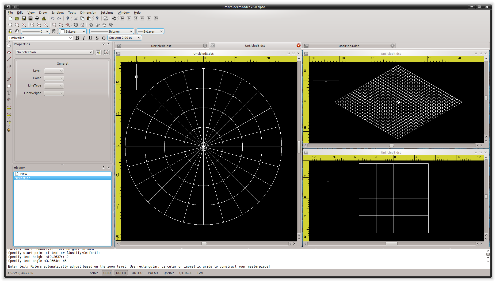
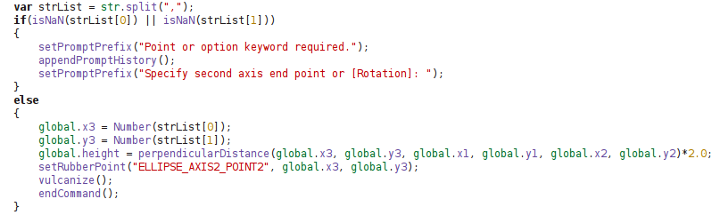

## Features

Embroidermodder 2 has many advanced features that enable you to create awesome designs quicker, tweak existing designs to perfection, and can be fully customized to fit your workflow.

A summary of these features:

* [Cross Platform](#anchorCrossPlatform)
* [Realistic rendering](#anchorRealRender)
* [Various grid types and auto-adjusting rulers](#anchorGridRuler)
* [Many measurement tools](#anchorMultiMeasure)
* [Add text to any design](#anchorText)
* [Supports many formats](#anchorFormats)
* [Batch Conversion](#anchorBatch)
* [Scripting API](#anchorScriptingAPI)

## Cross Platform

If you use multiple operating systems, it's important to choose software that works on all of them.

Embroidermodder 2 runs on Windows, Linux and Mac OS X. Let's not forget the <a href="http://www.raspberrypi.org">Raspberry Pi</a>.

## Realistic Rendering

It is important to be able to visualize what a design will look like when stitched and our pseudo "3D" realistic rendering helps achieve this.

Realistic rendering sample #1:

Realistic rendering sample #2:

Realistic rendering sample #3:

Various grid types and auto-adjusting rulers

Making use of the automatically adjusting ruler in conjunction with the grid will ensure your design is properly sized and fits within your embroidery hoop area.

Use rectangular, circular or isometric grids to construct your masterpiece!

Multiple grids and rulers in action:

## Many measurement tools

Taking measurements is a critical part of creating great designs. Whether you are designing mission critical embroidered space suits for NASA or some other far out design for your next meet-up, you will have precise measurement tools at your command to make it happen. You can locate individual points or find distances between any 2 points anywhere in the design!

Take quick and accurate measurements:

## Add text to any design

Need to make company apparel for all of your employees with individual names on them? No sweat. Just simply add text to your existing design or create one from scratch, quickly and easily.
Didn't get it the right size or made a typo? No problem. Just select the text and update it with the property editor.

Add text and adjust its properties quickly:

## Supports many formats

Embroidery machines all accept different formats. There are so many formats available that it can sometimes be confusing whether a design will work with your machine.

Embroidermodder 2 supports a wide variety of embroidery formats as well as several vector formats, such as SVG and DXF. This allows you to worry less about which designs you can use.

## Batch Conversion

Need to send a client several different formats? Just use libembroidery-convert, our command line utility which supports batch file conversion.

There are a multitude of formats to choose from:

## Scripting API

If you've got programming skills and there is a feature that isn't currently available that you absolutely cannot live without, you have the capability to create your own custom commands for Embroidermodder 2. We provide an QtScript API which exposes various application functionality so that it is possible to extend the application without requiring a new release. If you have created a command that you think is worth including in the next release, just <a href="contact.html">contact us</a> and we will review it for functionality, bugs, and finally inclusion.

An Embroidermodder 2 command excerpt:

