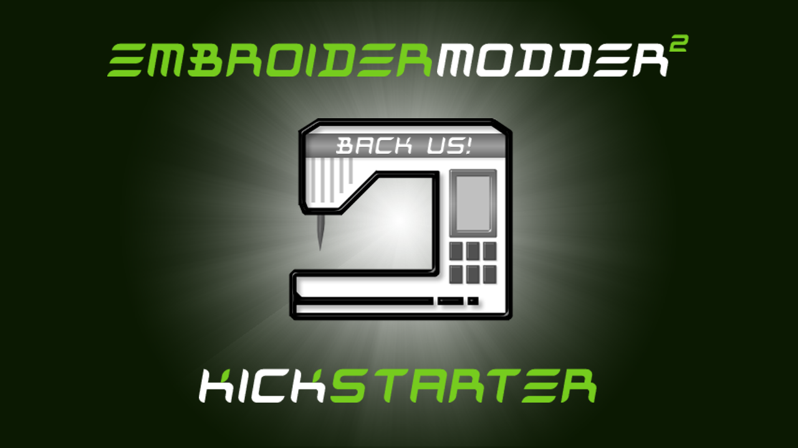

## Open Collective and New Plan

19th of December, 2021

Hi, welcome to our first update after switching to Open Collective.

I hope that we can get people excited about open software and hardware for embroidery again. Clearly there was some real talent and effort from Jonathon, Mark  and other contributors in making this happen. Hopefully, Josh and I can make these programs a standard fixture of garage workshops by making them easy to install, modify, build and distribute.

I've sketched out a timetable for the development of Embroidermodder, I feel I should share it with everyone:

| *Date* | *Event* |
|------|-------|
| _Dec 2021 - Jan 2022_ | libembroidery 1.0 features, particularly the basic file format support and fills Bugfixing, Testing, QA for libembroidery |
| _31st of Jan 2022_ | libembroidery 1.0 will be released, then updates will slow down and the Embroidermodder 2 development version will be fixed to the API of this version. |
| _Feb 2022_ | An overview of what has changed will be written up for the website as a news update Better documentation of libembroidery. |
| _Feb-April 2022_ | Finish the conversion to new GUI toolkit |
| _April-May 2022_ |  Finish all the targets in the Design, or assign them to 2.1. |
| _May-June 2022_ |  Stop pushing new features. Bugfixing, Testing, QA for Embroidermodder 2 |
| _Summer Solstice (21st of June) 2022_ | Embroidermodder 2 is officially released. Distribute NSIS installer, debian package, fedora package, mac bundle and source archives |
| _July 2022_ | News and Documentation work for Embroidermodder 2 |

_Embroidermodder 2_ is a zlib licensed software and we endevour to keep it free and well documented. Check out our [main github page](https://github.com/Embroidermodder/Embroidermodder) to see.

Cheers,

Robin

## Our Kickstarter Crowdfunding Campaign is LIVE!

March 17, 2014

We have launched our crowdfunding campaign on Kickstarter! It will be running until Sunday, April 20th. The way Kickstarter operates is that we need to reach our funding goal to receive any funds. There are downloads available for Windows (32-bit), Linux (32 and 64-bit), Mac OS X (64-bit) and Raspberry Pi (Raspbian) on the Kickstarter page. There has been a ton of work done to get to this point and to ensure a timely and stable delivery, this campaign needs to succeed. We really want to shake up the embroidery world and we hope you agree. The link to our campaign is: <a href="https://www.kickstarter.com/projects/redteam316/embroidermodder-2-for-windows-mac-linux-pi-and-ard">https://www.kickstarter.com/projects/redteam316/embroidermodder-2-for-windows-mac-linux-pi-and-ard</a>

... also check out our shamrockin' embroidery design created with Embroidermodder 2 using work-in-progress manual satin command!

Lucky you! [Download Here.](https://github.com/Embroidermodder/Embroidermodder/raw/master/embroidermodder2/samples/shamrockin.dst)

--Jonathan and Josh

<a href="news0.html#kickstarter-launched">Permanent link to this article</a>

## Fast Forward

February 13, 2014

There have been some changes that happened over the past several months:

The launch of the Kickstarter campaign was delayed but is still going to happen. Unless there are other unforeseen setbacks,
the revised plan is to launch our campaign on March 17.

We have started setup of a nightly build/continuous integration system using Travis-CI.
This is important as it will allow quicker bug fixes and increased stability long term. Currently
this is only available for 64-bit Linux builds but will eventually include OSX, Windows and Arduino.

We have also improved the stability and improved the API of our backend library: libembroidery. The API is
still changing but we now can produce standalone static and shared versions of libembroidery. Another notable
change is that there are now experimental Delphi and Lazarus(FreePascal) bindings in the works for libembroidery, contributed by <a href="https://github.com/x2nie">x2nie</a>.

Last but not least, I have a demonstration of our libembroidery code embedded on an Arduino. The video below simulates the stitching
by drawing it to a 2.8" TFT display (v1) made by <a href="https://adafruit.com">Adafruit</a>. It's really fast so I slowed it down for the video.
Instead of drawing, we could change it to control motors and other hardware to create an open source embroidery machine.
This is what the brain of an embroidery machine looks like and it just needs a heart and body. Enjoy the <a href="https://www.youtube.com/watch?v=KqiKfn4lxBk">video</a>!

<iframe src="https://www.youtube.com/embed/KqiKfn4lxBk" frameborder="0" allowfullscreen></iframe>

--Jonathan

<a href="news0.html#demo">Permanent link to this article</a>

## Crowdfunding Campaign Coming Soon!

September 9, 2013

There has been a considerable amount of development time put into Embroidermodder 2 over the past several months.
To be able to keep up this momentum, there needs to be at least one full time developer working on it.
We are planning on launching a Kickstarter campaign in early October if everything goes according to plan.
We also plan to release an alpha version during this timeframe, so there are many good things on the horizon!
Successful funding will have a major impact on how soon the final version will be released.

The preview link to our campaign is <a href="http://www.kickstarter.com/projects/redteam316/369640335?token=57f7685e">here</a>, feel free to leave feedback and spread the word via Twitter, Facebook, email, or word of mouth. Keep an eye out, because it's coming!

--Jonathan

<a href="news0.html#kickstarter">Permanent link to this article</a>

## New Website!

September 9, 2013

The Embroidermodder website now has a fresh new look. The content has been updated to reflect the upcoming version, Embroidermodder 2.
Check out our <a href="features.html">features page</a> for a summary of what to expect with Embroidermodder 2.

The background is a tiled image of an actual design that was stitched out during the pre-alpha stage.
It was created by Nina Paley and Theodore Gray using Mathematica in conjunction with our software.
They have graciously allowed us to use it for the project in whichever way we wish. We thought it looked so good, that it has become the new theme for Embroidermodder 2.
To check out some of the more interesting embroidery projects they are working on, <a href="http://blog.ninapaley.com/">look here</a>. 

The old website which was for Embroidermodder 1 has been preserved and can be found <a href="http://embroidermodder.sourceforge.net/embroidermodder1.html">here</a> for anyone interested.

--Jonathan

<a href="news0.html#new-website">Permanent link to this article</a>
