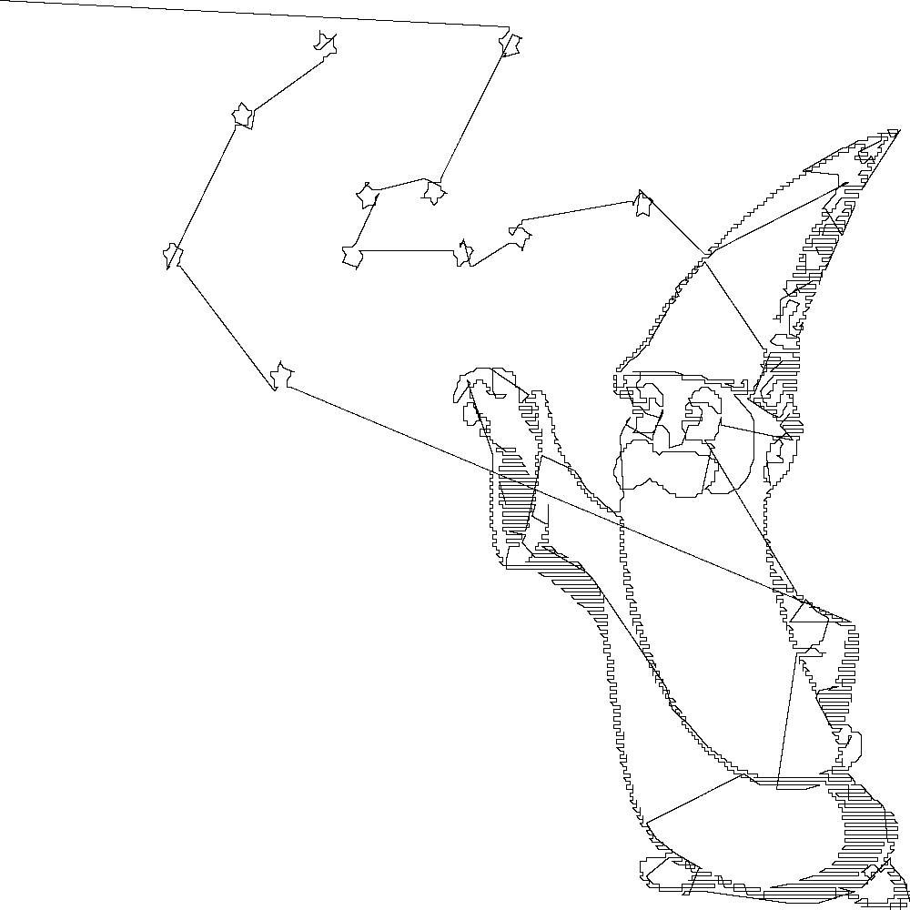

Hi backers,

since it's mainly me developing as a hobbyist at the moment successes are rare so I thought it would be good to share these with you.

## Working Fill Algorithms

I've managed to get two fills working from the command line using the commands:

```
$ embroider --fill input_image.ppm 130 output.dst
$ embroider --cross-stitch input_image.ppm 130 output.dst
```

So given this version of the banner logo:


It is cross-stitched like this:


There are major limitations, it requires an input that has depth 8 and is 1000x1000 pixels and it only takes in ppm format images. Your other format images could be converted to this format using:

```
$ convert input.png -depth 8 -geometry 1000x1000 output.ppm
```

A command like this will be embedded into the software to allow more image types but it would require the user to install imagemagick first.

Here's another example using the imagemagick wizard:



## Working Render Algorithm

The renders shown above were also made by the program using the commands:

```
$ embroider --render input.dst output.ppm
$ convert output.ppm output.png
```

## Timetable

As for the timetable, obviously that was too ambitious given the lack of a large team and the slow growth of interest. A tentative timetable is on the README, but that's uncertain as long as the major rewrite to C/SDL2 is underway, hopefully it'll still be a 2.0 release this year.

I'll try and share some more examples next month!

Cheers,

Robin
