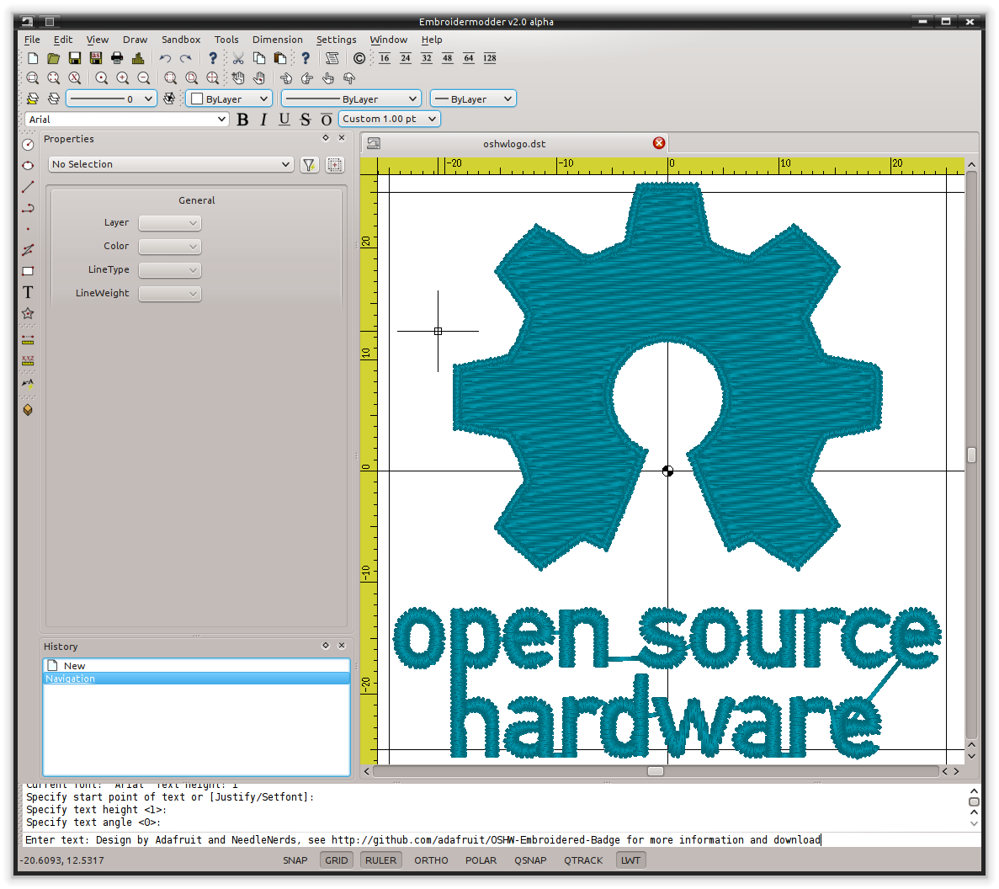

\mainpage Overview
\version 2.0.0-alpha
\author The Embroidermodder Team

(*UNDER MAJOR RESTRUCTURING, PLEASE WAIT FOR VERSION 2*)

\latexonly
\url{http://www.libembroidery.org}
\endlatexonly

Embroidermodder is a free machine embroidery application.
The newest version, Embroidermodder 2 can:

* edit and create embroidery designs
* estimate the amount of thread and machine time needed to stitch a design
* convert embroidery files to a variety of formats
* upscale or downscale designs
* run on Windows, Mac and Linux

Embroidermodder 2 is very much a work in progress since we're doing a ground
up rewrite to an interface in C using the GUI toolkit SDL2.
The reasoning for this is detailed in the issues tab.

For a more in-depth look at what we are developing read our 
[website](https://www.libembroidery.org) which includes these docs as well as the up-to date printer-friendly versions. These discuss recent changes, plans and has user and developer 
guides for all the Embroidermodder projects.

To see what we're focussing on right now, see the [Open Collective 
News](https://opencollective.com/embroidermodder).

\htmlonly
The current printer-friendly version of the manual
is [here](https://www.libembroidery.org/embroidermodder_2.0.0-alpha_manual.pdf).
\endhtmlonly

\subsection license License

The source code is under the terms of the zlib license: see `LICENSE.md` in the source code directory.

Permission is granted to copy, distribute and/or modify this document
under the terms of the GNU Free Documentation License, Version 1.3
or any later version published by the Free Software Foundation;
with no Invariant Sections, no Front-Cover Texts, and no Back-Cover Texts.

A copy of the license is included in the section entitled "GNU Free Documentation License".

\page about About

\section the-embroidermodder-team The Embroidermodder Project and Team

The _Embroidermodder 2_ project is a collection of small software utilities for
manipulating, converting and creating embroidery files in all major embroidery
machine formats. The program _Embroidermodder 2_ itself is a larger graphical
user interface (GUI) which is at the heart of the project.

The tools and associated documents are:

* This website ([`www.libembroidery.org`](https://www.libembroidery.org)), which is maintained [here](https://github.com/Embroidermodder/www.libembroidery.org).
* [The manual](https://www.libembroidery.org/embroidermodder_2.0_manual.pdf) covering all these projects.
* The GUI (`embroidermodder`), maintained [here](https://github.com/Embroidermodder/embroidermodder).
* The core library of low-level functions: [libembroidery](https://github.com/Embroidermodder/libembroidery).
* The CLI `embroider` which is part of [libembroidery](https://github.com/Embroidermodder/libembroidery).
* Mobile embroidery format viewers and tools ([`EmbroideryMobile`](https://github.com/Embroidermodder/embroiderymobile))).
* Specs for an open hardware embroidery machine called Embroiderbot (not started yet) which is also part of [libembroidery](https://github.com/Embroidermodder/libembroidery).

They all tools to make the standard
user experience of working with an embroidery machine better without expensive
software which is locked to specific manufacturers and formats. But ultimately
we hope that the core _Embroidermodder 2_ is a practical, ever-present tool in
larger workshops, small cottage industry workshops and personal hobbyist's
bedrooms.

Embroidermodder 2 is licensed under the zlib license and we aim to keep all of our tools open 
source and free of charge. If you would like to support the project check out our [Open 
Collective](https://opencollective.com/embroidermodder) group. If you would like to help, 
please join us on GitHub. This document is written as developer training as well helping new 
users (see the last sections) so this is the place to learn how to start changing the code.

The Embroidermodder Team is the collection of people who've submitted
patches, artwork and documentation to our three projects.
The team was established by Jonathan Greig and Josh Varga.
The full list is actively maintained below.

\subsection core-development-team "Core Development Team"

Embroidermodder 2:

  * [Jonathan Greig](https://github.com/redteam316)
  * [Josh Varga](https://github.com/JoshVarga)
  * [Robin Swift](https://github.com/robin-swift)

Embroidermodder 1:

  * [Josh Varga](https://github.com/JoshVarga)
  * [Mark Pontius](http://sourceforge.net/u/mpontius/profile)

\section Credits for Embroidermodder 2, libembroidery and all other related code

If you have contributed and wish to be added to this list, alter the [README on Embroidermodder 
github page](https://github.com/Embroidermodder/Embroidermodder) and we'll copy it to the 
libembroidery source code since that is credited to "The Embroidermodder Team".

\subsection embroidermodder-1 Embroidermodder 1

The Embroidermodder Team is also inspired by the original Embroidermodder that was built by 
Mark Pontius and the same Josh Varga on SourceForge which unfortunately appears to have died 
from linkrot. We may create a distribution on here to be the official "legacy" Embroidermodder 
code but likely in a seperate repository because it's GNU GPL v3 and this code is written to be 
zlib (that is, permissive licensed) all the way down.

One reason why this is useful is that the rewrite by Jonathan Greig, John Varga and Robin Swift 
for Embroidermodder 2 should have no regressions: no features present in v1 should be missing 
in v2.

\subsection features Features

Embroidermodder 2 has many advanced features that enable you to create awesome designs quicker, tweak existing designs to perfection, and can be fully customized to fit your workflow.

A summary of these features:

* Cross Platform
* Realistic rendering
* Various grid types and auto-adjusting rulers
* Many measurement tools
* Add text to any design
* Supports many formats
* Batch Conversion
* Scripting API

\subsubsection cross-platform Cross Platform

If you use multiple operating systems, it's important to choose software that works on all of them.

Embroidermodder 2 runs on Windows, Linux and Mac OS X. Let's not forget the [Raspberry 
Pi](http://www.raspberrypi.org).


\subsubsection section Realistic Rendering

It is important to be able to visualize what a design will look like when stitched and our 
pseudo ``3D'' realistic rendering helps achieve this.

Realistic rendering sample \#1:



Realistic rendering sample \#2:


Realistic rendering sample \#3:


Various grid types and auto-adjusting rulers

Making use of the automatically adjusting ruler in conjunction with the grid will ensure your 
design is properly sized and fits within your embroidery hoop area.

Use rectangular, circular or isometric grids to construct your masterpiece!

Multiple grids and rulers in action:


\subsubsection section Many measurement tools

Taking measurements is a critical part of creating great designs. Whether you are designing 
mission critical embroidered space suits for NASA or some other far out design for your next 
meet-up, you will have precise measurement tools at your command to make it happen. You can 
locate individual points or find distances between any 2 points anywhere in the design!

Take quick and accurate measurements:


\subsubsection add-text-to-any-design Add text to any design

Need to make company apparel for all of your employees with individual names on them? No sweat. 
Just simply add text to your existing design or create one from scratch, quickly and easily. 
Didn't get it the right size or made a typo? No problem. Just select the text and update it 
with the property editor.

Add text and adjust its properties quickly:


\subsubsection supports-many-formats Supports many formats

Embroidery machines all accept different formats. There are so many formats available that it 
can sometimes be confusing whether a design will work with your machine.

Embroidermodder 2 supports a wide variety of embroidery formats as well as several vector 
formats, such as SVG and DXF. This allows you to worry less about which designs you can use.

\subsubsection batch-conversion Batch Conversion

Need to send a client several different formats? Just use libembroidery-convert, our command 
line utility which supports batch file conversion.

There are a multitude of formats to choose from:


\subsubsection scripting-api Scripting API

If you've got programming skills and there is a feature that isn't currently available that you 
absolutely cannot live without, you have the capability to create your own custom commands for 
Embroidermodder 2. We provide an QtScript API which exposes various application functionality 
so that it is possible to extend the application without requiring a new release. If you have 
created a command that you think is worth including in the next release, just [contact 
us](contact.html) and we will review it for functionality, bugs, and finally inclusion.

An Embroidermodder 2 command excerpt:


\subsection build-and-install "Build and Install"

Assuming you already have the SDL2 libraries you can proceed to using the fast build, which 
assumes you want to build and test locally.

The fast build should be:

    bash build.sh

or, on Windows:

    .\build.bat

Then run using the `run.bat` or `run.sh` scripts in the build/ directory.

Otherwise, follow the instructions below.

If you plan to install the dev version to your system (we recommend you wait for the official 
installers and beta release first) then use the CMake build instead.

\subsubsection install-desktop Install on Desktop

We recommend that if you want to install the development version you use the CMake build. Like 
this:

    git submodule init
    git submodule update

    mkdir build
    cd build
    cmake ..
    cmake --build .
    sudo cmake --install .

These lines are written into the file:

    ./build_install.sh

On Windows use the next section.

\subsection history History

Embroidermodder 1 was started by Mark Pontius in 2004 while staying up all night with his son in his first couple months. When Mark returned 
to his day job, he lacked the time to continue the project. Mark made the decision to focus on his family and work, and in 
2005, Mark gave full control of the project to Josh Varga so that Embroidermodder could continue its growth.

Embroidermodder 2 was conceived in mid 2011 when Jonathan Greig and Josh Varga discussed the possibility of making a cross-platform version.
It is currently in active development and will run on GNU/Linux, Mac OS X, Microsoft Windows and Raspberry Pi.

All [Embroidermodder downloads](downloads.html) are hosted on SourceForge.

The [source code for Embroidermodder 1](http://sourceforge.net/p/embroidermodder/code/HEAD/tree/embroidermodder1) has always been hosted on Sourceforge.

The [source code for Embroidermodder 2](https://github.com/Embroidermodder/Embroidermodder) was moved to GitHub on July 18, 2013.

The [website for Embroidermodder](https://github.com/Embroidermodder/www.libembroidery.org) was moved to GitHub on September 9, 2013.

\section contact-us Contact us

For general questions email: [embroidermodder at gmail.com](mailto:embroidermodder@gmail.com)

To request a new feature [open an issue on the main Embroidermodder GitHub repository](https://github.com/Embroidermodder/Embroidermodder/issues). We'll move it to the correct repository.

\page downloads Downloads

\section alpha-build Alpha Build

This is a highly experimental build: we recommend users wait for the beta release when the basic features
are functional.

Visit our [GitHub Releases page](https://github.com/Embroidermodder/Embroidermodder/releases/tag/alpha)
for the current build. Unfortunately, earlier builds went down with the Sourceforge page we hosted them on.

\page . .

Embroidermodder 2 is very much a work in progress since we're doing a ground up rewrite to an 
interface in Python using the GUI toolkit Tk. The reasoning for this is detailed in the issues 
tab.

For a more in-depth look at what we are developing read the developer notes (link to dev notes 
section). This discusses recent changes in a less formal way than a changelog (since this 
software is in development) and covers what we are about to try.

\subsection Documentation

The documentation is in the form of the website (included in the `docs/` directory) and the 
printed docs in this file.

\subsubsection section Development

If you wish to develop with us you can chat via the contact email on the 
[website]\url{https://www.libembroidery.org} or in the issues tab on the [github 
page]\url{https://github.com/Embroidermodder/Embroidermodder/issues}. People have been polite 
and friendly in these conversations and I (Robin) have really enjoyed them. If we do have any 
arguments please note we have a [Code of Conduct](CODE\_OF\_CONDUCT.md) so there is a 
consistent policy to enforce when dealing with these arguments.

The first thing you should try is building from source using the [build advice](link to build) 
above. Then read some of the [development notes](link to dev notes.md) to get the general 
layout of the source code and what we are currently planning.

\subsubsection section Testing

To find unfixed errors run the tests by launching from the command line with:

    $ embroidermodder --test

then dig through the output. It's currently not worth reporting the errors, since
there are so many but if you can fix anything reported here you can submit a PR.

\subsection Code Optimisations and Simplifications

\subsubsection section Geometry

The geometry is stored, processed and altered via libembroidery. See the Python specific part 
of the documentation for libembroidery for this. What the code in Embroidermodder does is make 
the GUI widgets to change and view this information graphically.

For example if we create a circle with radius 10mm and center at `(20mm, 30mm)` then fill it 
with stitches the commands would be

```Python3
    from libembroidery import Pattern, Circle, Vector, satin
    circle = Circle(Vector(20, 30), 10)
    pattern = Pattern()
    pattern.add_circle(circle, fill=satin)
    pattern.to_stitches()
```

but the user would do this through a series of GUI actions:

1. Create new file
2. Click add circle
3. Use the Settings dialog to alter the radius and center
4. Use the fill tool on circle
5. Select satin from the drop down menu

So EM2 does the job of bridging that gap.

\subsubsection postscript-support Postscript Support

In order to safely support user contributed/shared data that can define, for example, double to 
double functions we need a consistent processor for these descriptions.

Embroidermodder backends to the postscript interpreter included in libembroidery to accomplish 
this.

For example the string:

    5 2 t mul add

is equivalent to the expression:

    2*t + 5

The benefit of not allowing this to simply be a Python expression is that it is safe against 
malicious use, or accidental misuse. The program can identify whether the output is of the 
appropriate form and give finitely many calculations before declaring the function to have run 
too long (stopping equations that hang).

To see examples of this see the `assets/shapes/*.ps` files.

\subsubsection svg-icons SVG Icons

To make the images easier to alter and restyle we could switch to svg icons. There's some code 
in the git history to help with this.

\subsubsection the-actions-system The Actions System

In order to simplify the development of a GUI that is flexible and easy to understand to new 
developers we have a custom action system that all user actions will go via an `actuator` that 
takes a string argument. By using a string argument the undo history is just an array of 
strings.

The C `action_hash_data` struct will contain: the icon used, the labels for the menus and 
tooltips and the function pointer for that action. There will be an accompanying argument for 
this function call, currently being drafted as `action_call`. So when the user makes a function 
call it should contain information like the mouse position, whether special key is pressed etc.

\subsubsection accessibility Accessibility

Software can be more or less friendly to people with dylexia, partial sightedness, reduced 
mobility and those who don't speak English. Embroidermodder 2 has, in its design, the following 
features to help:

* icons for everything to reduce the amount of reading required
* the system font is configurable: if you have a dyslexia-friendly font you can load it
* the interface rescales to help with partial-sightedness
* the system language is configurable, unfortunately the docs will only be in English but we can try to supply lots of images of the interface to make it easier to understand as a second language
* buttons are remappable: XBox controllers are known for being good for people with reduced mobility so remapping the buttons to whatever setup you have should help

Note that most of these features will be released with version 2.1, which is planned for around 
early 2023.

\subsubsection sample-files Sample Files

Various sample embroidery design files can be found in the `embroidermodder2/samples` folder.

\subsubsection shortcuts Shortcuts

A shortcut can be made up of zero or more modifier keys and at least one non-modifier key 
pressed at once.

To make this list quickly assessable, we can produce a list of hashes which are simply the 
flags ORed together.

The shortcuts are stored in the csv file `shortcuts.csv` as a 5-column table with the first 4 
columns describing the key combination. This is loaded into the shortcuts `TABLE`. Each tick 
the program checks the input state for this combination by first translating the key names into 
indices for the key state, then checking for whether all of them are set to true.

\subsubsection removed-elements Removed Elements

So I've had a few pieces of web infrastructure fail me recently and I think it's worth noting. 
An issue that affects us is an issue that can effect people who use our software.

\subsubsection qt-and-dependencies Qt and dependencies

Downloading and installing Qt has been a pain for some users (46Gb on possibly slow 
connections).

I'm switching to FreeGLUT 3 (which is a whole other conversation) which means we can ship it 
with the source code package meaning only a basic build environment is necessary to build it.

\subsubsection social-platform Social Platform

Github is giving me a server offline (500) error and is still giving a bad ping.

So... all the issues and project boards etc. being on Github is all well and good assuming that 
we have our own copies. But we don't if Github goes down or some other major player takes over 
the space and we have to move (again, since this started on SourceForge).

This file is a backup for that which is why I'm repeating myself between them.

\subsubsection opengl OpenGL

OpenGL rendering within the application. This will allow for Realistic Visualization - Bump 
Mapping/OpenGL/Gradients?

This should backend to a C renderer or something.

\subsubsection configuration-data-ideas Configuration Data Ideas

Embroidermodder should boot from the command line regardless of whether it is or is not 
installed (this helps with testing and running on machines without root). Therefore, it can 
create an initiation file but it won't rely on its existence to boot: 
`~/.embroidermodder/config.json`.

* Switch colors to be stored as 6 digit hexcodes with a `#`.
* We've got close to a hand implemented ini read/write setup in `settings.py`.

\subsubsection section Distribution

When we release the new pip wheel we should also package:

* `.tar.gz` and `.zip` source archive.
* Debian package
* RPM package

Only do this once per minor version number.

\todo Screenshot a working draft to demonstrate.

\subsubsection perennial-jobs Perennial Jobs

\todo (perennial) Check for memory leaks
\todo (perennial) Clear compiler warnings on `-Wall -ansi -pedantic` for C.
\todo (perennial) Write new tests for new code.
\todo (perennial) Get Embroidermodder onto the current version of libembroidery.
\todo (perennial) PEP7 compliance.
\todo (perennial) Better documentation with more photos/screencaps.

\subsubsection full-test-suite Full Test Suite

(This needs a hook from Embroidermodder to embroider's full test suite.)

The flag `--full-test-suite` runs all the tests that have been written.
Since this results in a lot of output the details are both to stdout
and to a text file called `test_matrix.txt`.

Patches that strictly improve the results in the `test_matrix.txt` over
the current version will likely be accepted and it'll be a good place
to go digging for contributions. (Note: strictly improve means that
the testing result for each test is as good a result, if not better.
Sacrificing one critera for another would require some design work
before we would consider it.)

\subsubsection symbols Symbols

Symbols use the SVG path syntax.

In theory, we could combine the icons and symbols systems, since they could be
rendered once and stored as icons in Qt. (Or as textures in FreeGLUT.)

Also we want to render the patterns themselves using SVG syntax, so it would
save on repeated work overall.

\subsection features Features

\subsubsection bindings Bindings

Bindings for libembroidery are maintained for the languages we use internally
in the project, for other languages we consider that the responsibility of
other teams using the library.

So libembroidery is going to be supported on:

* `C` (by default)
* `C++` (also by default)
* `Java` (for the Android application MobileViewer)
* `Swift` (for the iOS application iMobileViewer)

For `C#` we recommend directly calling the function directly
using the DllImport feature:

    [DllImport("libembroidery.so", EntryPoint="readCsv")]

see this StackOverflow discussion for help: [https://stackoverflow.com/questions/11425202/is-it-possible-to-call-a-c-function-from-c-net](https://stackoverflow.com/questions/11425202/is-it-possible-to-call-a-c-function-from-c-net).

For Python you can do the same using ctypes: [https://www.geeksforgeeks.org/how-to-call-a-c-function-in-python/](https://www.geeksforgeeks.org/how-to-call-a-c-function-in-python/).

\subsubsection other-supported-thread-brands Other Supported Thread Brands

The thread lists that aren't preprogrammed into formats but are indexed in
the data file for the purpose of conversion or fitting to images/graphics.

* Arc Polyester
* Arc Rayon
* Coats and Clark Rayon
* Exquisite Polyester
* Fufu Polyester
* Fufu Rayon
* Hemingworth Polyester
* Isacord Polyester
* Isafil Rayon
* Marathon Polyester
* Marathon Rayon
* Madeira Polyester
* Madeira Rayon
* Metro Polyester
* Pantone
* Robison Anton Polyester
* Robison Anton Rayon
* Sigma Polyester
* Sulky Rayon
* ThreadArt Rayon
* ThreadArt Polyester
* ThreaDelight Polyester
* Z102 Isacord Polyester

\subsection gui-design GUI Design

Embroidermodder 2 was written in C++/Qt5 and it was far too complex. We had issues with people
not able to build from source because the Qt5 libraries were so ungainly. So I decided to do a
rewrite in C/SDL2 (originally FreeGLUT, but that was a mistake) with data stored as YAML. This
means linking 4-7 libraries depending on your system which are all well supported and widely available.

This is going well, although it's slow progress as I'm trying to keep track of the design while
also doing a ground up rewrite. I don't want to throw away good ideas. Since I also write code
for libembroidery my time is divided.
Overview of the UI rewrite

(Problems to be solved in brackets.)

It's not much to look at because I'm trying to avoid using an external
widgets system, which in turn means writing things like toolbars and menubars
over. If you want to get the design the actuator is the heart of it.

Without Qt5 we need a way of assigning signals with actions, so this is what
I've got: the user interacts with a UI element, this sends an integer to the
actuator that does the thing using the current state of the mainwindow struct
of which we expect there to be exactly one instance. The action is taken out
by a jump table that calls the right function (most of which are missing in
action and not connected up properly). It also logs the number, along with
key parts of the main struct in the undo history (an unsolved problem because
we need to decide how much data to copy over per action). This means undo,
redo and repeat actions can refer to this data.

\subsection to-do To Do

These should be sorted into relevant code sections. \todo sort todo list.

\todo (2.0.0-alpha1) Statistics from 1.0, needs histogram

\todo (2.0.0-alpha1) Saving DST/PES/JEF (varga)

\todo (2.0.0-alpha1) Saving CSV/SVG (rt) + CSV read/write UNKNOWN interpreted as COLOR bug

\todo (2.0.0-alpha2) Notify user of data loss if not saving to an object format.

\todo (2.0.0-alpha2) Import Raster Image

\todo (2.0.0-alpha2) SNAP/ORTHO/POLAR

\todo (2.0.0-alpha2) Layer Manager + LayerSwitcher DockWidget

\todo (2.0.0-alpha2) Reading DXF

\todo (2.0.0-alpha3) Writing DXF

\todo (2.0.0-alpha3) Up and Down keys cycle thru commands in the command prompt

\todo (2.0.0-alpha3) Amount of Thread \| Machine Time Estimation (also allow customizable times for setup, color changes, manually 
trimming jump threads, etc...that way a realistic total time can be estimated)

\todo (2.0.0-alpha3) Otto Theme Icons - whatsthis icon doesn't scale well, needs redone

\todo (2.0.0-alpha3) embroidermodder2.ico 16 x 16 looks horrible

\todo (2.0.0-alpha4) CAD Command: Arc (rt)

\todo (2.0.0-alpha4) automate changelog and write to a javascript file for the docs: git log --pretty=tformat:'<a href="\url{https://github.com/Embroidermodder/Embroidermodder/commit/%H}">%s</a>'

\todo (2.0.0-beta1) Custom Filter Bug - doesn't save changes in some cases

\todo (2.0.0-beta1) Cannot open file with `#` in name when opening multiple files (works fine when opening the single file)

\todo (2.0.0-beta1) Closing Settings Dialog with the X in the window saves settings rather than discards them

\todo (2.0.0-beta1) Advanced Printing

\todo (2.0.0-beta1) Filling Algorithms (varga)

\todo (2.0.0-beta1) Otto Theme Icons - beta (rt) - Units, Render, Selectors

\todo (2.0.0-rc1) QDoc Comments

\todo (2.0.0-rc1) Review KDE4 Thumbnailer

\todo (2.0.0-rc1) Documentation for libembroidery \| formats

\todo (2.0.0-rc1) HTML Help files

\todo (2.0.0-rc1) Update language translations

\todo (2.0.0-rc1) CAD Command review: line

\todo (2.0.0-rc1) CAD Command review: circle

\todo (2.0.0-rc1) CAD Command review: rectangle

\todo (2.0.0-rc1) CAD Command review: polygon

\todo (2.0.0-rc1) CAD Command review: polyline

\todo (2.0.0-rc1) CAD Command review: point

\todo (2.0.0-rc1) CAD Command review: ellipse

\todo (2.0.0-rc1) CAD Command review: arc

\todo (2.0.0-rc1) CAD Command review: distance

\todo (2.0.0-rc1) CAD Command review: locatepoint

\todo (2.0.0-rc1) CAD Command review: move

\todo (2.0.0-rc1) CAD Command review: rgb

\todo (2.0.0-rc1) CAD Command review: rotate

\todo (2.0.0-rc1) CAD Command review: scale

\todo (2.0.0-rc1) CAD Command review: singlelinetext

\todo (2.0.0-rc1) CAD Command review: star

\todo (2.0.0-rc1) Clean up all compiler warning messages, right now theres plenty :P

\todo (2.0) tar.gz archive

\todo (2.0) zip archive

\todo (2.0) Debian Package (rt)

\todo (2.0) NSIS Installer (rt)

\todo (2.0) Mac Bundle?

\todo (2.0) press release

\todo (2.x/ideas) libembroidery.mk for MXE project (refer to qt submodule packages for qmake based building. Also refer to plibc.mk for example of how write an update macro for github.)

\todo (2.x/ideas) libembroidery safeguard for all writers - check if the last stitch is an END stitch. If not, add an end stitch in the writer and modify the header data if necessary.

\todo (2.x/ideas) Cut/Copy - Allow Post-selection

\todo (2.x/ideas) CAD Command: Array

\todo (2.x/ideas) CAD Command: Offset

\todo (2.x/ideas) CAD Command: Extend

\todo (2.x/ideas) CAD Command: Trim

\todo (2.x/ideas) CAD Command: BreakAtPoint

\todo (2.x/ideas) CAD Command: Break2Points

\todo (2.x/ideas) CAD Command: Fillet

\todo (2.x/ideas) CAD Command: Chamfer

\todo (2.x/ideas) CAD Command: Split

\todo (2.x/ideas) CAD Command: Area

\todo (2.x/ideas) CAD Command: Time

\todo (2.x/ideas) CAD Command: PickAdd

\todo (2.x/ideas) CAD Command: Product

\todo (2.x/ideas) CAD Command: Program

\todo (2.x/ideas) CAD Command: ZoomFactor

\todo (2.x/ideas) CAD Command: GripHot

\todo (2.x/ideas) CAD Command: GripColor \| GripCool

\todo (2.x/ideas) CAD Command: GripSize

\todo (2.x/ideas) CAD Command: Highlight

\todo (2.x/ideas) CAD Command: Units

\todo (2.x/ideas) CAD Command: Grid

\todo (2.x/ideas) CAD Command: Find

\todo (2.x/ideas) CAD Command: Divide

\todo (2.x/ideas) CAD Command: ZoomWindow (Move out of view.cpp)

\todo (2.x/ideas) Command: Web (Generates Spiderweb patterns)

\todo (2.x/ideas) Command: Guilloche (Generates Guilloche patterns)

\todo (2.x/ideas) Command: Celtic Knots

\todo (2.x/ideas) Command: Knotted Wreath

\todo (2.x/ideas) Lego Mindstorms NXT/EV3 ports and/or commands.

\todo (2.x/ideas) native function that flashes the command prompt to get users attention when using the prompt is required for a command.

\todo (2.x/ideas) libembroidery-composer like app that combines multiple files into one.

\todo (2.x/ideas) Settings Dialog, it would be nice to have it notify you when switching tabs that a setting has been changed. Adding an Apply button is what would make sense for this to happen. 

\todo (2.x/ideas) Keyboard Zooming/Panning

\todo (2.x/ideas) G-Code format?

\todo (2.x/ideas) 3D Raised Embroidery

\todo (2.x/ideas) Gradient Filling Algorithms

\todo (2.x/ideas) Stitching Simulation

\todo (2.x/ideas) RPM packages?

\todo (2.x/ideas) Reports?

\todo (2.x/ideas) Record and Playback Commands

\todo (2.x/ideas) Settings option for reversing zoom scrolling direction

\todo (2.x/ideas) Qt GUI for libembroidery-convert

\todo (2.x/ideas) EPS format? Look at using Ghostscript as an optional add-on to libembroidery...

\todo (2.x/ideas) optional compile option for including LGPL/GPL libs etc... with warning to user about license requirements.

\todo (2.x/ideas) Realistic Visualization - Bump Mapping/OpenGL/Gradients?

\todo (2.x/ideas) Stippling Fill

\todo (2.x/ideas) User Designed Custom Fill

\todo (2.x/ideas) Honeycomb Fill

\todo (2.x/ideas) Hilbert Curve Fill

\todo (2.x/ideas) Sierpinski Triangle fill

\todo (2.x/ideas) Circle Grid Fill

\todo (2.x/ideas) Spiral Fill

\todo (2.x/ideas) Offset Fill

\todo (2.x/ideas) Brick Fill

\todo (2.x/ideas) Trim jumps over a certain length.

\todo (2.x/ideas) FAQ about setting high number of jumps for more controlled trimming.

\todo (2.x/ideas) Minimum stitch length option. (Many machines also have this option too)

\todo (2.x/ideas) Add 'Design Details' functionality to libembroidery-convert

\todo (2.x/ideas) Add 'Batch convert many to one format' functionality to libembroidery-convert

\todo (2.x/ideas) EmbroideryFLOSS - Color picker that displays catalog numbers and names.

\todo (beta) Realistic Visualization - Bump Mapping/OpenGL/Gradients?

\todo (beta) Get undo history widget back (BUG).

\todo (beta) Mac Bundle, .tar.gz and .zip source archive.

\todo (beta) NSIS installer for Windows, Debian package, RPM package

\todo (beta) GUI frontend for embroider features that aren't
supported by embroidermodder: flag selector from a table

\todo (beta) Update all formats without color to check for edr or rgb files.

\todo (beta) Setting for reverse scrolling direction (for zoom, vertical pan)

\todo (beta) Keyboard zooming, panning

\todo (beta) New embroidermodder2.ico 16x16 logo that looks good at that scale.

\todo (beta) Saving dst, pes, jef.

\todo (beta) Settings dialog: notify when the user is switching tabs
that the setting has been changed, adding apply button is what would
make sense for this to happen.

\todo (beta) Update language translations.

\todo (beta) Replace KDE4 thumbnailer.

\todo (beta) Import raster image.

\todo (beta) Statistics from 1.0, needs histogram.

\todo (beta) SNAP/ORTHO/POLAR.

\todo (beta) Cut/copy allow post-selection.

\todo (beta) Layout into config.

\todo (beta) Notify user of data loss if not saving to an object format.

\todo (beta) Add which formats to work with to preferences.

\todo (beta) Cannot open file with `#` in the name when opening multiple
files but works with opening a single file.

\todo (beta) Closing settings dialog with the X in the window saves
settings rather than discarding them.

\todo (beta) Otto theme icons: units, render, selectors, what's
this icon doesn't scale.

\todo (beta) Layer manager and Layer switcher dock widget.

\todo (beta) Test that all formats read data in correct scale
(format details should match other programs).

\todo (beta) Custom filter bug -- doesn't save changes in some cases.

\todo (beta) Tools to find common problems in the source code and suggest fixes
to the developers. For example, a translation miss: that is, for any language
other than English a missing entry in the translation table should supply a
clear warning to developers.

\todo (beta) Converting Qt C++ version to native GUI C throughout.

\todo (beta) OpenGL Rendering: `Real` rendering to see what the embroidery
looks like, Icons and toolbars, Menu bar.

\todo (beta) Libembroidery interfacing: get all classes to use the proper
libembroidery types within them. So `Ellipse` has `EmbEllipse` as public
data within it.

\todo (beta) Move calculations of rotation and scaling into `EmbVector` calls.

\todo (beta) GUI frontend for embroider features that aren't supported by
embroidermodder: flag selector from a table

\todo (beta) Update all formats without color to check for edr or rgb files.

\todo (beta) Setting for reverse scrolling direction (for zoom, vertical pan)

\todo (beta) Keyboard zooming, panning

\todo (beta) Better integrated help: I don't think the help should backend to
a html file somewhere on the user's system. A better system would be a custom
widget within the program that's searchable.

\todo (beta) New embroidermodder2.ico 16x16 logo that looks good at that scale.

\todo (beta) Settings dialog: notify when the user is switching tabs that the
setting has been changed, adding apply button is what would make sense for
this to happen.

\subsection contributing Contributing

\subsubsection version-control Version Control

Being an open source project, developers can grab the latest code at any time
and attempt to build it themselves. We try our best to ensure that it will build smoothly
at any time, although occasionally we do break the build. In these instances,
please provide a patch, pull request which fixes the issue or open an issue and
notify us of the problem, as we may not be aware of it and we can build fine.

Try to group commits based on what they are related to: features/bugs/comments/graphics/commands/etc...

See the coding style [here](coding-style).

\subsubsection section Get the Development Build going

When we switch to releases we recommend using them, unless you're reporting a bug in which case you can check the development build for whether it has been patched. If this applies to you, the current development build is:

* [Linux](https://github.com/Embroidermodder/Embroidermodder/suites/8882922866/artifacts/406005099)
* [Mac OS](https://github.com/Embroidermodder/Embroidermodder/suites/8882922866/artifacts/406005101)
* [Windows](https://github.com/Embroidermodder/Embroidermodder/suites/8882922866/artifacts/406005102)

\todo (beta) Libembroidery 1.0.

\todo (beta) Better integrated help: I don't think the help should backend to a html file somewhere on the user's system. A better system would be a custom widget within the program that's searchable.

\todo (beta) EmbroideryFLOSS - Color picker that displays catalog numbers and names.

\todo (beta) Custom filter bug -- doesn't save changes in some cases.

\todo (beta) Advanced printing.

\todo (beta) Stitching simulation.

\todo (2.x/ideas) User designed custom fill.

These are key bits of reasoning behind why the GUI is built the way it is.

\subsection translation Translation of the user interface

In a given table the left column is the default symbol and the right string is the translation. 
If the translate function fails to find a translation it returns the default symbol.

So in US English it is an empty table, but in UK English
only the dialectical differences are present.

Ideally, we should support at least the 6 languages spoken at the UN. Quoting www.un.org:

> _There are six official languages of the UN. These are Arabic, Chinese, English, French, Russian and Spanish._

We're adding Hindi, on the grounds that it is one of the most commonly spoken languages and at 
least one of the Indian languages should be present.

Written Chinese is generally supported as two different symbol sets and we follow that 
convension.

English is supported as two dialects to ensure that the development team is aware of what those 
differences are. The code base is written by a mixture of US and UK native English speakers 
meaning that only the variable names are consistently one dialect: US English. As for 
documentation: it is whatever dialect the writer prefers (but they should maintain consistency 
within a text block like this one).

Finally, we have "default", which is the dominant language
of the internals of the software. Practically, this is
just US English, but in terms of programming history this
is the "C locale".

\subsection old-action-system Old action system notes

Action: the basic system to encode all user input.

This typedef gives structure to the data associated with each action
which, in the code, is referred to by the action id (an int from
the define table above).

\subsection description-of-struct DESCRIPTION OF STRUCT CONTENTS

\subsubsection label label

The action label is always in US English, lowercase,
seperated with hyphens.

For example: `new-file`.

\subsection flags

The bit based flags all collected into a 32-bit integer.

| bit(s) | description |
|--------|-------------|
| 0      | User (0) or system (1) permissions.        |
| 1-3    | The mode of input.                         |
| 4-8    | The object classes that this action        |
|        | can be applied to.                         |
| 9-10   | What menu (if any) should it be present in.|
| 11-12  | What                                       |

\subsection description Description

The string placed in the tooltip describing the action.

\section original-prompt-system Original Prompt System

NOTE: `main()` is run every time the command is started.
Use it to reset variables so they are ready to go.

NOTE: `click()` is run only for left clicks.
Middle clicks are used for panning.
Right clicks bring up the context menu.

NOTE: `move()` is optional. It is run only after
`enableMoveRapidFire()` is called. It
will be called every time the mouse moves until
`disableMoveRapidFire()` is called.

NOTE: `prompt()` is run when Enter is pressed.
`appendPromptHistory` is automatically called before `prompt()`
is called so calling it is only needed for erroneous input.
Any text in the command prompt is sent as an uppercase string.

\subsection cad CAD command review
\addindex newfile
\addindex openfile
\addindex savefile
\addindex scale
\addindex circle
\addindex offset
\addindex extend
\addindex trim
\addindex break-at-point
\addindex break-2-points
\addindex fillet
\addindex star

| **ID** | **name** | **arguments** | **description** |
|--------|----------|---------------|-----------------|
| 0 | `newfile` | none | Create a new EmbPattern with a new tab in the GUI. |
| 1 | `openfile` | filename string | Open an EmbPattern with the supplied filename `fname`.  |
| 2 | `savefile` | filename string | Save the current loaded EmbPattern to the supplied filname `fname`. |
| 3 | `scale` | selected objects, 1 float | Scale all selected objects by the number supplied, without selection scales the entire design |
| 4 | `circle` | mouse co-ords | Adds a circle to the design based on the supplied numbers, converts to stitches on save for stitch only formats. |
| 5 | `offset` | mouse co-ords | Shifts the selected objects by the amount given by the mouse co-ordinates.  |
| 6 | `extend` | | |
| 7 | `trim` | | |
| 8 | `break_at_point`  | | |
| 9 | `break_2_points` | | |
| 10 | `fillet` | | |
| 11 | `star` | | |
| 12 | `singlelinetext` \addindex singlelinetext | | |
| 13 | \addindex chamfer `chamfer` | | |
| 14 | \addindex split `split` | | |
| 15 | \addindex area `area` | | |
| 16 | \addindex time `time` | | |
| 17 | \addindex pickadd `pickadd` | | |
| 16 | \addindex zoomfactor `zoomfactor` | | |
| 17 | \addindex product `product` | | |
| 18 | \addindex program `program` | | |
| 19 | \addindex zoomwindow `zoomwindow` | | |
| 20 | \addindex divide `divide` | | |
| 21 | \addindex find `find` | | |
| 22 | \addindex record `record` | | |
| 23 | \addindex playback `playback` | | |
| 24 | \addindex rotate `rotate` | | |
| 25 | \addindex rgb `rgb` | | |
| 26 | \addindex move `move` | | |
| 27 | \addindex grid `grid` | | |
| 28 | \addindex griphot `griphot` |  |  |
| 29 | \addindex gripcolor `gripcolor` | | |
| 30 | \addindex gripcool `gripcool` |  |  |
| 31 | \addindex gripsize `gripsize` |  |  |
| 32 | \addindex highlight `highlight` |  |  |
| 33 | \addindex units `units` |  |  |
| 34 | \addindex locatepoint `locatepoint` |  |  |
| 35 | \addindex distance `distance` |  |  |
| 36 | \addindex arc `arc` |  |  |
| 37 | \addindex ellipse `ellipse` |  |  |
| 38 | \addindex array `array` |  |  |
| 39 | \addindex point `point` |  |  |
| 40 | \addindex polyline `polyline` |  |  |
| 41 | \addindex polygon `polygon` |  |  |
| 42 | \addindex rectangle `rectangle` |  |  |
| 43 | \addindex line `line` |  |  |
| 44 | \addindex arc-rt `arc (rt)` |  |  |
| 45 | \addindex dolphin `dolphin` |  |  |
| 46 | \addindex heart `heart`  | | |

\subsection Actions

\subsubsection ARC
\addindex arc

\subsubsection CIRCLE
\addindex circle

\subsubsection OPEN
\addindex open

\page tutorials Tutorials

\section basic-features Basic Features

\subsection move-single-stitch Move a single stitch in an existing pattern

1. In the `File` menu, click `Open...`. When the open dialog appears find
  and select your file by double clicking the name of the file. Alternatively,
  left click the file once then click the `Open` button.
2. 
3. In the `File' menu

TIP: For users who prefer

\section altering-a-single-stitch Altering a Single Stitch (2022-09-19)

In this tutorial we cover the scenarios where:

1. you have a design that you want to move a few points in but make no major changes
2. you have a design that you want to remove a few stitches from
3. you have a design that has some stitches in the wrong colour

In all cases, open Embroidermodder 2 and use `File > Open` to get the open file dialog.

(TO BE COMPLETED.)

\subsection convert-patterns Convert one pattern to another format

1. In the `File` menu, click `Open...`.
2. The 
3. In the dropdown menu within the save dialog select the 

\section advanced-features Advanced Features

\page post-history Post History

\seciton open-collective Open Collective and New Plan (2021-12-19)

Hi, welcome to our first update after switching to Open Collective.

I hope that we can get people excited about open software and hardware for embroidery again. Clearly there was some real talent and effort from Jonathon, Mark  and other contributors in making this happen. Hopefully, Josh and I can make these programs a standard fixture of garage workshops by making them easy to install, modify, build and distribute.

I've sketched out a timetable for the development of Embroidermodder, I feel I should share it with everyone:

| *Date* | *Event* |
|------|-------|
| _Dec 2021 - Jan 2022_ | libembroidery 1.0 features, particularly the basic file format support and fills Bugfixing, Testing, QA for libembroidery |
| _31st of Jan 2022_ | libembroidery 1.0 will be released, then updates will slow down and the Embroidermodder 2 development version will be fixed to the API of this version. |
| _Feb 2022_ | An overview of what has changed will be written up for the website as a news update Better documentation of libembroidery. |
| _Feb-April 2022_ | Finish the conversion to new GUI toolkit |
| _April-May 2022_ |  Finish all the targets in the Design, or assign them to 2.1. |
| _May-June 2022_ |  Stop pushing new features. Bugfixing, Testing, QA for Embroidermodder 2 |
| _Summer Solstice (21st of June) 2022_ | Embroidermodder 2 is officially released. Distribute NSIS installer, debian package, fedora package, mac bundle and source archives |
| _July 2022_ | News and Documentation work for Embroidermodder 2 |

_Embroidermodder 2_ is a zlib licensed software and we endevour to keep it free and well documented. Check out our [main github page](https://github.com/Embroidermodder/Embroidermodder) to see.

Cheers,

Robin

\section fast-forward Fast Forward (2014-02-13)

There have been some changes that happened over the past several months:

The launch of the Kickstarter campaign was delayed but is still going to happen. Unless there are other unforeseen setbacks,
the revised plan is to launch our campaign on March 17.

We have started setup of a nightly build/continuous integration system using Travis-CI.
This is important as it will allow quicker bug fixes and increased stability long term. Currently
this is only available for 64-bit Linux builds but will eventually include OSX, Windows and Arduino.

We have also improved the stability and improved the API of our backend library: libembroidery. The API is
still changing but we now can produce standalone static and shared versions of libembroidery. Another notable
change is that there are now experimental Delphi and Lazarus(FreePascal) bindings in the works for libembroidery, contributed by <a href="https://github.com/x2nie">x2nie</a>.

Last but not least, I have a demonstration of our libembroidery code embedded on an Arduino. The video below simulates the stitching
by drawing it to a 2.8" TFT display (v1) made by <a href="https://adafruit.com">Adafruit</a>. It's really fast so I slowed it down for the video.
Instead of drawing, we could change it to control motors and other hardware to create an open source embroidery machine.
This is what the brain of an embroidery machine looks like and it just needs a heart and body. Enjoy the <a href="https://www.youtube.com/watch?v=KqiKfn4lxBk">video</a>!
<div class="video"><iframe src="https://www.youtube.com/embed/KqiKfn4lxBk" frameborder="0" allowfullscreen></iframe></div>

--Jonathan

[Permanent link to this article](news0.html#demo)

\section jan22news January 2022 Development Notes For Embroidermodder 2 (2022-01-31)

Hi backers,

since the last update development has been focused on mostly not user-facing aspects of the program. This is what we planned in the timetable, aiming to release the libembroidery library for the end of the month.

The idea being that if we can fix an API for libembroidery early, it will focus development into a program that remains more consistent by the height of the Summer.

Unfortunately, this was too ambitious. But we can discuss what has changed, and why a later date is better than focusing on hitting this milestone.

\subsection broad-development-goals Broad Development Goals

We want:

 * A small codebase.
 * A separation of code and data in procedural style.
 * A separation of basic library functions from GUI code.
 * A build system without non-standard dependencies (i.e. not including windows.h, X11, GL).
 * A software that runs without installation
 * A software that can keep records of its state that can be loaded on reboot

To meet these goals we are making a C/FreeGLUT application:

 * Runs on more systems because it has less (and less high level) dependencies.
 * Requires less specialist knowledge from our potential new developers of Qt, C++ and the build system.
 * Compiles with less faff since the only dependencies are the graphics libraries of the host system (meeting broad development goal 4).

Other decisions made to meet these goals are detailed below.

\subsection new-settings-system The New Settings System

In the attempt to convert the mostly C++ codebase to C, we developed a basic system for storing the data of Embroidermodder (including all the icons) as a single JSON file weighing in at about 6Mb.

This allows the second broad development goal to be met.

\subsection reducing-reliance-on-qt5 Reducing Reliance on Qt5

The FreeGLUT variant of the code (in gui.c) will eventually be the software.

The broad development goals should make that very complex change a sequence of smaller, less complex changes. For example: breaking apart highly object-oriented code that relies on high level Qt function calls into data and code and then seperating out the code parts into C and C++ functions.

\subsection color-palettes Color Palettes

Using a custom script we converted all the icons into xpm, then using another reduced their palettes down to 16 colors + transparency.

This hasn't affected their appearance significantly, and makes making a global GUI palette feasible. With a global GUI palette we can make icon themes be a simple remap of the palette.

\subsection conclusion Conclusion

Overall, the software is easier to understand. But not easy enough for it to be worth committing to extensive documentation that will likely have to change. This also makes deciding on a API difficult.

Based on this, a short term aim can be writing more high level documentation like this update to clarify (even just to the team) why we made the decisions we have.

Cheers,

Robin Swift

The Embroidermodder Team

\section June 2022 Backer Update (2022-06-22)

Hi backers,

since it's mainly me developing as a hobbyist at the moment successes are rare so I thought it would be good to share these with you.

\subsection working-fill-algorithm Working Fill Algorithms

I've managed to get two fills working from the command line using the commands:

```
$ embroider --fill input_image.ppm 130 output.dst
$ embroider --cross-stitch input_image.ppm 130 output.dst
```

So given this version of the banner logo:


It is cross-stitched like this:


There are major limitations, it requires an input that has depth 8 and is 1000x1000 pixels and it only takes in ppm format images. Your other format images could be converted to this format using:

```
$ convert input.png -depth 8 -geometry 1000x1000 output.ppm
```

A command like this will be embedded into the software to allow more image types but it would require the user to install imagemagick first.

Here's another example using the imagemagick wizard:


\subsection working-render-algorithm Working Render Algorithm

The renders shown above were also made by the program using the commands:

```
$ embroider --render input.dst output.ppm
$ convert output.ppm output.png
```

\subsection timetable Timetable

As for the timetable, obviously that was too ambitious given the lack of a large team and the slow growth of interest. A tentative timetable is on the README, but that's uncertain as long as the major rewrite to C/SDL2 is underway, hopefully it'll still be a 2.0 release this year.

I'll try and share some more examples next month!

Cheers,

Robin

\subpage kickstarter-live Our Kickstarter Crowdfunding Campaign is LIVE! 
(2014-03-17)
\author Jonathan and Josh

[link](https://www.kickstarter.com/projects/redteam316/embroidermodder-2-for-windows-mac-linux-pi-and-ard)


We have launched our crowdfunding campaign on Kickstarter! It will be running until Sunday, April 20th. The way Kickstarter operates is that we need to reach our funding goal to receive any funds. There are downloads available for Windows (32-bit), Linux (32 and 64-bit), Mac OS X (64-bit) and Raspberry Pi (Raspbian) on the Kickstarter page. There has been a ton of work done to get to this point and to ensure a timely and stable delivery, this campaign needs to succeed. We really want to shake up the embroidery world and we hope you agree. The link to our campaign is: [https://www.kickstarter.com/projects/redteam316/embroidermodder-2-for-windows-mac-linux-pi-and-ard](https://www.kickstarter.com/projects/redteam316/embroidermodder-2-for-windows-mac-linux-pi-and-ard).

... also check out our shamrockin' embroidery design created with Embroidermodder 2 using work-in-progress manual satin command!

Lucky you! [Download Here.](https://github.com/Embroidermodder/Embroidermodder/raw/master/embroidermodder2/samples/shamrockin.dst)


--Jonathan and Josh

[Permanent link to this article](news0.html#kickstarter-launched)

\subpage new-website New Website! (2013-09-09)
\author Jonathan

The Embroidermodder website now has a fresh new look. The content has been updated to reflect the upcoming version, Embroidermodder 2.
Check out our <a href="features.html">features page</a> for a summary of what to expect with Embroidermodder 2.

The background is a tiled image of an actual design that was stitched out during the pre-alpha stage.
It was created by Nina Paley and Theodore Gray using Mathematica in conjunction with our software.
They have graciously allowed us to use it for the project in whichever way we wish. We thought it looked so good, that it has become the new theme for Embroidermodder 2.
To check out some of the more interesting embroidery projects they are working on, [look here](http://blog.ninapaley.com/).

The old website which was for Embroidermodder 1 has been preserved and can be found [here](http://embroidermodder.sourceforge.net/embroidermodder1.html) for anyone interested.

--Jonathan

[Permanent link to this article](news0.html#new-website)

\subpage crowdfunding-1 Crowdfunding Campaign Coming Soon!
\author Jonathan

[link](http://www.kickstarter.com/projects/redteam316/369640335?token=57f7685e)


There has been a considerable amount of development time put into Embroidermodder 2 over the past several months.
To be able to keep up this momentum, there needs to be at least one full time developer working on it.
We are planning on launching a Kickstarter campaign in early October if everything goes according to plan.
We also plan to release an alpha version during this timeframe, so there are many good things on the horizon!
Successful funding will have a major impact on how soon the final version will be released.

The preview link to our campaign is [here](http://www.kickstarter.com/projects/redteam316/369640335?token=57f7685e), feel free to leave feedback and spread the word via Twitter, Facebook, email, or word of mouth. Keep an eye out, because it's coming!

--Jonathan (2013-09-09)

[Permanent link to this article](#crowdfunding-1)

\section open-collective Open Collective and New Plan (2021-12-19)

Hi, welcome to our first update after switching to Open Collective.

I hope that we can get people excited about open software and hardware for embroidery again. Clearly there was some real talent and effort from Jonathon, Mark  and other contributors in making this happen. Hopefully, Josh and I can make these programs a standard fixture of garage workshops by making them easy to install, modify, build and distribute.

I've sketched out a timetable for the development of Embroidermodder, I feel I should share it with everyone:

| *Date* | *Event* |
|------|-------|
| _Dec 2021 - Jan 2022_ | libembroidery 1.0 features, particularly the basic file format support and fills Bugfixing, Testing, QA for libembroidery |
| _31st of Jan 2022_ | libembroidery 1.0 will be released, then updates will slow down and the Embroidermodder 2 development version will be fixed to the API of this version. |
| _Feb 2022_ | An overview of what has changed will be written up for the website as a news update Better documentation of libembroidery. |
| _Feb-April 2022_ | Finish the conversion to new GUI toolkit |
| _April-May 2022_ |  Finish all the targets in the Design, or assign them to 2.1. |
| _May-June 2022_ |  Stop pushing new features. Bugfixing, Testing, QA for Embroidermodder 2 |
| _Summer Solstice (21st of June) 2022_ | Embroidermodder 2 is officially released. Distribute NSIS installer, debian package, fedora package, mac bundle and source archives |
| _July 2022_ | News and Documentation work for Embroidermodder 2 |

_Embroidermodder 2_ is a zlib licensed software and we endevour to keep it free and well documented. Check out our [main github page](https://github.com/Embroidermodder/Embroidermodder) to see.

Cheers,

Robin

\section jan22news January 2022 Development Notes For Embroidermodder 2 (2022-01-31)

Hi backers,

since the last update development has been focused on mostly not user-facing aspects of the program. This is what we planned in the timetable, aiming to release the libembroidery library for the end of the month.

The idea being that if we can fix an API for libembroidery early, it will focus development into a program that remains more consistent by the height of the Summer.

Unfortunately, this was too ambitious. But we can discuss what has changed, and why a later date is better than focusing on hitting this milestone.

\subsection broad-development-goals Broad Development Goals

We want:

 * A small codebase.
 * A separation of code and data in procedural style.
 * A separation of basic library functions from GUI code.
 * A build system without non-standard dependencies (i.e. not including windows.h, X11, GL).
 * A software that runs without installation
 * A software that can keep records of its state that can be loaded on reboot

To meet these goals we are making a C/FreeGLUT application:

 * Runs on more systems because it has less (and less high level) dependencies.
 * Requires less specialist knowledge from our potential new developers of Qt, C++ and the build system.
 * Compiles with less faff since the only dependencies are the graphics libraries of the host system (meeting broad development goal 4).

Other decisions made to meet these goals are detailed below.

\subsection the-new-settings-system The New Settings System

In the attempt to convert the mostly C++ codebase to C, we developed a basic system for storing the data of Embroidermodder (including all the icons) as a single JSON file weighing in at about 6Mb.

This allows the second broad development goal to be met.

\subsection reducing-reliance-on-qt5 Reducing Reliance on Qt5

The FreeGLUT variant of the code (in gui.c) will eventually be the software.

The broad development goals should make that very complex change a sequence of smaller, less complex changes. For example: breaking apart highly object-oriented code that relies on high level Qt function calls into data and code and then seperating out the code parts into C and C++ functions.

\subsection Color Palettes

Using a custom script we converted all the icons into xpm, then using another reduced their palettes down to 16 colors + transparency.

This hasn't affected their appearance significantly, and makes making a global GUI palette feasible. With a global GUI palette we can make icon themes be a simple remap of the palette.

\subsection Conclusion

Overall, the software is easier to understand. But not easy enough for it to be worth committing to extensive documentation that will likely have to change. This also makes deciding on a API difficult.

Based on this, a short term aim can be writing more high level documentation like this update to clarify (even just to the team) why we made the decisions we have.

Cheers,

Robin Swift

The Embroidermodder Team

\section jun22news June 2022 Backer Update (2022-06-22)

Hi backers,

since it's mainly me developing as a hobbyist at the moment successes are rare so I thought it would be good to share these with you.

\subsection Working Fill Algorithms

I've managed to get two fills working from the command line using the commands:

```
$ embroider --fill input_image.ppm 130 output.dst
$ embroider --cross-stitch input_image.ppm 130 output.dst
```

So given this version of the banner logo:


It is cross-stitched like this:


There are major limitations, it requires an input that has depth 8 and is 1000x1000 pixels and it only takes in ppm format images. Your other format images could be converted to this format using:

```
$ convert input.png -depth 8 -geometry 1000x1000 output.ppm
```

A command like this will be embedded into the software to allow more image types but it would require the user to install imagemagick first.

Here's another example using the imagemagick wizard:


\subsection working-render-algorithm Working Render Algorithm

The renders shown above were also made by the program using the commands:

```
$ embroider --render input.dst output.ppm
$ convert output.ppm output.png
```

\subsection timetable Timetable

As for the timetable, obviously that was too ambitious given the lack of a large team and the slow growth of interest. A tentative timetable is on the README, but that's uncertain as long as the major rewrite to C/SDL2 is underway, hopefully it'll still be a 2.0 release this year.

I'll try and share some more examples next month!

Cheers,

Robin

\section new-website New Website! (2013-09-09)

The Embroidermodder website now has a fresh new look. The content has been updated to reflect the upcoming version, Embroidermodder 2.
Check out our [features page](features.html) for a summary of what to expect with Embroidermodder 2.

The background is a tiled image of an actual design that was stitched out during the pre-alpha stage.
It was created by Nina Paley and Theodore Gray using Mathematica in conjunction with our software.
They have graciously allowed us to use it for the project in whichever way we wish. We thought it looked so good, that it has become the new theme for Embroidermodder 2.
To check out some of the more interesting embroidery projects they are working on, [look here](http://blog.ninapaley.com/).

The old website which was for Embroidermodder 1 has been preserved and can be found [here](http://embroidermodder.sourceforge.net/embroidermodder1.html) for anyone interested.

--Jonathan

[Permanent link to this article](news0.html#new-website)

\section kickstarter Crowdfunding Campaign Coming Soon! (2013-09-09)


[link](http://www.kickstarter.com/projects/redteam316/369640335?token=57f7685e)

There has been a considerable amount of development time put into Embroidermodder 2 over the past several months.
To be able to keep up this momentum, there needs to be at least one full time developer working on it.
We are planning on launching a Kickstarter campaign in early October if everything goes according to plan.
We also plan to release an alpha version during this timeframe, so there are many good things on the horizon!
Successful funding will have a major impact on how soon the final version will be released.

The preview link to our campaign is [here](http://www.kickstarter.com/projects/redteam316/369640335?token=57f7685e), feel free to leave feedback and spread the word via Twitter, Facebook, email, or word of mouth. Keep an eye out, because it's coming!

--Jonathan

[Permanent link to this article](news0.html#kickstarter)

\section kickstarter-launched Our Kickstarter Crowdfunding Campaign is LIVE! (2014-03-17)


[link](https://www.kickstarter.com/projects/redteam316/embroidermodder-2-for-windows-mac-linux-pi-and-ard)

We have launched our crowdfunding campaign on Kickstarter! It will be running until Sunday, April 20th. The way Kickstarter operates is that we need to reach our funding goal to receive any funds. There are downloads available for Windows (32-bit), Linux (32 and 64-bit), Mac OS X (64-bit) and Raspberry Pi (Raspbian) on the Kickstarter page. There has been a ton of work done to get to this point and to ensure a timely and stable delivery, this campaign needs to succeed. We really want to shake up the embroidery world and we hope you agree. The link to our campaign is: <a href="https://www.kickstarter.com/projects/redteam316/embroidermodder-2-for-windows-mac-linux-pi-and-ard">https://www.kickstarter.com/projects/redteam316/embroidermodder-2-for-windows-mac-linux-pi-and-ard</a>

... also check out our shamrockin' embroidery design created with Embroidermodder 2 using work-in-progress manual satin command!

Lucky you! [Download Here.](https://github.com/Embroidermodder/Embroidermodder/raw/master/embroidermodder2/samples/shamrockin.dst)

<a href="https://github.com/Embroidermodder/Embroidermodder/raw/master/embroidermodder2/samples/shamrockin.dst"></a>

--Jonathan and Josh

[Permanent link to this article](news0.html#kickstarter-launched)

\section fast-forward Fast Forward (2014-02-13)

There have been some changes that happened over the past several months:

The launch of the Kickstarter campaign was delayed but is still going to happen. Unless there are other unforeseen setbacks,
the revised plan is to launch our campaign on March 17.

We have started setup of a nightly build/continuous integration system using Travis-CI.
This is important as it will allow quicker bug fixes and increased stability long term. Currently
this is only available for 64-bit Linux builds but will eventually include OSX, Windows and Arduino.

We have also improved the stability and improved the API of our backend library: libembroidery. The API is
still changing but we now can produce standalone static and shared versions of libembroidery. Another notable
change is that there are now experimental Delphi and Lazarus(FreePascal) bindings in the works for libembroidery, contributed by <a href="https://github.com/x2nie">x2nie</a>.

Last but not least, I have a demonstration of our libembroidery code embedded on an Arduino. The video below simulates the stitching
by drawing it to a 2.8" TFT display (v1) made by <a href="https://adafruit.com">Adafruit</a>. It's really fast so I slowed it down for the video.
Instead of drawing, we could change it to control motors and other hardware to create an open source embroidery machine.
This is what the brain of an embroidery machine looks like and it just needs a heart and body. Enjoy the <a href="https://www.youtube.com/watch?v=KqiKfn4lxBk">video</a>!
<div class="video"><iframe src="https://www.youtube.com/embed/KqiKfn4lxBk" frameborder="0" allowfullscreen></iframe></div>

--Jonathan

[Permanent link to this article.](news0.html#fast-forward)

\page Changelog

\page Ideas

Stuff that is now supposed to be generated by Doxygen:

\todo Bibliography style to plainnat.

\todo Serif font for printed docs.

\todo US letter paper version of printed docs.

\page formats Formats

\section overview Overview

\subsection read-write-support-levels Read/Write Support Levels

The table of read/write format support levels uses the status levels described here:

| Status Label | Description |
|---|---|
| `rw-none` | Either the format produces no output, reporting an error. Or it produces a Tajima dst file as an alternative. |
| `rw-poor` | A file somewhat similar to our examples is produced. We don't know how well it runs on machines in practice as we don't have any user reports or personal tests. |
| `rw-basic` | Simple files in this format run well on machines that use this format. |
| `rw-standard` | Files with non-standard features work on machines and we have good documentation on the format. |
| `rw-reliable` | All known features don't cause crashes. Almost all work as expected. |
| `rw-complete` | All known features of the format work on machines that use this format. Translations from and to this format preserve all features present in both.

These can be split into `r-basic w-none`, for example, if they don't match.

So all formats can, in principle, have good read and good write support, because it's defined in relation to files that we have described the formats for.

\subsubsection test-support-levels Test Support Levels

| Status Label | Description |
|----|----|
| `test-none` | No tests have been written to test the specifics of the format. |
| `test-basic` | Stitch Lists and/or colors have read/write tests. |
| `test-thorough` | All features of that format has at least one test. |
| `test-fuzz` | Can test the format for uses of features that we haven't thought of by feeding in nonsense that is designed to push possibly dangerous weaknesses to reveal themselves. |
| `test-complete` | Both thorough and fuzz testing is covered. |

So all formats can, in principle, have complete testing support, because it's defined in relation to files that we have described the formats for.

\subsubsection documentation-support-levels Documentation Support Levels

| Status Label | Description |
|---|---|
| `doc-none` | We haven't researched this beyond finding example files. |
| `doc-basic` | We have a rough sketch of the size and contents of the header if there is one. We know the basic stitch encoding (if there is one), but not necessarily all stitch features. |
| `doc-standard` | We know some good sources and/or have tested all the features that appear to exist. They mostly work the way we have described. |
| `doc-good` | All features that were described somewhere have been covered here or we have thoroughly tested our ideas against other softwares and hardwares and they work as expected. |
| `doc-complete` | There is a known official description and our description covers all the same features. |

Not all formats can have complete documentation because it's based on what 
information is publically available. So the total score is reported in the table
below based on what level we think is available.

\subsubsection overall-support Overall Support

Since the overall support level is the combination of these
4 factors, but rather than summing up their values it's an 
issue of the minimum support of the 4.

| Status Label | Description |
|----|----|
| `read-only` | If write support is none and read support is not none. |
| `write-only` | If read support is none and write support is not none. |
| `unstable` | If both read and write support are not none but testing or documentation is none. |
| `basic` | If all ratings are better than none. |
| `reliable` | If all ratings are better than basic. |
| `complete` | If all ratings could not reasonably be better (for example any improvements rely on information that we may never have access to). This is the only status that can be revoked, since if the format changes or new documentation is released it is no longer complete. |
| `experimental` | For all other scenarios. |

\subsection table-of-formats Table of Format Support Levels

Overview of documentation support by format.

| Format | Ratings | Score |
|----|----|----|
| Toyota Embroidery Format (.100) | rw-basic doc-none test-none | unstable |
| Toyota Embroidery Format (.10o) | rw-basic doc-none test-none | unstable |
| Bernina Embroidery Format (.art) | rw-none doc-none test-none | experimental |
| Bitmap Cache Embroidery Format (.bmc) | r-basic w-none doc-none test-none | unstable |
| Bits and Volts Embroidery Format (.bro) | rw-none doc-none test-none | experimental |
| Melco Embroidery Format (.cnd) | rw-none doc-none test-none | experimental |
| Embroidery Thread Color Format (.col) | rw-basic doc-none test-none | `experimental` |
| Singer Embroidery Format (.csd) | rw-none doc-none test-none | experimental |
| Comma Separated Values (.csv) | rw-none doc-none test-none | experimental |
| Barudan Embroidery Format (.dat) | rw-none doc-none test-none | experimental |
| Melco Embroidery Format (.dem) | rw-none doc-none test-none | experimental |
| Barudan Embroidery Format (.dsb) | rw-none doc-none test-none | experimental |
| Tajima Embroidery Format (.dst) | rw-none doc-none test-none | experimental |
| ZSK USA Embroidery Format (.dsz) | rw-none doc-none test-none | experimental |
| Drawing Exchange Format (.dxf) | rw-none doc-none test-none | experimental |
| Embird Embroidery Format (.edr) | rw-none doc-none test-none | experimental |
| Elna Embroidery Format (.emd) | rw-none doc-none test-none | experimental |
| Melco Embroidery Format (.exp) | rw-none doc-none test-none | experimental |
| Eltac Embroidery Format (.exy) | rw-none doc-none test-none | experimental |
| Sierra Expanded Embroidery Format (.eys) | rw-none doc-none test-none | experimental |
| Fortron Embroidery Format (.fxy) | rw-none doc-none test-none | experimental |
| Smoothie G-Code Embroidery Format (.gc) | rw-none doc-none test-none | experimental |
| Great Notions Embroidery Format (.gnc) | rw-none doc-none test-none | experimental |
| Gold Thread Embroidery Format (.gt) | rw-none doc-none test-none | experimental |
| Husqvarna Viking Embroidery Format (.hus) | rw-none doc-none test-none | experimental |
| Inbro Embroidery Format (.inb) | rw-none doc-none test-none | experimental |
| Embroidery Color Format (.inf) | rw-none doc-none test-none | experimental |
| Janome Embroidery Format (.jef) | rw-none doc-none test-none | experimental |
| Pfaff Embroidery Format (.ksm) | rw-none doc-none test-none | experimental |
| Pfaff Embroidery Format (.max) | rw-none doc-none test-none | experimental |
| Mitsubishi Embroidery Format (.mit) | rw-none doc-none test-none | experimental |
| Ameco Embroidery Format (.new) | rw-none doc-none test-none | experimental |
| Melco Embroidery Format (.ofm) | rw-none doc-none test-none | experimental |
| Pfaff Embroidery Format (.pcd) | rw-none doc-none test-none | experimental |
| Pfaff Embroidery Format (.pcm) | rw-none doc-none test-none | experimental |
| Pfaff Embroidery Format (.pcq) | rw-none doc-none test-none | experimental |
| Pfaff Embroidery Format (.pcs) | rw-none doc-none test-none | experimental |
| Brother Embroidery Format (.pec) | rw-none doc-none test-none | experimental |
| Brother Embroidery Format (.pel) | rw-none doc-none test-none | experimental |
| Brother Embroidery Format (.pem) | rw-none doc-none test-none | experimental |
| Brother Embroidery Format (.pes) | rw-none doc-none test-none | experimental |
| Brother Embroidery Format (.phb) | rw-none doc-none test-none | experimental |
| Brother Embroidery Format (.phc) | rw-none doc-none test-none | experimental |
| AutoCAD Embroidery Format (.plt) | rw-none doc-none test-none | experimental |
| RGB Embroidery Format (.rgb) | rw-none doc-none test-none | experimental |
| Janome Embroidery Format (.sew) | rw-none doc-none test-none | experimental |
| Husqvarna Viking Embroidery Format (.shv) | rw-none doc-none test-none | experimental |
| Sunstar Embroidery Format (.sst) | rw-none doc-none test-none | experimental |
| Data Stitch Embroidery Format (.stx) | rw-none doc-none test-none | experimental |
| Scalable Vector Graphics (.svg) | rw-none doc-none test-none | experimental |
| Pfaff Embroidery Format (.t01) | rw-none doc-none test-none | experimental |
| Pfaff Embroidery Format (.t09) | rw-none doc-none test-none | experimental |
| Happy Embroidery Format (.tap) | rw-none doc-none test-none | experimental |
| ThredWorks Embroidery Format (.thr) | rw-none doc-none test-none | experimental |
| Text File (.txt) | rw-none doc-none test-none | experimental |
| Barudan Embroidery Format (.u00) | rw-none doc-none test-none | experimental |
| Barudan Embroidery Format (.u01) | rw-none doc-none test-none | experimental |
| Pfaff Embroidery Format (.vip) | rw-none doc-none test-none | experimental |
| Pfaff Embroidery Format (.vp3) | rw-none doc-none test-none | experimental |
| Singer Embroidery Format (.xxx) | rw-none doc-none test-none | experimental |
| ZSK USA Embroidery Format (.zsk) | rw-none doc-none test-none | experimental |

\subsection format-support Format Support

\addindex 10o
\addindex 100
\addindex art
\addindex bro
\addindex cnd
\addindex col
\addindex csd
\addindex dat
\addindex dem
\addindex dsb
\addindex dst
\addindex dsz
\addindex dxf
\addindex edr
\addindex emd
\addindex exp
\addindex exy
\addindex fxy
\addindex gnc
\addindex gt
\addindex hus 
\addindex inb 
\addindex jef
\addindex ksm
\addindex pcd
\addindex pcm
\addindex pcq 
\addindex pcs
\addindex pec
\addindex pel
\addindex pem
\addindex pes 
\addindex phb 
\addindex phc
\addindex rgb
\addindex sew
\addindex shv
\addindex sst
\addindex svg
\addindex tap
\addindex u01
\addindex vip
\addindex vp3
\addindex xxx
\addindex zsk

| FORMAT | READ  | WRITE | NOTES |
|--------|-------|-------|-------|
| `10o` | YES |  | read (need to fix external color loading) (maybe find out what ctrl | code flags of 0x10, 0x08, 0x04, and 0x02 mean) |
| `100` |  |  | none (4 byte codes) 61 00 10 09 (type, type2, x, y ?) x | y (signed char) |
| `100` |  |  | none (4 byte codes) 61 00 10 09 (type, type2, x, y ?) x & y (signed char) |
| `art` |  |  | none |
| `bro` | YES |  | read (complete)(maybe figure out detail of header) |
| `cnd` |  |  | none |
| `col` |  |  | (color file no design) read(final) write(final) |
| `csd` | YES   |  | read (complete) |
| `dat` |  |  | read () |
| `dem` |  |  | none (looks like just encrypted cnd) |
| `dsb` | YES   |  | read (unknown how well) (stitch data looks same as 10o) |
| `dst` | YES   |  | read (complete) / write(unknown) |
| `dsz` | YES   |  | read (unknown) |
| `dxf` |  |  | read (Port to C. needs refactored) |
| `edr` |  |  | read (C version is broken) / write (complete) |
| `emd` |  |  | read (unknown) |
| `exp` | YES   |  | read (unknown) / write(unknown) |
| `exy` | YES   |  | read (need to fix external color loading) |
| `fxy` | YES   |  | read (need to fix external color loading) |
| `gnc` |  |  | none |
| `gt` |  |  | read (need to fix external color loading) |
| `hus` | YES   |  | read (unknown) / write (C version is broken) |
| `inb` | YES   |  | read (buggy?) |
| `jef` | YES   |  | write (need to fix the offsets when it is moving to another spot) |
| `ksm` | YES   |  | read (unknown) / write (unknown) |
| `pcd` |  |  |  |
| `pcm` |       |       |  |
| `pcq` |       |       | read (Port to C) |
| `pcs` | BUGGY |       | read (buggy / colors are not correct / after reading, writing any other format is messed up) |
| `pec` |       |       | read / write (without embedded images, sometimes overlooks some stitches leaving a gap) |
| `pel` |       |       | none |
| `pem` |       |       | none |
| `pes` | YES   |       |  |
| `phb` |       |       |  |
| `phc` |       |       |  |
| `rgb` |       |       |  |
| `sew` | YES   |       |  |
| `shv` |       |       | read (C version is broken) |
| `sst` |       |       | none |
| `svg` |       | YES   |  |
| `tap` | YES   |       | read (unknown) |
| `u01` |       |       |  |
| `vip` | YES   |       |  |
| `vp3` | YES   |       |  |
| `xxx` | YES   |       |  |
| `zsk` |       |       | read (complete) |

\todo Josh, Review this section and move any info still valid or
needing work into TODO comments in the actual
libembroidery code. Many items in this list are out of date and do not reflect the current status of
libembroidery. When finished, delete this file.
 
- Test that all formats read data in correct scale (format details should match other programs)
- Add which formats to work with to preferences.
- Check for memory leaks
- Update all formats without color to check for edr or rgb files
- Fix issues with DST (VERY important that DST work well)

\todo Support for Singer FHE, CHE (Compucon) formats?

\page geometry-and-algorithms Geometry and Algorithms

\section geometry-to-do To Do

\todo (Arduino) Fix emb-outline files

\todo (Arduino)Fix thread-color files

\todo (Arduino) Logging of Last Stitch Location to External USB Storage(commonly available and easily replaced) ...wait until TRE is available to avoid rework

\todo (Arduino) inotool.org - seems like the logical solution for Nightly/CI builds

\todo (Arduino) Smoothieboard experiments

\todo (testing) looping test that reads 10 times while running valgrind. See \texttt{embPattern\_loadExternalColorFile()} Arduino leak note for more info.

\subsection development Development

If you wish to develop with us you can chat via the contact email
on the [website]\url{https://libembroidery.org} or in the issues tab on the
[github page]\url{https://github.com/Embroidermodder/Embroidermodder/issues}.
People have been polite and friendly in these conversations and I (Robin)
have really enjoyed them.
If we do have any arguments please note we have a
[Code of Conduct] CODE\_OF\_CONDUCT.md so there is a consistent policy to
enforce when dealing with these arguments.

The first thing you should try is building from source using the [build advice](build)
above. Then read some of the [manual] \url{https://libembroidery.org/embroidermodder_2.0_manual.pdf} to get the general
layout of the source code and what we are currently planning.

\subsection testing Testing

To find unfixed errors run the tests by launching from the command line with:

    $ embroidermodder --test

then dig through the output. It's currently not worth reporting the errors, since
there are so many but if you can fix anything reported here you can submit a PR.

\subsection contributing Contributing

\subsubsection funding Funding

The easiest way to help is to fund development (see the Donate button above),
since we can't afford to spend a lot of time developing and only have limited
kit to test out libembroidery on.

\subsubsection programming-and-engineering Programming and Engineering

Should you want to get into the code itself:

*  Low level C developers are be needed for the base library `libembroidery`.
*  Low level assembly programmers are needed for translating some of `libembroidery` to `EmbroiderBot`.
*  Hardware Engineers to help design our own kitbashed embroidery machine `EmbroiderBot`, one of the original project aims in 2013.
*  Scheme developers and C/SDL developers to help build the GUI.
*  Scheme developers to help add designs for generating of custom stitch-filled emblems like the heart or dolphi. Note that this happens in Embroidermodder not libembroidery (which assumes that you already have a function available).

\subsubsection writing Writing

We also need people familiar with the software and the general
machine embroidery ecosystem to contribute to the
[documentation](https://github.com/Embroidermodder/docs).

We need researchers to find references for the documentation: colour tables,
machine specifications etc. The history is murky and often very poorly maintained
so if you know anything from working in the industry that you can share: it'd be
appreciated!

\subsection embroidermodder-project-coding-standards Embroidermodder Project Coding Standards

A basic set of guidelines to use when submitting code.

Code structure is mre important than style, so first we advise you read ``Design'' and experimenting before getting into the specifics of code style.

\subsubsection where-code-goes Where Code Goes

Anything that deals with the specifics of embroidery file formats, threads, rendering to images, embroidery machinery or command line interfaces should go in `libembroidery` not here.

\subsubsection Where Non-compiled Files Go

\todo Like most user interfaces Embroidermodder is mostly data, so here we will have a list describing where each CSV goes.

\subsubsection Ways in which we break style on purpose

Most style guides advise you to keep functions short. We make a few pointed exceptions to this where the overall health and functionality of the source code should benefit.

The `actuator` function will always be a mess and it should be: we're keeping the total source lines of code down by encoding all user action into a descrete sequence of strings that are all below \texttt{\_STRING\_LENGTH} in length. See the section on the actuator (TODO) describing why any other solution we could think  here would mean more more code without a payoff in speed of execution or clarity.

\subsection version-control Version Control

Being an open source project, developers can grab the latest code at any time and attempt to build it themselves. We try our best to ensure that it will build smoothly at any time, although occasionally we do break the build. In these instances, please provide a patch, pull request which fixes the issue or open an issue and notify us of the problem, as we may not be aware of it and we can build fine.

Try to group commits based on what they are related to: features/bugs/comments/graphics/commands/etc...

\subsection Donations

Creating software that interfaces with hardware is costly. A summary of some of the costs involved:

*  Developer time for 2 core developers
*  Computer equipment and parts
*  Embroidery machinery
*  Various electronics for kitbashing Embroiderbot
*  Consumable materials (thread, fabric, stabilizer, etc...)

If you have found our software useful, please consider funding further development by donating to the project on Open Collective (\url{https://opencollective.com/embroidermodder}).

\subsection embroidermodder-project Embroidermodder Project Coding Standards

Rather than maintain our own standard for style, please defer to
the Python's PEP 7
\cite pep7
for C style and emulating that in C++.

A basic set of guidelines to use when submitting code. Defer to the PEP7 standard with the following additions:

* All files and directories shall be lowercase and contain no spaces.
* Structs and class names should use LeadingCapitals.
* Enums and constants should be BLOCK_CAPITALS.
* Class members and functions without a parent class should be snake_case. With the exception of when one of the words is a "class" name from libembroidery in which case it has the middle capitals like this: `embArray_add`.
* Don't use exceptions.
* Don't use ternary operator (?:) in place of if/else.
* Don't repeat a variable name that already occurs in an outer scope.

\subsubsection version-control Version Control

Being an open source project, developers can grab the latest code at any
time and attempt to build it themselves. We try our best to ensure that
it will build smoothly at any time, although occasionally we do break
the build. In these instances, please provide a patch, pull request
which fixes the issue or open an issue and notify us of the problem, as
we may not be aware of it and we can build fine.

Try to group commits based on what they are related to:
features/bugs/comments/graphics/commands/etc...

\subsubsection comments Comments

When writing code, sometimes there are items that we know can be
improved, incomplete or need special clarification. In these cases, use
the types of comments shown below. They are pretty standard and are
highlighted by many editors to make reviewing code easier. We also use
shell scripts to parse the code to find all of these occurrences so
someone wanting to go on a bug hunt will be able to easily see which
areas of the code need more love.

libembroidery and Embroidermodder are written in C and adheres to C89 standards. This means
that any C99 or C++ comments will show up as errors when compiling with
gcc. In any C code, you must use:

    /* Use C Style Comments within code blocks.
     *
     * Use Doxygen style code blocks to place todo, bug, hack, warning,
     * and note items like this:
     *
     * \todo EXAMPLE: This code clearly needs more work or further review.
     *
     * \bug This code is definitely wrong. It needs fixed.
     *
     * \hack This code shouldn't be written this way or I don't
     * feel right about it. There may a better solution
     *
     * \warning Think twice (or more times) before changing this code.
     * I put this here for a good reason.
     *
     * \note This comment is much more important than lesser comments.
     */

\subsection ideas Ideas

\subsubsection why-this-document Why this document

I've been trying to make this document indirectly through the Github
issues page and the website we're building but I think a
straightforward, plain-text file needs to be the ultimate backup for
this. Then I can have a printout while I'm working on the project.

\subsubsection qt-and-dependencies Qt and dependencies

I'm switching to SDL2 (which is a whole other conversation) which means
we can ship it with the source code package meaning only a basic build
environment is necessary to build it.

\subsubsection documentation Documentation

Can we treat the website being a duplicate of the docs a non-starter?
I'd be happier with tex/pdf only and (I know this is counter-intuitive)
one per project.

\subsubsection social-platform Social Platform

So... all the issues and project boards etc. being on Github is all
well and good assuming that we have our own copies. But we don't if
Github goes down or some other major player takes over the space and we
have to move (again, since this started on SourceForge).

This file is a backup for that which is why I'm repeating myself between
them.

\subsubsection identify-todo Identify the meaning of these TODO items

* Saving CSV/SVG (rt) + CSV read/write UNKNOWN interpreted as COLOR bug `#179`
* Lego Mindstorms NXT/EV3 ports and/or commands

\subsubsection progress-chart Progress Chart

The chart of successful from-to conversions (previously a separate issue)
is something that should appear in the README.

\subsubsection standard Standard

The criteria for a good Pull Request from an outside developer has these properties, from most to least important:

*  No regressions on testing.
*  Add a feature, bug fix or documentation that is already agreed on through GitHub issues or some other way with a core developer.
*  No GUI specific code should be in libembroidery, that's for Embroidermodder.
*  Pedantic/ansi C unless there's a good reason to use another language.
*  Meet the style above (i.e. [PEP 7, Code Lay-out](\url{https://peps.python.org/pep-0007/#code-lay-out})). We'll just fix the style if the code's good and it's not a lot of work.
*  `embroider` should be in POSIX style as a command line program.
*  No dependancies that aren't "standard", i.e. use only the C Standard Library.

\subsubsection image-fitting Image Fitting

A currently unsolved problem in development that warrants further research is
the scenario where a user wants to feed embroider an image that can then be .

\subsubsection to-place To Place

A _right-handed coordinate system_ is one where up is positive and right is
positive. Left-handed is up is positive, left is positive. Screens often use
down is positive, right is positive, including the OpenGL standard so when
switching between graphics formats and stitch formats we need to use a vertical
flip (`embPattern\_flip`).

`0x20` is the space symbol, so when padding either 0 or space is preferred and in the case of space use the literal ' '.

\subsubsection development-to-do To Do

We currently need help with:

*  Thorough descriptions of each embroidery format.
*  Finding resources for each of the branded thread libraries (along with a full citation for documentation).
*  Finding resources for each geometric algorithm used (along with a full citation for documentation).
*  Completing the full `--full-test-suite`  with no segfaults and at least a clear error message (for example ``not implemented yet``).
*  Identifying ``best guesses`` for filling in missing information when going from, say `.csv` to a late `.pes` version. What should the default be when the data doesn't clarify?
*  Improving the written documentation.
*  Funding, see the Sponsor button above. We can treat this as ``work`` and put far more hours in with broad support in small donations from people who want specific features.

Beyond this the development targets are categories sorted into:

*  Basic Features
*  Code quality and user friendliness
*  embroider CLI
*  Documentation
*  GUI
*  electronics development

\subsubsection basic-features Basic features

*  Incorporate `#if 0`ed parts of `libembroidery.c`.
*  Interpret how to write formats that have a read mode from the source code and vice versa.
*  Document the specifics of the file formats here for embroidery machine specific formats. Find websites and other sources that break down the binary formats we currently don't understand.
*  Find more and better documentation of the structure of the headers for the formats we do understand.

\subsubsection code-quality-and-user-friendliness Code quality and user friendliness

*  Document all structs, macros and functions (will contribute directly
   on the web version).
*  Incorporate experimental code, improve support for language bindings.
*  Make stitch x, y into an EmbVector.

\subsubsection documentation Documentation

*  Create csv data files for thread tables.
*  Convert tex to markdown, make tex an output of `build.bash`.
*  Run `sloccount` on `extern/` and `.` (and ) so we know the current scale of the project, aim to get this number low. Report the total as part of the documentation.
*  Try to get as much of the source code that we maintain into C as possible so new developers don't need to learn multiple languages to have an effect. This bars the embedded parts of the code. 

\subsubsection gui GUI

*  Make EmbroideryMobile (Android) also backend to `libembroidery` with a Java wrapper.
*  Make EmbroideryMobile (iOS) also backend to `libembroidery` with a Swift wrapper.
*  Share some of the MobileViewer and iMobileViewer layout with the main EM2. Perhaps combine those 3 into the Embroidermodder repository so there are 4 repositories total.
*  Convert layout data to JSON format and use cJSON for parsing.

\subsection electronics-development Electronics development

*  Currently experimenting with Fritzing[8](8), upload netlists to embroiderbot when they can run simulations using the asm in `libembroidery`.
*  Create a common assembly for data that is the same across chipsets `libembrodiery\_data\_internal.s`.
*  Make the defines part of `embroidery.h` all systems and the function list `c code only`. That way we can share some development between assembly and C versions.

\subsection Development

\subsubsection Contributing

If you're interested in getting involved, here's some guidance
for new developers. Currently The Embroidermodder Team is all
hobbyists with an interest in making embroidery machines more
open and user friendly. If you'd like to support us in some other way
you can donate to our Open Collective page (click the Donate button) so
we can spend more time working on the project.

All code written for libembroidery should be ANSI C89 compliant
if it is C. Using other languages should only be used where
necessary to support bindings.

\subsubsection debug Debug

If you wish to help with development, run this debug script and send us the error log.

    #!/bin/bash

    rm -fr libembroidery-debug

    git clone http://github.com/embroidermodder/libembroidery libembroidery-debug
    cd libembroidery-debug

    cmake -DCMAKE_BUILD_TYPE=DEBUG .
    cmake --build . --config=DEBUG

    valgrind ./embroider --full-test-suite

While we will attempt to maintain good results from this script as part of normal development it should be the first point of failure on any system we haven't tested or format we understand less.

\subsubsection binary-download Binary download

We need a current `embroider` command line program download, so people can update
without building.

\section embroiderbot Embroiderbot and Libembroidery on Embedded Systems

The libembroidery library is designed to support embedded environments, so it can be used in CNC applications.

\subsection compatible-board Compatible Boards

We recommend using an Arduino\addindex{Arduino} Mega 2560 or another board with equal or
greater specs. That being said, we have had success using an Arduino Uno
R3 but this will likely require further optimization and other
improvements to ensure continued compatibility with the Uno. See below
for more information.

\subsection arduino Arduino Considerations

There are two main concerns here: Flash Storage and SRAM.

libembroidery continually outgrows the 32KB of Flash storage on the
Arduino Uno and every time this occurs, a decision has to be made as to
what capabilities should be included or omitted. While reading files is
the main focus on arduino, writing files may also play a bigger role
in the future. Long term, it would be most practical to handle the
inclusion or omission of any feature via a single configuration header
file that the user can modify to suit their needs.

SRAM is in extremely limited supply and it will deplete quickly so any
dynamic allocation should occur early during the setup phase of the
sketch and sparingly or not at all later in the sketch. To help minimize
SRAM consumption on Arduino and ensure libembroidery can be used in any
way the sketch creator desires, it is required that any sketch using
libembroidery must implement event handlers. See the ino-event source
and header files for more information.

There is also an excellent article by Bill Earl on the Adafruit Learning
System which covers these topics in more depth:
[http://learn.adafruit.com/memories-of-an-arduino?view=all](http://learn.adafruit.com/memories-of-an-arduino?view=all).

\subsection space Space

Since a stitch takes 3 bytes of storage and many patterns use more than
10k stitches, we can't assume that the pattern will fit in memory. Therefore
we will need to buffer the current pattern on and off storage in small
chunks. By the same reasoning, we can't load all of one struct beore
looping so we will need functions similar to binaryReadInt16 for each
struct.

This means the EmbArray approach won't work since we need to load
each element and dynamic memory management is unnecessary because
the arrays lie in storage.

\todo Replace EmbArray functions with embPattern load functions.

\subsection tables Tables

All thread tables and large text blocks are too big to compile directly
into the source code. Instead we can package the library with a data packet
that is compiled from an assembly program in raw format so the specific
padding can be controlled.

In the user section above we will make it clear that this file
needs to be loaded on the pattern USB/SD card or the program won't function.

\todo Start file with a list of offsets to data with a corresponding table
to load into with macro constants for each label needed.

\subsection current_pattern Current Pattern Memory Management

It will be simpler to make one file per EmbArray so we keep an EmbFile*
and a length, so no malloc call is necessary. So there needs to be a consistent
tmpfile naming scheme.

\todo For each pattern generate a random string of hexadecimal and append it
to the filenames like `stitchList\_A16F.dat`. Need to check for a file
which indicates that this string has been used already.

\subsection special-notes Special Notes

Due to historical reasons and to remain compatible with the Arduino 1.0
IDE, this folder must be called ``utility''. Refer to the arduino build
process for more info:
[https://arduino.github.io/arduino-cli/0.19/sketch-build-process/](https://arduino.github.io/arduino-cli/0.19/sketch-build-process/).

libembroidery relies on the Arduino SD library for reading files. See
the ino-file source and header files for more information.

\subsection the-assembly-split The Assembly Split

One problem to the problem of supporting both systems with abundant memory
(such as a 2010s or later desktop) and with scarce memory (such as embedded
systems) is that they don't share the same assembly language. To deal with
this: there will be two equivalent software which are hand engineered to be
similar but one will be in C and the other in the assembly dialects we support.

All assembly will be intended for embedded systems only, since a slightly
smaller set of features will be supported. However, we will write a
`x86` version since that can be tested.

That way the work that has been done to simplify the C code can be applied to the assembly versions.

\section embroider The Embroider Command Line Program

\todo Move back to libembroidery now we have the combined docs build.

\subsection pipeline Embroider pipeline

Adjectives apply to every following noun so

    embroider --satin 0.3,0.6 --thickness 2 --circle 10,20,5 \
        --border 3 --disc 30,40,10 --arc 30,50,10,60 output.pes

Creates:

* a circle with properties: thickness 2, satin 0.3,0.6
* a disc with properties: 
* an arc with properties:

in that order then writes them to the output file `output.pes`.

\subsection cli embroider CLI

* Make `-circle` flag to add a circle to the current pattern.
* Make `-rect` flag to add a rectangle to the current pattern.
* Make `-fill` flag to set the current satin fill algorithm for the current geometry. (for example `-fill crosses -circle 11,13,10` fills a circle with center 11mm, 13mm with radius 10mm with crosses).
* Make `-ellipse` flag to add to ellipse to the current pattern.
* Make `-bezier` flag to add a bezier curve to the current pattern.

\page docs-license GNU Free Documentation License

Version 1.3, 3 November 2008

Copyright (C) 2000, 2001, 2002, 2007, 2008 Free Software Foundation,
Inc. <https://fsf.org/>

Everyone is permitted to copy and distribute verbatim copies of this
license document, but changing it is not allowed.

#### 0. PREAMBLE

The purpose of this License is to make a manual, textbook, or other
functional and useful document "free" in the sense of freedom: to
assure everyone the effective freedom to copy and redistribute it,
with or without modifying it, either commercially or noncommercially.
Secondarily, this License preserves for the author and publisher a way
to get credit for their work, while not being considered responsible
for modifications made by others.

This License is a kind of "copyleft", which means that derivative
works of the document must themselves be free in the same sense. It
complements the GNU General Public License, which is a copyleft
license designed for free software.

We have designed this License in order to use it for manuals for free
software, because free software needs free documentation: a free
program should come with manuals providing the same freedoms that the
software does. But this License is not limited to software manuals; it
can be used for any textual work, regardless of subject matter or
whether it is published as a printed book. We recommend this License
principally for works whose purpose is instruction or reference.

#### 1. APPLICABILITY AND DEFINITIONS

This License applies to any manual or other work, in any medium, that
contains a notice placed by the copyright holder saying it can be
distributed under the terms of this License. Such a notice grants a
world-wide, royalty-free license, unlimited in duration, to use that
work under the conditions stated herein. The "Document", below, refers
to any such manual or work. Any member of the public is a licensee,
and is addressed as "you". You accept the license if you copy, modify
or distribute the work in a way requiring permission under copyright
law.

A "Modified Version" of the Document means any work containing the
Document or a portion of it, either copied verbatim, or with
modifications and/or translated into another language.

A "Secondary Section" is a named appendix or a front-matter section of
the Document that deals exclusively with the relationship of the
publishers or authors of the Document to the Document's overall
subject (or to related matters) and contains nothing that could fall
directly within that overall subject. (Thus, if the Document is in
part a textbook of mathematics, a Secondary Section may not explain
any mathematics.) The relationship could be a matter of historical
connection with the subject or with related matters, or of legal,
commercial, philosophical, ethical or political position regarding
them.

The "Invariant Sections" are certain Secondary Sections whose titles
are designated, as being those of Invariant Sections, in the notice
that says that the Document is released under this License. If a
section does not fit the above definition of Secondary then it is not
allowed to be designated as Invariant. The Document may contain zero
Invariant Sections. If the Document does not identify any Invariant
Sections then there are none.

The "Cover Texts" are certain short passages of text that are listed,
as Front-Cover Texts or Back-Cover Texts, in the notice that says that
the Document is released under this License. A Front-Cover Text may be
at most 5 words, and a Back-Cover Text may be at most 25 words.

A "Transparent" copy of the Document means a machine-readable copy,
represented in a format whose specification is available to the
general public, that is suitable for revising the document
straightforwardly with generic text editors or (for images composed of
pixels) generic paint programs or (for drawings) some widely available
drawing editor, and that is suitable for input to text formatters or
for automatic translation to a variety of formats suitable for input
to text formatters. A copy made in an otherwise Transparent file
format whose markup, or absence of markup, has been arranged to thwart
or discourage subsequent modification by readers is not Transparent.
An image format is not Transparent if used for any substantial amount
of text. A copy that is not "Transparent" is called "Opaque".

Examples of suitable formats for Transparent copies include plain
ASCII without markup, Texinfo input format, LaTeX input format, SGML
or XML using a publicly available DTD, and standard-conforming simple
HTML, PostScript or PDF designed for human modification. Examples of
transparent image formats include PNG, XCF and JPG. Opaque formats
include proprietary formats that can be read and edited only by
proprietary word processors, SGML or XML for which the DTD and/or
processing tools are not generally available, and the
machine-generated HTML, PostScript or PDF produced by some word
processors for output purposes only.

The "Title Page" means, for a printed book, the title page itself,
plus such following pages as are needed to hold, legibly, the material
this License requires to appear in the title page. For works in
formats which do not have any title page as such, "Title Page" means
the text near the most prominent appearance of the work's title,
preceding the beginning of the body of the text.

The "publisher" means any person or entity that distributes copies of
the Document to the public.

A section "Entitled XYZ" means a named subunit of the Document whose
title either is precisely XYZ or contains XYZ in parentheses following
text that translates XYZ in another language. (Here XYZ stands for a
specific section name mentioned below, such as "Acknowledgements",
"Dedications", "Endorsements", or "History".) To "Preserve the Title"
of such a section when you modify the Document means that it remains a
section "Entitled XYZ" according to this definition.

The Document may include Warranty Disclaimers next to the notice which
states that this License applies to the Document. These Warranty
Disclaimers are considered to be included by reference in this
License, but only as regards disclaiming warranties: any other
implication that these Warranty Disclaimers may have is void and has
no effect on the meaning of this License.

#### 2. VERBATIM COPYING

You may copy and distribute the Document in any medium, either
commercially or noncommercially, provided that this License, the
copyright notices, and the license notice saying this License applies
to the Document are reproduced in all copies, and that you add no
other conditions whatsoever to those of this License. You may not use
technical measures to obstruct or control the reading or further
copying of the copies you make or distribute. However, you may accept
compensation in exchange for copies. If you distribute a large enough
number of copies you must also follow the conditions in section 3.

You may also lend copies, under the same conditions stated above, and
you may publicly display copies.

#### 3. COPYING IN QUANTITY

If you publish printed copies (or copies in media that commonly have
printed covers) of the Document, numbering more than 100, and the
Document's license notice requires Cover Texts, you must enclose the
copies in covers that carry, clearly and legibly, all these Cover
Texts: Front-Cover Texts on the front cover, and Back-Cover Texts on
the back cover. Both covers must also clearly and legibly identify you
as the publisher of these copies. The front cover must present the
full title with all words of the title equally prominent and visible.
You may add other material on the covers in addition. Copying with
changes limited to the covers, as long as they preserve the title of
the Document and satisfy these conditions, can be treated as verbatim
copying in other respects.

If the required texts for either cover are too voluminous to fit
legibly, you should put the first ones listed (as many as fit
reasonably) on the actual cover, and continue the rest onto adjacent
pages.

If you publish or distribute Opaque copies of the Document numbering
more than 100, you must either include a machine-readable Transparent
copy along with each Opaque copy, or state in or with each Opaque copy
a computer-network location from which the general network-using
public has access to download using public-standard network protocols
a complete Transparent copy of the Document, free of added material.
If you use the latter option, you must take reasonably prudent steps,
when you begin distribution of Opaque copies in quantity, to ensure
that this Transparent copy will remain thus accessible at the stated
location until at least one year after the last time you distribute an
Opaque copy (directly or through your agents or retailers) of that
edition to the public.

It is requested, but not required, that you contact the authors of the
Document well before redistributing any large number of copies, to
give them a chance to provide you with an updated version of the
Document.

#### 4. MODIFICATIONS

You may copy and distribute a Modified Version of the Document under
the conditions of sections 2 and 3 above, provided that you release
the Modified Version under precisely this License, with the Modified
Version filling the role of the Document, thus licensing distribution
and modification of the Modified Version to whoever possesses a copy
of it. In addition, you must do these things in the Modified Version:

-   A. Use in the Title Page (and on the covers, if any) a title
    distinct from that of the Document, and from those of previous
    versions (which should, if there were any, be listed in the
    History section of the Document). You may use the same title as a
    previous version if the original publisher of that version
    gives permission.
-   B. List on the Title Page, as authors, one or more persons or
    entities responsible for authorship of the modifications in the
    Modified Version, together with at least five of the principal
    authors of the Document (all of its principal authors, if it has
    fewer than five), unless they release you from this requirement.
-   C. State on the Title page the name of the publisher of the
    Modified Version, as the publisher.
-   D. Preserve all the copyright notices of the Document.
-   E. Add an appropriate copyright notice for your modifications
    adjacent to the other copyright notices.
-   F. Include, immediately after the copyright notices, a license
    notice giving the public permission to use the Modified Version
    under the terms of this License, in the form shown in the
    Addendum below.
-   G. Preserve in that license notice the full lists of Invariant
    Sections and required Cover Texts given in the Document's
    license notice.
-   H. Include an unaltered copy of this License.
-   I. Preserve the section Entitled "History", Preserve its Title,
    and add to it an item stating at least the title, year, new
    authors, and publisher of the Modified Version as given on the
    Title Page. If there is no section Entitled "History" in the
    Document, create one stating the title, year, authors, and
    publisher of the Document as given on its Title Page, then add an
    item describing the Modified Version as stated in the
    previous sentence.
-   J. Preserve the network location, if any, given in the Document
    for public access to a Transparent copy of the Document, and
    likewise the network locations given in the Document for previous
    versions it was based on. These may be placed in the "History"
    section. You may omit a network location for a work that was
    published at least four years before the Document itself, or if
    the original publisher of the version it refers to
    gives permission.
-   K. For any section Entitled "Acknowledgements" or "Dedications",
    Preserve the Title of the section, and preserve in the section all
    the substance and tone of each of the contributor acknowledgements
    and/or dedications given therein.
-   L. Preserve all the Invariant Sections of the Document, unaltered
    in their text and in their titles. Section numbers or the
    equivalent are not considered part of the section titles.
-   M. Delete any section Entitled "Endorsements". Such a section may
    not be included in the Modified Version.
-   N. Do not retitle any existing section to be Entitled
    "Endorsements" or to conflict in title with any Invariant Section.
-   O. Preserve any Warranty Disclaimers.

If the Modified Version includes new front-matter sections or
appendices that qualify as Secondary Sections and contain no material
copied from the Document, you may at your option designate some or all
of these sections as invariant. To do this, add their titles to the
list of Invariant Sections in the Modified Version's license notice.
These titles must be distinct from any other section titles.

You may add a section Entitled "Endorsements", provided it contains
nothing but endorsements of your Modified Version by various
partiesfor example, statements of peer review or that the text has
been approved by an organization as the authoritative definition of a
standard.

You may add a passage of up to five words as a Front-Cover Text, and a
passage of up to 25 words as a Back-Cover Text, to the end of the list
of Cover Texts in the Modified Version. Only one passage of
Front-Cover Text and one of Back-Cover Text may be added by (or
through arrangements made by) any one entity. If the Document already
includes a cover text for the same cover, previously added by you or
by arrangement made by the same entity you are acting on behalf of,
you may not add another; but you may replace the old one, on explicit
permission from the previous publisher that added the old one.

The author(s) and publisher(s) of the Document do not by this License
give permission to use their names for publicity for or to assert or
imply endorsement of any Modified Version.

#### 5. COMBINING DOCUMENTS

You may combine the Document with other documents released under this
License, under the terms defined in section 4 above for modified
versions, provided that you include in the combination all of the
Invariant Sections of all of the original documents, unmodified, and
list them all as Invariant Sections of your combined work in its
license notice, and that you preserve all their Warranty Disclaimers.

The combined work need only contain one copy of this License, and
multiple identical Invariant Sections may be replaced with a single
copy. If there are multiple Invariant Sections with the same name but
different contents, make the title of each such section unique by
adding at the end of it, in parentheses, the name of the original
author or publisher of that section if known, or else a unique number.
Make the same adjustment to the section titles in the list of
Invariant Sections in the license notice of the combined work.

In the combination, you must combine any sections Entitled "History"
in the various original documents, forming one section Entitled
"History"; likewise combine any sections Entitled "Acknowledgements",
and any sections Entitled "Dedications". You must delete all sections
Entitled "Endorsements".

#### 6. COLLECTIONS OF DOCUMENTS

You may make a collection consisting of the Document and other
documents released under this License, and replace the individual
copies of this License in the various documents with a single copy
that is included in the collection, provided that you follow the rules
of this License for verbatim copying of each of the documents in all
other respects.

You may extract a single document from such a collection, and
distribute it individually under this License, provided you insert a
copy of this License into the extracted document, and follow this
License in all other respects regarding verbatim copying of that
document.

#### 7. AGGREGATION WITH INDEPENDENT WORKS

A compilation of the Document or its derivatives with other separate
and independent documents or works, in or on a volume of a storage or
distribution medium, is called an "aggregate" if the copyright
resulting from the compilation is not used to limit the legal rights
of the compilation's users beyond what the individual works permit.
When the Document is included in an aggregate, this License does not
apply to the other works in the aggregate which are not themselves
derivative works of the Document.

If the Cover Text requirement of section 3 is applicable to these
copies of the Document, then if the Document is less than one half of
the entire aggregate, the Document's Cover Texts may be placed on
covers that bracket the Document within the aggregate, or the
electronic equivalent of covers if the Document is in electronic form.
Otherwise they must appear on printed covers that bracket the whole
aggregate.

#### 8. TRANSLATION

Translation is considered a kind of modification, so you may
distribute translations of the Document under the terms of section 4.
Replacing Invariant Sections with translations requires special
permission from their copyright holders, but you may include
translations of some or all Invariant Sections in addition to the
original versions of these Invariant Sections. You may include a
translation of this License, and all the license notices in the
Document, and any Warranty Disclaimers, provided that you also include
the original English version of this License and the original versions
of those notices and disclaimers. In case of a disagreement between
the translation and the original version of this License or a notice
or disclaimer, the original version will prevail.

If a section in the Document is Entitled "Acknowledgements",
"Dedications", or "History", the requirement (section 4) to Preserve
its Title (section 1) will typically require changing the actual
title.

#### 9. TERMINATION

You may not copy, modify, sublicense, or distribute the Document
except as expressly provided under this License. Any attempt otherwise
to copy, modify, sublicense, or distribute it is void, and will
automatically terminate your rights under this License.

However, if you cease all violation of this License, then your license
from a particular copyright holder is reinstated (a) provisionally,
unless and until the copyright holder explicitly and finally
terminates your license, and (b) permanently, if the copyright holder
fails to notify you of the violation by some reasonable means prior to
60 days after the cessation.

Moreover, your license from a particular copyright holder is
reinstated permanently if the copyright holder notifies you of the
violation by some reasonable means, this is the first time you have
received notice of violation of this License (for any work) from that
copyright holder, and you cure the violation prior to 30 days after
your receipt of the notice.

Termination of your rights under this section does not terminate the
licenses of parties who have received copies or rights from you under
this License. If your rights have been terminated and not permanently
reinstated, receipt of a copy of some or all of the same material does
not give you any rights to use it.

#### 10. FUTURE REVISIONS OF THIS LICENSE

The Free Software Foundation may publish new, revised versions of the
GNU Free Documentation License from time to time. Such new versions
will be similar in spirit to the present version, but may differ in
detail to address new problems or concerns. See
<https://www.gnu.org/licenses/>.

Each version of the License is given a distinguishing version number.
If the Document specifies that a particular numbered version of this
License "or any later version" applies to it, you have the option of
following the terms and conditions either of that specified version or
of any later version that has been published (not as a draft) by the
Free Software Foundation. If the Document does not specify a version
number of this License, you may choose any version ever published (not
as a draft) by the Free Software Foundation. If the Document specifies
that a proxy can decide which future versions of this License can be
used, that proxy's public statement of acceptance of a version
permanently authorizes you to choose that version for the Document.

#### 11. RELICENSING

"Massive Multiauthor Collaboration Site" (or "MMC Site") means any
World Wide Web server that publishes copyrightable works and also
provides prominent facilities for anybody to edit those works. A
public wiki that anybody can edit is an example of such a server. A
"Massive Multiauthor Collaboration" (or "MMC") contained in the site
means any set of copyrightable works thus published on the MMC site.

"CC-BY-SA" means the Creative Commons Attribution-Share Alike 3.0
license published by Creative Commons Corporation, a not-for-profit
corporation with a principal place of business in San Francisco,
California, as well as future copyleft versions of that license
published by that same organization.

"Incorporate" means to publish or republish a Document, in whole or in
part, as part of another Document.

An MMC is "eligible for relicensing" if it is licensed under this
License, and if all works that were first published under this License
somewhere other than this MMC, and subsequently incorporated in whole
or in part into the MMC, (1) had no cover texts or invariant sections,
and (2) were thus incorporated prior to November 1, 2008.

The operator of an MMC Site may republish an MMC contained in the site
under CC-BY-SA on the same site at any time before August 1, 2009,
provided the MMC is eligible for relicensing.

### ADDENDUM: How to use this License for your documents

To use this License in a document you have written, include a copy of
the License in the document and put the following copyright and
license notices just after the title page:

        Copyright (C)  YEAR  YOUR NAME.
        Permission is granted to copy, distribute and/or modify this document
        under the terms of the GNU Free Documentation License, Version 1.3
        or any later version published by the Free Software Foundation;
        with no Invariant Sections, no Front-Cover Texts, and no Back-Cover Texts.
        A copy of the license is included in the section entitled "GNU
        Free Documentation License".

If you have Invariant Sections, Front-Cover Texts and Back-Cover
Texts, replace the "with  Texts." line with this:

        with the Invariant Sections being LIST THEIR TITLES, with the
        Front-Cover Texts being LIST, and with the Back-Cover Texts being LIST.

If you have Invariant Sections without Cover Texts, or some other
combination of the three, merge those two alternatives to suit the
situation.

If your document contains nontrivial examples of program code, we
recommend releasing these examples in parallel under your choice of
free software license, such as the GNU General Public License, to
permit their use in free software.
