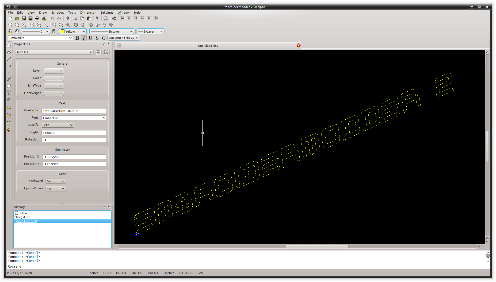
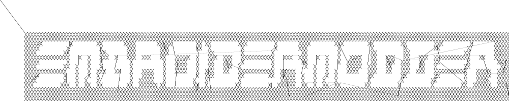
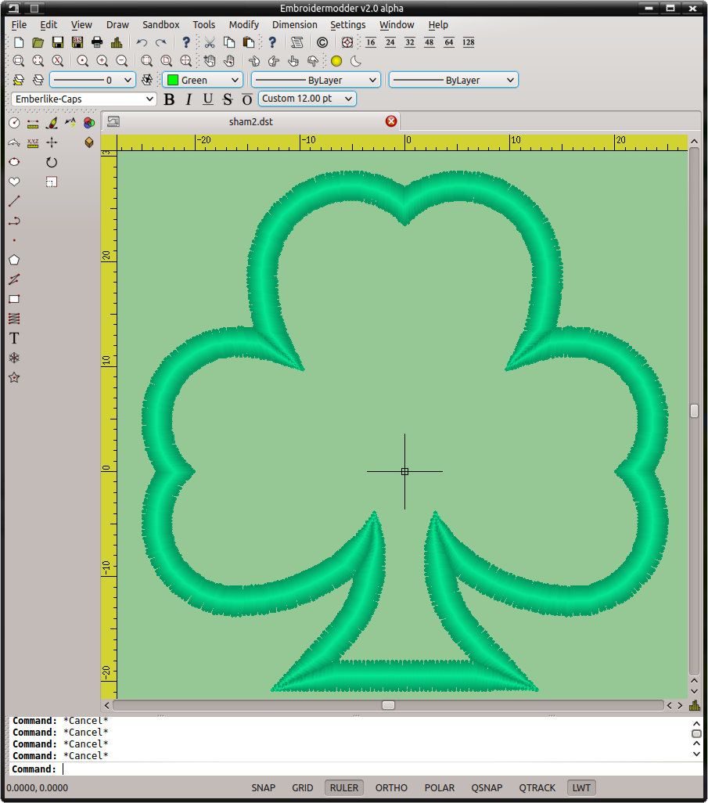

\mainpage Overview
\version 2.0.0-alpha
\author The Embroidermodder Team

This folder contains the GUI and application code for the development version Embroidermodder 2 using Dear ImGui and GLFW.

Stuff that is now supposed to be generated by Doxygen:

\todo Bibliography style to plainnat.

\todo Serif font for printed docs.

\todo US letter paper version of printed docs.

(*UNDER MAJOR RESTRUCTURING, PLEASE WAIT FOR VERSION 2*)

[http://www.libembroidery.org](http://www.libembroidery.org)

Embroidermodder is a free machine embroidery application.
The newest version, Embroidermodder 2 can:

* edit and create embroidery designs
* estimate the amount of thread and machine time needed to stitch a design
* convert embroidery files to a variety of formats
* upscale or downscale designs
* run on Windows, Mac and Linux

Embroidermodder 2 is very much a work in progress since we're doing a ground
up rewrite to an interface in C using the GUI toolkit SDL2.
The reasoning for this is detailed in the issues tab.

For a more in-depth look at what we are developing read our 
[website]\url{https://www.libembroidery.org} which includes these docs as well as the up-to 
date printer-friendly versions. These discuss recent changes, plans and has user and developer 
guides for all the Embroidermodder projects.

To see what we're focussing on right now, see the [Open Collective 
News]\url{https://opencollective.com/embroidermodder}.

The current printer-friendly version of the manual
is (here)[https://www.libembroidery.org/embroidermodder_2.0.0-alpha_manual.pdf].

\subsection license License

The source code is under the terms of the zlib license: see `LICENSE.md` in the source code directory.

Permission is granted to copy, distribute and/or modify this document
under the terms of the GNU Free Documentation License, Version 1.3
or any later version published by the Free Software Foundation;
with no Invariant Sections, no Front-Cover Texts, and no Back-Cover Texts.

A copy of the license is included in the section entitled "GNU Free Documentation License".

\subsection the-embroidermodder-team The Embroidermodder Project and Team

The _Embroidermodder 2_ project is a collection of small software utilities for
manipulating, converting and creating embroidery files in all major embroidery
machine formats. The program _Embroidermodder 2_ itself is a larger graphical
user interface (GUI) which is at the heart of the project.

The tools and associated documents are:

* This website ([`www.libembroidery.org`](https://www.libembroidery.org)), which is maintained [here](https://github.com/Embroidermodder/www.libembroidery.org).
* [The manual](https://www.libembroidery.org/embroidermodder_2.0_manual.pdf) covering all these projects.
* The GUI (`embroidermodder`), maintained [here](https://github.com/Embroidermodder/embroidermodder).
* The core library of low-level functions: [libembroidery](https://github.com/Embroidermodder/libembroidery).
* The CLI `embroider` which is part of [libembroidery](https://github.com/Embroidermodder/libembroidery).
* Mobile embroidery format viewers and tools ([`EmbroideryMobile`](https://github.com/Embroidermodder/embroiderymobile))).
* Specs for an open hardware embroidery machine called Embroiderbot (not started yet) which is also part of [libembroidery](https://github.com/Embroidermodder/libembroidery).

They are all tools to make the standard
user experience of working with an embroidery machine better without expensive
software which is locked to specific manufacturers and formats. But ultimately
we hope that the core _Embroidermodder 2_ is a practical, ever-present tool in
larger workshops, small cottage industry workshops and personal hobbyist's
bedrooms.

Embroidermodder 2 is licensed under the zlib license and we aim to keep all of
our tools open source and free of charge. If you would like to support the
project check out our [Open Collective](https://opencollective.com/embroidermodder) group. If you would like to help, please
join us on GitHub. This document is written as developer training as well
helping new users (see the last sections) so this is the place to learn how
to start changing the code.

The Embroidermodder Team is the collection of people who've submitted
patches, artwork and documentation to our three projects.
The team was established by Jonathan Greig and Josh Varga.
The full list of contributors who wish to be credited is [here](https://www.libembroidery.org/docs/credits/).

\section about About

\subsection the-embroidermodder-team The Embroidermodder Project and Team

The _Embroidermodder 2_ project is a collection of small software utilities for
manipulating, converting and creating embroidery files in all major embroidery
machine formats. The program _Embroidermodder 2_ itself is a larger graphical
user interface (GUI) which is at the heart of the project.

The tools and associated documents are:

* This manual which covers all subprojects.
* The website ([`www.libembroidery.org`](https://www.libembroidery.org)), which is maintained [here](https://github.com/Embroidermodder/www.libembroidery.org).
* Mobile embroidery format viewers and tools [`EmbroideryMobile`](https://github.com/Embroidermodder/EmbroideryMobile).
* The core library of functions ([`libembroidery`](https://github.com/Embroidermodder/libembroidery)) and its manual.
* The Python version of the library of functions (`libembroidery-python`) which is part of [`libembroidery`](https://github.com/Embroidermodder/libembroidery).
* The CLI (`embroider`) which is part of [`libembroidery`](https://github.com/Embroidermodder/libembroidery).
* Specs for an open hardware embroidery machine called Embroiderbot (not started yet) which is part of [`libembroidery`](https://github.com/Embroidermodder/libembroidery).
* The GUI (`embroidermodder`), this repository.

They all tools to make the standard
user experience of working with an embroidery machine better without expensive
software which is locked to specific manufacturers and formats. But ultimately
we hope that the core _Embroidermodder 2_ is a practical, ever-present tool in
larger workshops, small cottage industry workshops and personal hobbyist's
bedrooms.

Embroidermodder 2 is licensed under the zlib license and we aim to keep all of our tools open 
source and free of charge. If you would like to support the project check out our [Open 
Collective](https://opencollective.com/embroidermodder) group. If you would like to help, 
please join us on GitHub. This document is written as developer training as well helping new 
users (see the last sections) so this is the place to learn how to start changing the code.

The Embroidermodder Team is the collection of people who've submitted
patches, artwork and documentation to our three projects.
The team was established by Jonathan Greig and Josh Varga.
The full list is actively maintained below.

\subsection Credits for Embroidermodder 2, libembroidery and all other related code

If you have contributed and wish to be added to this list, alter the [README on Embroidermodder 
github page](https://github.com/Embroidermodder/Embroidermodder) and we'll copy it to the 
libembroidery source code since that is credited to "The Embroidermodder Team".

\subsection embroidermodder-1 "Embroidermodder 1"

The Embroidermodder Team is also inspired by the original Embroidermodder that was built by 
Mark Pontius and the same Josh Varga on SourceForge which unfortunately appears to have died 
from linkrot. We may create a distribution on here to be the official "legacy" Embroidermodder 
code but likely in a seperate repository because it's GNU GPL v3 and this code is written to be 
zlib (that is, permissive licensed) all the way down.

One reason why this is useful is that the rewrite by Jonathan Greig, John Varga and Robin Swift 
for Embroidermodder 2 should have no regressions: no features present in v1 should be missing 
in v2.

\subsection features Features

Embroidermodder 2 has many advanced features that enable you to create awesome designs quicker, tweak existing designs to perfection, and can be fully customized to fit your workflow.

A summary of these features:

* Cross Platform
* Realistic rendering
* Various grid types and auto-adjusting rulers
* Many measurement tools
* Add text to any design
* Supports many formats
* Batch Conversion
* Scripting API

\subsubsection cross-platform Cross Platform

If you use multiple operating systems, it's important to choose software that works on all of them.

Embroidermodder 2 runs on Windows, Linux and Mac OS X. Let's not forget the [Raspberry 
Pi](http://www.raspberrypi.org).


\subsubsection section Realistic Rendering

It is important to be able to visualize what a design will look like when stitched and our 
pseudo ``3D'' realistic rendering helps achieve this.

Realistic rendering sample \#1:


Realistic rendering sample \#2:


Realistic rendering sample \#3:


Various grid types and auto-adjusting rulers

Making use of the automatically adjusting ruler in conjunction with the grid will ensure your 
design is properly sized and fits within your embroidery hoop area.

Use rectangular, circular or isometric grids to construct your masterpiece!

Multiple grids and rulers in action:


\subsubsection section Many measurement tools

Taking measurements is a critical part of creating great designs. Whether you are designing 
mission critical embroidered space suits for NASA or some other far out design for your next 
meet-up, you will have precise measurement tools at your command to make it happen. You can 
locate individual points or find distances between any 2 points anywhere in the design!

Take quick and accurate measurements:


\subsubsection section Add text to any design

Need to make company apparel for all of your employees with individual names on them? No sweat. 
Just simply add text to your existing design or create one from scratch, quickly and easily. 
Didn't get it the right size or made a typo? No problem. Just select the text and update it 
with the property editor.

Add text and adjust its properties quickly:



\subsubsection section Supports many formats

Embroidery machines all accept different formats. There are so many formats available that it 
can sometimes be confusing whether a design will work with your machine.

Embroidermodder 2 supports a wide variety of embroidery formats as well as several vector 
formats, such as SVG and DXF. This allows you to worry less about which designs you can use.

\subsubsection batch-conversion Batch Conversion

Need to send a client several different formats? Just use libembroidery-convert, our command 
line utility which supports batch file conversion.

There are a multitude of formats to choose from:


\subsubsection scripting-api Scripting API

If you've got programming skills and there is a feature that isn't currently available that you 
absolutely cannot live without, you have the capability to create your own custom commands for 
Embroidermodder 2. We provide an QtScript API which exposes various application functionality 
so that it is possible to extend the application without requiring a new release. If you have 
created a command that you think is worth including in the next release, just [contact 
us](contact.html) and we will review it for functionality, bugs, and finally inclusion.

An Embroidermodder 2 command excerpt:


\subsection build-and-install "Build and Install"

Assuming you already have the SDL2 libraries you can proceed to using the fast build, which 
assumes you want to build and test locally.

The fast build should be:

    bash build.sh

or, on Windows:

    .\build.bat

Then run using the `run.bat` or `run.sh` scripts in the build/ directory.

Otherwise, follow the instructions below.

If you plan to install the dev version to your system (we recommend you wait for the official 
installers and beta release first) then use the CMake build instead.

\subsubsection install-desktop Install on Desktop

We recommend that if you want to install the development version you use the CMake build. Like 
this:

    git submodule init
    git submodule update

    mkdir build
    cd build
    cmake ..
    cmake --build .
    sudo cmake --install .

These lines are written into the file:

    ./build_install.sh

On Windows use the next section.

\section about "About"

\subsection core-development-team "Core Development Team"

Embroidermodder 2:

  * [Jonathan Greig](https://github.com/redteam316)
  * [Josh Varga](https://github.com/JoshVarga)
  * [Robin Swift](https://github.com/robin-swift)

Embroidermodder 1:

  * [Josh Varga](https://github.com/JoshVarga)
  * [Mark Pontius](http://sourceforge.net/u/mpontius/profile)

\subsection history History

Embroidermodder 1 was started by Mark Pontius in 2004 while staying up all night with his son in his first couple months. When Mark returned 
to his day job, he lacked the time to continue the project. Mark made the decision to focus on his family and work, and in 
2005, Mark gave full control of the project to Josh Varga so that Embroidermodder could continue its growth.

Embroidermodder 2 was conceived in mid 2011 when Jonathan Greig and Josh Varga discussed the possibility of making a cross-platform version.
It is currently in active development and will run on GNU/Linux, Mac OS X, Microsoft Windows and Raspberry Pi.

All <a href="downloads.html">Embroidermodder downloads</a> are hosted on SourceForge.

The <a href="http://sourceforge.net/p/embroidermodder/code/HEAD/tree/embroidermodder1">source code for Embroidermodder 1</a> has always been hosted on Sourceforge.

The <a href="https://github.com/Embroidermodder/Embroidermodder">source code for Embroidermodder 2</a> was moved to GitHub on July 18, 2013.

The <a href="https://github.com/Embroidermodder/Embroidermodder.github.io">website for Embroidermodder</a> was moved to GitHub on September 9, 2013.

\section contact Contact us

For general questions email:

<a href="mailto:embroidermodder@gmail.com">embroidermodder at gmail.com</a>

To request a new feature  <a href="https://github.com/Embroidermodder/Embroidermodder/issues">open an issue on the main Embroidermodder GitHub repository</a>. We'll move it to the correct repository.

\section downloads Downloads

\subsection alpha-build Alpha Build

This is a highly experimental build: we recommend users wait for the beta release when the basic features
are functional.

Visit our [GitHub Releases page](https://github.com/Embroidermodder/Embroidermodder/releases/tag/alpha)
for the current build. Unfortunately, earlier builds went down with the Sourceforge page we hosted them on.

\section . .

_(UNDER MAJOR RESTRUCTURING, PLEASE WAIT FOR VERSION 2)_

Embroidermodder is a free machine embroidery application.
The newest version, Embroidermodder 2 can:

* edit and create embroidery designs
* estimate the amount of thread and machine time needed to stitch a design
* convert embroidery files to a variety of formats
* upscale or downscale designs
* run on Windows, Mac and Linux

For more information, see our website \cite{thewebsite}.

Embroidermodder 2 is very much a work in progress since we're doing a ground up rewrite to an 
interface in Python using the GUI toolkit Tk. The reasoning for this is detailed in the issues 
tab.

For a more in-depth look at what we are developing read the developer notes (link to dev notes 
section). This discusses recent changes in a less formal way than a changelog (since this 
software is in development) and covers what we are about to try.

\subsection Documentation

The documentation is in the form of the website (included in the `docs/` directory) and the 
printed docs in this file.

\subsubsection section Development

If you wish to develop with us you can chat via the contact email on the 
[website]\url{https://www.libembroidery.org} or in the issues tab on the [github 
page]\url{https://github.com/Embroidermodder/Embroidermodder/issues}. People have been polite 
and friendly in these conversations and I (Robin) have really enjoyed them. If we do have any 
arguments please note we have a [Code of Conduct](CODE\_OF\_CONDUCT.md) so there is a 
consistent policy to enforce when dealing with these arguments.

The first thing you should try is building from source using the [build advice](link to build) 
above. Then read some of the [development notes](link to dev notes.md) to get the general 
layout of the source code and what we are currently planning.

\subsubsection section Testing

To find unfixed errors run the tests by launching from the command line with:

    $ embroidermodder --test

then dig through the output. It's currently not worth reporting the errors, since
there are so many but if you can fix anything reported here you can submit a PR.

\subsection Code Optimisations and Simplifications

\subsubsection section Geometry

The geometry is stored, processed and altered via libembroidery. See the Python specific part 
of the documentation for libembroidery for this. What the code in Embroidermodder does is make 
the GUI widgets to change and view this information graphically.

For example if we create a circle with radius 10mm and center at `(20mm, 30mm)` then fill it 
with stitches the commands would be

```Python3
    from libembroidery import Pattern, Circle, Vector, satin
    circle = Circle(Vector(20, 30), 10)
    pattern = Pattern()
    pattern.add_circle(circle, fill=satin)
    pattern.to_stitches()
```

but the user would do this through a series of GUI actions:

1. Create new file
2. Click add circle
3. Use the Settings dialog to alter the radius and center
4. Use the fill tool on circle
5. Select satin from the drop down menu

So EM2 does the job of bridging that gap.

\subsubsection postscript-support Postscript Support

In order to safely support user contributed/shared data that can define, for example, double to 
double functions we need a consistent processor for these descriptions.

Embroidermodder backends to the postscript interpreter included in libembroidery to accomplish 
this.

For example the string:

    5 2 t mul add

is equivalent to the expression:

    2*t + 5

The benefit of not allowing this to simply be a Python expression is that it is safe against 
malicious use, or accidental misuse. The program can identify whether the output is of the 
appropriate form and give finitely many calculations before declaring the function to have run 
too long (stopping equations that hang).

To see examples of this see the `assets/shapes/*.ps` files.

\subsubsection svg-icons SVG Icons

To make the images easier to alter and restyle we could switch to svg icons. There's some code 
in the git history to help with this.

\subsubsection the-actions-system The Actions System

In order to simplify the development of a GUI that is flexible and easy to understand to new 
developers we have a custom action system that all user actions will go via an `actuator` that 
takes a string argument. By using a string argument the undo history is just an array of 
strings.

The C `action_hash_data` struct will contain: the icon used, the labels for the menus and 
tooltips and the function pointer for that action. There will be an accompanying argument for 
this function call, currently being drafted as `action_call`. So when the user makes a function 
call it should contain information like the mouse position, whether special key is pressed etc.

\subsubsection accessibility Accessibility

Software can be more or less friendly to people with dylexia, partial sightedness, reduced 
mobility and those who don't speak English. Embroidermodder 2 has, in its design, the following 
features to help:

* icons for everything to reduce the amount of reading required
* the system font is configurable: if you have a dyslexia-friendly font you can load it
* the interface rescales to help with partial-sightedness
* the system language is configurable, unfortunately the docs will only be in English but we can try to supply lots of images of the interface to make it easier to understand as a second language
* buttons are remappable: XBox controllers are known for being good for people with reduced mobility so remapping the buttons to whatever setup you have should help

Note that most of these features will be released with version 2.1, which is planned for around 
early 2023.

\subsubsection sample-files Sample Files

Various sample embroidery design files can be found in the `embroidermodder2/samples` folder.

\subsubsection shortcuts Shortcuts

A shortcut can be made up of zero or more modifier keys and at least one non-modifier key 
pressed at once.

To make this list quickly assessable, we can produce a list of hashes which are simply the 
flags ORed together.

The shortcuts are stored in the csv file `shortcuts.csv` as a 5-column table with the first 4 
columns describing the key combination. This is loaded into the shortcuts `TABLE`. Each tick 
the program checks the input state for this combination by first translating the key names into 
indices for the key state, then checking for whether all of them are set to true.

\subsubsection removed-elements Removed Elements

So I've had a few pieces of web infrastructure fail me recently and I think it's worth noting. 
An issue that affects us is an issue that can effect people who use our software.

\subsubsection qt-and-dependencies Qt and dependencies

Downloading and installing Qt has been a pain for some users (46Gb on possibly slow 
connections).

I'm switching to FreeGLUT 3 (which is a whole other conversation) which means we can ship it 
with the source code package meaning only a basic build environment is necessary to build it.

\subsubsection social-platform Social Platform

Github is giving me a server offline (500) error and is still giving a bad ping.

So... all the issues and project boards etc. being on Github is all well and good assuming that 
we have our own copies. But we don't if Github goes down or some other major player takes over 
the space and we have to move (again, since this started on SourceForge).

This file is a backup for that which is why I'm repeating myself between them.

\subsubsection opengl OpenGL

OpenGL rendering within the application. This will allow for Realistic Visualization - Bump 
Mapping/OpenGL/Gradients?

This should backend to a C renderer or something.

\subsubsection configuration-data-ideas Configuration Data Ideas

Embroidermodder should boot from the command line regardless of whether it is or is not 
installed (this helps with testing and running on machines without root). Therefore, it can 
create an initiation file but it won't rely on its existence to boot: 
`~/.embroidermodder/config.json`.

* Switch colors to be stored as 6 digit hexcodes with a `#`.
* We've got close to a hand implemented ini read/write setup in `settings.py`.

\subsubsection section Distribution

When we release the new pip wheel we should also package:

* `.tar.gz` and `.zip` source archive.
* Debian package
* RPM package

Only do this once per minor version number.

\subsubsection scripting-overhaul Scripting Overhaul

Originally Embroidermodder had a terminal widget, this is why we removed it.

> **ROBIN**
>
> I think supporting scripting within Embroidermodder doesn't make sense.
>
> All features that use scripting can be part of libembroidery instead.
> Users who are capable of using scripting won't need it, they can alter their 
> embroidery files in CSV > format, or import pyembroidery to get access.
> It makes maintaining the code a lot more complicated, especially if we move 
> away from Qt.
> Users who don't want the scripting feature will likely be confused by it, 
> since we say that's what libembroidery, embroider and pyembroidery are for.
> 
> How about a simpler ``call user shell`` feature? Similar to texmaker we just 
> call system on a batch or shell script supplied by the user and it processes 
> the file directly then the software reloads the file. Then we aren't parsing 
> it directly.
> 
> I don't want to change this without Josh's support because it's a fairly major change.
> 
> **JOSH**
>
> I totally agree.
>
> I like the idea of scripting just so people that know how to code could write 
> their own designs without needing to fully build the app. Scripting would be 
> a very advanced feature that most users would be confused by. Libembroidery 
> would be a good fit for advanced features.
>
> Now we are using Python (again, sort of) this would be a lot more natural,
> perhaps we could boot the software without blocking the shell so they can
> interact?

\todo Screenshot a working draft to demonstrate.

\subsubsection perennial-jobs Perennial Jobs

\todo (perennial) Check for memory leaks
\todo (perennial) Clear compiler warnings on `-Wall -ansi -pedantic` for C.
\todo (perennial) Write new tests for new code.
\todo (perennial) Get Embroidermodder onto the current version of libembroidery.
\todo (perennial) PEP7 compliance.
\todo (perennial) Better documentation with more photos/screencaps.

\subsubsection full-test-suite Full Test Suite

(This needs a hook from Embroidermodder to embroider's full test suite.)

The flag `--full-test-suite` runs all the tests that have been written.
Since this results in a lot of output the details are both to stdout
and to a text file called `test_matrix.txt`.

Patches that strictly improve the results in the `test_matrix.txt` over
the current version will likely be accepted and it'll be a good place
to go digging for contributions. (Note: strictly improve means that
the testing result for each test is as good a result, if not better.
Sacrificing one critera for another would require some design work
before we would consider it.)

\subsubsection symbols Symbols

Symbols use the SVG path syntax.

In theory, we could combine the icons and symbols systems, since they could be
rendered once and stored as icons in Qt. (Or as textures in FreeGLUT.)

Also we want to render the patterns themselves using SVG syntax, so it would
save on repeated work overall.

\subsection features Features

\subsubsection bindings Bindings

Bindings for libembroidery are maintained for the languages we use internally
in the project, for other languages we consider that the responsibility of
other teams using the library.

So libembroidery is going to be supported on:

* `C` (by default)
* `C++` (also by default)
* `Java` (for the Android application MobileViewer)
* `Swift` (for the iOS application iMobileViewer)

For `C#` we recommend directly calling the function directly
using the DllImport feature:

    [DllImport("libembroidery.so", EntryPoint="readCsv")]

see this StackOverflow discussion for help: [https://stackoverflow.com/questions/11425202/is-it-possible-to-call-a-c-function-from-c-net](https://stackoverflow.com/questions/11425202/is-it-possible-to-call-a-c-function-from-c-net).

For Python you can do the same using ctypes: [https://www.geeksforgeeks.org/how-to-call-a-c-function-in-python/](https://www.geeksforgeeks.org/how-to-call-a-c-function-in-python/).

\subsubsection other-supported-thread-brands Other Supported Thread Brands

The thread lists that aren't preprogrammed into formats but are indexed in
the data file for the purpose of conversion or fitting to images/graphics.

* Arc Polyester
* Arc Rayon
* Coats and Clark Rayon
* Exquisite Polyester
* Fufu Polyester
* Fufu Rayon
* Hemingworth Polyester
* Isacord Polyester
* Isafil Rayon
* Marathon Polyester
* Marathon Rayon
* Madeira Polyester
* Madeira Rayon
* Metro Polyester
* Pantone
* Robison Anton Polyester
* Robison Anton Rayon
* Sigma Polyester
* Sulky Rayon
* ThreadArt Rayon
* ThreadArt Polyester
* ThreaDelight Polyester
* Z102 Isacord Polyester

\subsection gui-design GUI Design

Embroidermodder 2 was written in C++/Qt5 and it was far too complex. We had issues with people
not able to build from source because the Qt5 libraries were so ungainly. So I decided to do a
rewrite in C/SDL2 (originally FreeGLUT, but that was a mistake) with data stored as YAML. This
means linking 4-7 libraries depending on your system which are all well supported and widely available.

This is going well, although it's slow progress as I'm trying to keep track of the design while
also doing a ground up rewrite. I don't want to throw away good ideas. Since I also write code
for libembroidery my time is divided.
Overview of the UI rewrite

(Problems to be solved in brackets.)

It's not much to look at because I'm trying to avoid using an external
widgets system, which in turn means writing things like toolbars and menubars
over. If you want to get the design the actuator is the heart of it.

Without Qt5 we need a way of assigning signals with actions, so this is what
I've got: the user interacts with a UI element, this sends an integer to the
actuator that does the thing using the current state of the mainwindow struct
of which we expect there to be exactly one instance. The action is taken out
by a jump table that calls the right function (most of which are missing in
action and not connected up properly). It also logs the number, along with
key parts of the main struct in the undo history (an unsolved problem because
we need to decide how much data to copy over per action). This means undo,
redo and repeat actions can refer to this data.

\subsection to-do To Do

These should be sorted into relevant code sections. \todo sort todo list.

\todo (2.0.0-alpha1) Statistics from 1.0, needs histogram

\todo (2.0.0-alpha1) Saving DST/PES/JEF (varga)

\todo (2.0.0-alpha1) Saving CSV/SVG (rt) + CSV read/write UNKNOWN interpreted as COLOR bug

\todo (2.0.0-alpha2) Notify user of data loss if not saving to an object format.

\todo (2.0.0-alpha2) Import Raster Image

\todo (2.0.0-alpha2) SNAP/ORTHO/POLAR

\todo (2.0.0-alpha2) Layer Manager + LayerSwitcher DockWidget

\todo (2.0.0-alpha2) Reading DXF

\todo (2.0.0-alpha3) Writing DXF

\todo (2.0.0-alpha3) Up and Down keys cycle thru commands in the command prompt

\todo (2.0.0-alpha3) Amount of Thread \| Machine Time Estimation (also allow customizable times for setup, color changes, manually 
trimming jump threads, etc...that way a realistic total time can be estimated)

\todo (2.0.0-alpha3) Otto Theme Icons - whatsthis icon doesn't scale well, needs redone

\todo (2.0.0-alpha3) embroidermodder2.ico 16 x 16 looks horrible

\todo (2.0.0-alpha4) CAD Command: Arc (rt)

\todo (2.0.0-alpha4) automate changelog and write to a javascript file for the docs: git log --pretty=tformat:'<a href="\url{https://github.com/Embroidermodder/Embroidermodder/commit/%H}">%s</a>'

\todo (2.0.0-beta1) Custom Filter Bug - doesn't save changes in some cases

\todo (2.0.0-beta1) Cannot open file with `#` in name when opening multiple files (works fine when opening the single file)

\todo (2.0.0-beta1) Closing Settings Dialog with the X in the window saves settings rather than discards them

\todo (2.0.0-beta1) Advanced Printing

\todo (2.0.0-beta1) Filling Algorithms (varga)

\todo (2.0.0-beta1) Otto Theme Icons - beta (rt) - Units, Render, Selectors

\todo (2.0.0-rc1) QDoc Comments

\todo (2.0.0-rc1) Review KDE4 Thumbnailer

\todo (2.0.0-rc1) Documentation for libembroidery \| formats

\todo (2.0.0-rc1) HTML Help files

\todo (2.0.0-rc1) Update language translations

\todo (2.0.0-rc1) CAD Command review: line

\todo (2.0.0-rc1) CAD Command review: circle

\todo (2.0.0-rc1) CAD Command review: rectangle

\todo (2.0.0-rc1) CAD Command review: polygon

\todo (2.0.0-rc1) CAD Command review: polyline

\todo (2.0.0-rc1) CAD Command review: point

\todo (2.0.0-rc1) CAD Command review: ellipse

\todo (2.0.0-rc1) CAD Command review: arc

\todo (2.0.0-rc1) CAD Command review: distance

\todo (2.0.0-rc1) CAD Command review: locatepoint

\todo (2.0.0-rc1) CAD Command review: move

\todo (2.0.0-rc1) CAD Command review: rgb

\todo (2.0.0-rc1) CAD Command review: rotate

\todo (2.0.0-rc1) CAD Command review: scale

\todo (2.0.0-rc1) CAD Command review: singlelinetext

\todo (2.0.0-rc1) CAD Command review: star

\todo (2.0.0-rc1) Clean up all compiler warning messages, right now theres plenty :P

\todo (2.0) tar.gz archive

\todo (2.0) zip archive

\todo (2.0) Debian Package (rt)

\todo (2.0) NSIS Installer (rt)

\todo (2.0) Mac Bundle?

\todo (2.0) press release

\todo (2.x/ideas) libembroidery.mk for MXE project (refer to qt submodule packages for qmake based building. Also refer to plibc.mk for example of how write an update macro for github.)

\todo (2.x/ideas) libembroidery safeguard for all writers - check if the last stitch is an END stitch. If not, add an end stitch in the writer and modify the header data if necessary.

\todo (2.x/ideas) Cut/Copy - Allow Post-selection

\todo (2.x/ideas) CAD Command: Array

\todo (2.x/ideas) CAD Command: Offset

\todo (2.x/ideas) CAD Command: Extend

\todo (2.x/ideas) CAD Command: Trim

\todo (2.x/ideas) CAD Command: BreakAtPoint

\todo (2.x/ideas) CAD Command: Break2Points

\todo (2.x/ideas) CAD Command: Fillet

\todo (2.x/ideas) CAD Command: Chamfer

\todo (2.x/ideas) CAD Command: Split

\todo (2.x/ideas) CAD Command: Area

\todo (2.x/ideas) CAD Command: Time

\todo (2.x/ideas) CAD Command: PickAdd

\todo (2.x/ideas) CAD Command: Product

\todo (2.x/ideas) CAD Command: Program

\todo (2.x/ideas) CAD Command: ZoomFactor

\todo (2.x/ideas) CAD Command: GripHot

\todo (2.x/ideas) CAD Command: GripColor \| GripCool

\todo (2.x/ideas) CAD Command: GripSize

\todo (2.x/ideas) CAD Command: Highlight

\todo (2.x/ideas) CAD Command: Units

\todo (2.x/ideas) CAD Command: Grid

\todo (2.x/ideas) CAD Command: Find

\todo (2.x/ideas) CAD Command: Divide

\todo (2.x/ideas) CAD Command: ZoomWindow (Move out of view.cpp)

\todo (2.x/ideas) Command: Web (Generates Spiderweb patterns)

\todo (2.x/ideas) Command: Guilloche (Generates Guilloche patterns)

\todo (2.x/ideas) Command: Celtic Knots

\todo (2.x/ideas) Command: Knotted Wreath

\todo (2.x/ideas) Lego Mindstorms NXT/EV3 ports and/or commands.

\todo (2.x/ideas) native function that flashes the command prompt to get users attention when using the prompt is required for a command.

\todo (2.x/ideas) libembroidery-composer like app that combines multiple files into one.

\todo (2.x/ideas) Settings Dialog, it would be nice to have it notify you when switching tabs that a setting has been changed. Adding an Apply button is what would make sense for this to happen. 

\todo (2.x/ideas) Keyboard Zooming/Panning

\todo (2.x/ideas) G-Code format?

\todo (2.x/ideas) 3D Raised Embroidery

\todo (2.x/ideas) Gradient Filling Algorithms

\todo (2.x/ideas) Stitching Simulation

\todo (2.x/ideas) RPM packages?

\todo (2.x/ideas) Reports?

\todo (2.x/ideas) Record and Playback Commands

\todo (2.x/ideas) Settings option for reversing zoom scrolling direction

\todo (2.x/ideas) Qt GUI for libembroidery-convert

\todo (2.x/ideas) EPS format? Look at using Ghostscript as an optional add-on to libembroidery...

\todo (2.x/ideas) optional compile option for including LGPL/GPL libs etc... with warning to user about license requirements.

\todo (2.x/ideas) Realistic Visualization - Bump Mapping/OpenGL/Gradients?

\todo (2.x/ideas) Stippling Fill

\todo (2.x/ideas) User Designed Custom Fill

\todo (2.x/ideas) Honeycomb Fill

\todo (2.x/ideas) Hilbert Curve Fill

\todo (2.x/ideas) Sierpinski Triangle fill

\todo (2.x/ideas) Circle Grid Fill

\todo (2.x/ideas) Spiral Fill

\todo (2.x/ideas) Offset Fill

\todo (2.x/ideas) Brick Fill

\todo (2.x/ideas) Trim jumps over a certain length.

\todo (2.x/ideas) FAQ about setting high number of jumps for more controlled trimming.

\todo (2.x/ideas) Minimum stitch length option. (Many machines also have this option too)

\todo (2.x/ideas) Add 'Design Details' functionality to libembroidery-convert

\todo (2.x/ideas) Add 'Batch convert many to one format' functionality to libembroidery-convert

\todo (2.x/ideas) EmbroideryFLOSS - Color picker that displays catalog numbers and names.

\todo (beta) Realistic Visualization - Bump Mapping/OpenGL/Gradients?

\todo (beta) Get undo history widget back (BUG).

\todo (beta) Mac Bundle, .tar.gz and .zip source archive.

\todo (beta) NSIS installer for Windows, Debian package, RPM package

\todo (beta) GUI frontend for embroider features that aren't
supported by embroidermodder: flag selector from a table

\todo (beta) Update all formats without color to check for edr or rgb files.

\todo (beta) Setting for reverse scrolling direction (for zoom, vertical pan)

\todo (beta) Keyboard zooming, panning

\todo (beta) New embroidermodder2.ico 16x16 logo that looks good at that scale.

\todo (beta) Saving dst, pes, jef.

\todo (beta) Settings dialog: notify when the user is switching tabs
that the setting has been changed, adding apply button is what would
make sense for this to happen.

\todo (beta) Update language translations.

\todo (beta) Replace KDE4 thumbnailer.

\todo (beta) Import raster image.

\todo (beta) Statistics from 1.0, needs histogram.

\todo (beta) SNAP/ORTHO/POLAR.

\todo (beta) Cut/copy allow post-selection.

\todo (beta) Layout into config.

\todo (beta) Notify user of data loss if not saving to an object format.

\todo (beta) Add which formats to work with to preferences.

\todo (beta) Cannot open file with `#` in the name when opening multiple
files but works with opening a single file.

\todo (beta) Closing settings dialog with the X in the window saves
settings rather than discarding them.

\todo (beta) Otto theme icons: units, render, selectors, what's
this icon doesn't scale.

\todo (beta) Layer manager and Layer switcher dock widget.

\todo (beta) Test that all formats read data in correct scale
(format details should match other programs).

\todo (beta) Custom filter bug -- doesn't save changes in some cases.

\todo (beta) Tools to find common problems in the source code and suggest fixes
to the developers. For example, a translation miss: that is, for any language
other than English a missing entry in the translation table should supply a
clear warning to developers.

\todo (beta) Converting Qt C++ version to native GUI C throughout.

\todo (beta) OpenGL Rendering: `Real` rendering to see what the embroidery
looks like, Icons and toolbars, Menu bar.

\todo (beta) Libembroidery interfacing: get all classes to use the proper
libembroidery types within them. So `Ellipse` has `EmbEllipse` as public
data within it.

\todo (beta) Move calculations of rotation and scaling into `EmbVector` calls.

\todo (beta) GUI frontend for embroider features that aren't supported by
embroidermodder: flag selector from a table

\todo (beta) Update all formats without color to check for edr or rgb files.

\todo (beta) Setting for reverse scrolling direction (for zoom, vertical pan)

\todo (beta) Keyboard zooming, panning

\todo (beta) Better integrated help: I don't think the help should backend to
a html file somewhere on the user's system. A better system would be a custom
widget within the program that's searchable.

\todo (beta) New embroidermodder2.ico 16x16 logo that looks good at that scale.

\todo (beta) Settings dialog: notify when the user is switching tabs that the
setting has been changed, adding apply button is what would make sense for
this to happen.

\subsection contributing Contributing

\subsubsection version-control Version Control

Being an open source project, developers can grab the latest code at any time
and attempt to build it themselves. We try our best to ensure that it will build smoothly
at any time, although occasionally we do break the build. In these instances,
please provide a patch, pull request which fixes the issue or open an issue and
notify us of the problem, as we may not be aware of it and we can build fine.

Try to group commits based on what they are related to: features/bugs/comments/graphics/commands/etc...

See the coding style [here](coding-style).

\subsubsection section Get the Development Build going

When we switch to releases we recommend using them, unless you're reporting a bug in which case you can check the development build for whether it has been patched. If this applies to you, the current development build is:

* [Linux](https://github.com/Embroidermodder/Embroidermodder/suites/8882922866/artifacts/406005099)
* [Mac OS](https://github.com/Embroidermodder/Embroidermodder/suites/8882922866/artifacts/406005101)
* [Windows](https://github.com/Embroidermodder/Embroidermodder/suites/8882922866/artifacts/406005102)

\todo (beta) Libembroidery 1.0.

\todo (beta) Better integrated help: I don't think the help should backend to a html file somewhere on the user's system. A better system would be a custom widget within the program that's searchable.

\todo (beta) EmbroideryFLOSS - Color picker that displays catalog numbers and names.

\todo (beta) Custom filter bug -- doesn't save changes in some cases.

\todo (beta) Advanced printing.

\todo (beta) Stitching simulation.

\todo (2.x/ideas) User designed custom fill.

These are key bits of reasoning behind why the GUI is built the way it is.

\subsectionTranslation of the user interface

In a given table the left column is the default symbol and the right string is the translation. 
If the translate function fails to find a translation it returns the default symbol.

So in US English it is an empty table, but in UK English
only the dialectical differences are present.

Ideally, we should support at least the 6 languages spoken at the UN. Quoting www.un.org:

> _There are six official languages of the UN. These are Arabic, Chinese, English, French, Russian and Spanish._

We're adding Hindi, on the grounds that it is one of the most commonly spoken languages and at 
least one of the Indian languages should be present.

Written Chinese is generally supported as two different symbol sets and we follow that 
convension.

English is supported as two dialects to ensure that the development team is aware of what those 
differences are. The code base is written by a mixture of US and UK native English speakers 
meaning that only the variable names are consistently one dialect: US English. As for 
documentation: it is whatever dialect the writer prefers (but they should maintain consistency 
within a text block like this one).

Finally, we have "default", which is the dominant language
of the internals of the software. Practically, this is
just US English, but in terms of programming history this
is the "C locale".

\subsection old-action-system Old action system notes

Action: the basic system to encode all user input.

This typedef gives structure to the data associated with each action
which, in the code, is referred to by the action id (an int from
the define table above).

\subsection description-of-struct DESCRIPTION OF STRUCT CONTENTS

\subsubsection label label

The action label is always in US English, lowercase,
seperated with hyphens.

For example: `new-file`.

\subsection flags

The bit based flags all collected into a 32-bit integer.

| bit(s) | description |
|--------|-------------|
| 0      | User (0) or system (1) permissions.        |
| 1-3    | The mode of input.                         |
| 4-8    | The object classes that this action        |
|        | can be applied to.                         |
| 9-10   | What menu (if any) should it be present in.|
| 11-12  | What                                       |

\subsection description Description

The string placed in the tooltip describing the action.

\section original-prompt-system Original Prompt System

NOTE: `main()` is run every time the command is started.
Use it to reset variables so they are ready to go.

NOTE: `click()` is run only for left clicks.
Middle clicks are used for panning.
Right clicks bring up the context menu.

NOTE: `move()` is optional. It is run only after
`enableMoveRapidFire()` is called. It
will be called every time the mouse moves until
`disableMoveRapidFire()` is called.

NOTE: `prompt()` is run when Enter is pressed.
`appendPromptHistory` is automatically called before `prompt()`
is called so calling it is only needed for erroneous input.
Any text in the command prompt is sent as an uppercase string.

\subsection cad CAD command review

| **ID** | **name** | **arguments** | **description** |
|--------|----------|---------------|-----------------|
| 0 | `newfile` \addindex "newfile" | none | Create a new EmbPattern with a new tab in the GUI. |
| 1 | `openfile` \addindex "openfile" | filename string | Open an EmbPattern with the supplied filename `fname`.  |
| 2 | `savefile` \addindex "savefile" | filename string | Save the current loaded EmbPattern to the supplied filname `fname`. |
| 3 | `scale` \addindex "scale" | selected objects, 1 float | Scale all selected objects by the number supplied, without selection scales the entire design |
| 4 | `circle` \addindex "circle" | mouse co-ords | Adds a circle to the design based on the supplied numbers, converts to stitches on save for stitch only formats. |
| 5 | `offset` \addindex "offset" | mouse co-ords | Shifts the selected objects by the amount given by the mouse co-ordinates.  |
| 6 | `extend` \addindex "extend" | | |
| 7 | `trim` \addindex "trim" | | |
| 8 | `break_at_point` \addindex "break-at-point" | | |
| 9 | `break_2_points` \addindex "break-2-points" | | |
| 10 | `fillet` \addindex fillet | | |
| 11 | `star` \addindex star | | |
| 12 | `singlelinetext` \addindex singlelinetext | | |
| 13 | \addindex chamfer `chamfer` | | |
| 14 | \addindex split `split` | | |
| 15 | \addindex area `area` | | |
| 16 | \addindex time `time` | | |
| 17 | \addindex pickadd `pickadd` | | |
| 16 | \addindex zoomfactor `zoomfactor` | | |
| 17 | \addindex product `product` | | |
| 18 | \addindex program `program` | | |
| 19 | \addindex zoomwindow `zoomwindow` | | |
| 20 | \addindex divide `divide` | | |
| 21 | \addindex find `find` | | |
| 22 | \addindex record `record` | | |
| 23 | \addindex playback `playback` | | |
| 24 | \addindex rotate `rotate` | | |
| 25 | \addindex rgb `rgb` | | |
| 26 | \addindex move `move` | | |
| 27 | \addindex grid `grid` | | |
| 28 | \addindex griphot `griphot` |  |  |
| 29 | \addindex gripcolor `gripcolor` | | |
| 30 | \addindex gripcool `gripcool` |  |  |
| 31 | \addindex gripsize `gripsize` |  |  |
| 32 | \addindex highlight `highlight` |  |  |
| 33 | \addindex units `units` |  |  |
| 34 | \addindex locatepoint `locatepoint` |  |  |
| 35 | \addindex distance `distance` |  |  |
| 36 | \addindex arc `arc` |  |  |
| 37 | \addindex ellipse `ellipse` |  |  |
| 38 | \addindex array `array` |  |  |
| 39 | \addindex point `point` |  |  |
| 40 | \addindex polyline `polyline` |  |  |
| 41 | \addindex polygon `polygon` |  |  |
| 42 | \addindex rectangle `rectangle` |  |  |
| 43 | \addindex line `line` |  |  |
| 44 | \addindex arc-rt `arc (rt)` |  |  |
| 45 | \addindex dolphin `dolphin` |  |  |
| 46 | \addindex heart `heart`  | | |

\subsection Actions

\subsubsection ARC
\addindex "arc"

\subsubsection CIRCLE
\addindex "circle"

\subsubsection OPEN
\addindex "open"

\page tutorials Tutorials

\section basic-features Basic Features

\subsection move-single-stitch Move a single stitch in an existing pattern

1. In the `File` menu, click `Open...`. When the open dialog appears find
  and select your file by double clicking the name of the file. Alternatively,
  left click the file once then click the `Open` button.
2. 
3. In the `File' menu

TIP: For users who prefer

\section altering-a-single-stitch Altering a Single Stitch (2022-09-19)

In this tutorial we cover the scenarios where:

1. you have a design that you want to move a few points in but make no major changes
2. you have a design that you want to remove a few stitches from
3. you have a design that has some stitches in the wrong colour

In all cases, open Embroidermodder 2 and use `File > Open` to get the open file dialog.

(TO BE COMPLETED.)

\subsection convert-patterns Convert one pattern to another format

1. In the `File` menu, click `Open...`.
2. The 
3. In the dropdown menu within the save dialog select the 

\section advanced-features Advanced Features

\page Post History

\seciton open-collective Open Collective and New Plan (2021-12-19)

Hi, welcome to our first update after switching to Open Collective.

I hope that we can get people excited about open software and hardware for embroidery again. Clearly there was some real talent and effort from Jonathon, Mark  and other contributors in making this happen. Hopefully, Josh and I can make these programs a standard fixture of garage workshops by making them easy to install, modify, build and distribute.

I've sketched out a timetable for the development of Embroidermodder, I feel I should share it with everyone:

| *Date* | *Event* |
|------|-------|
| _Dec 2021 - Jan 2022_ | libembroidery 1.0 features, particularly the basic file format support and fills Bugfixing, Testing, QA for libembroidery |
| _31st of Jan 2022_ | libembroidery 1.0 will be released, then updates will slow down and the Embroidermodder 2 development version will be fixed to the API of this version. |
| _Feb 2022_ | An overview of what has changed will be written up for the website as a news update Better documentation of libembroidery. |
| _Feb-April 2022_ | Finish the conversion to new GUI toolkit |
| _April-May 2022_ |  Finish all the targets in the Design, or assign them to 2.1. |
| _May-June 2022_ |  Stop pushing new features. Bugfixing, Testing, QA for Embroidermodder 2 |
| _Summer Solstice (21st of June) 2022_ | Embroidermodder 2 is officially released. Distribute NSIS installer, debian package, fedora package, mac bundle and source archives |
| _July 2022_ | News and Documentation work for Embroidermodder 2 |

_Embroidermodder 2_ is a zlib licensed software and we endevour to keep it free and well documented. Check out our [main github page](https://github.com/Embroidermodder/Embroidermodder) to see.

Cheers,

Robin

\section fast-forward Fast Forward (2014-02-13)

There have been some changes that happened over the past several months:

The launch of the Kickstarter campaign was delayed but is still going to happen. Unless there are other unforeseen setbacks,
the revised plan is to launch our campaign on March 17.

We have started setup of a nightly build/continuous integration system using Travis-CI.
This is important as it will allow quicker bug fixes and increased stability long term. Currently
this is only available for 64-bit Linux builds but will eventually include OSX, Windows and Arduino.

We have also improved the stability and improved the API of our backend library: libembroidery. The API is
still changing but we now can produce standalone static and shared versions of libembroidery. Another notable
change is that there are now experimental Delphi and Lazarus(FreePascal) bindings in the works for libembroidery, contributed by <a href="https://github.com/x2nie">x2nie</a>.

Last but not least, I have a demonstration of our libembroidery code embedded on an Arduino. The video below simulates the stitching
by drawing it to a 2.8" TFT display (v1) made by <a href="https://adafruit.com">Adafruit</a>. It's really fast so I slowed it down for the video.
Instead of drawing, we could change it to control motors and other hardware to create an open source embroidery machine.
This is what the brain of an embroidery machine looks like and it just needs a heart and body. Enjoy the <a href="https://www.youtube.com/watch?v=KqiKfn4lxBk">video</a>!
<div class="video"><iframe src="https://www.youtube.com/embed/KqiKfn4lxBk" frameborder="0" allowfullscreen></iframe></div>

--Jonathan

[Permanent link to this article](news0.html#demo)

\section jan22news January 2022 Development Notes For Embroidermodder 2 (2022-01-31)

Hi backers,

since the last update development has been focused on mostly not user-facing aspects of the program. This is what we planned in the timetable, aiming to release the libembroidery library for the end of the month.

The idea being that if we can fix an API for libembroidery early, it will focus development into a program that remains more consistent by the height of the Summer.

Unfortunately, this was too ambitious. But we can discuss what has changed, and why a later date is better than focusing on hitting this milestone.

\subsection broad-development-goals Broad Development Goals

We want:

 * A small codebase.
 * A separation of code and data in procedural style.
 * A separation of basic library functions from GUI code.
 * A build system without non-standard dependencies (i.e. not including windows.h, X11, GL).
 * A software that runs without installation
 * A software that can keep records of its state that can be loaded on reboot

To meet these goals we are making a C/FreeGLUT application:

 * Runs on more systems because it has less (and less high level) dependencies.
 * Requires less specialist knowledge from our potential new developers of Qt, C++ and the build system.
 * Compiles with less faff since the only dependencies are the graphics libraries of the host system (meeting broad development goal 4).

Other decisions made to meet these goals are detailed below.

\subsection new-settings-system The New Settings System

In the attempt to convert the mostly C++ codebase to C, we developed a basic system for storing the data of Embroidermodder (including all the icons) as a single JSON file weighing in at about 6Mb.

This allows the second broad development goal to be met.

\subsection reducing-reliance-on-qt5 Reducing Reliance on Qt5

The FreeGLUT variant of the code (in gui.c) will eventually be the software.

The broad development goals should make that very complex change a sequence of smaller, less complex changes. For example: breaking apart highly object-oriented code that relies on high level Qt function calls into data and code and then seperating out the code parts into C and C++ functions.

\subsection color-palettes Color Palettes

Using a custom script we converted all the icons into xpm, then using another reduced their palettes down to 16 colors + transparency.

This hasn't affected their appearance significantly, and makes making a global GUI palette feasible. With a global GUI palette we can make icon themes be a simple remap of the palette.

\subsection conclusion Conclusion

Overall, the software is easier to understand. But not easy enough for it to be worth committing to extensive documentation that will likely have to change. This also makes deciding on a API difficult.

Based on this, a short term aim can be writing more high level documentation like this update to clarify (even just to the team) why we made the decisions we have.

Cheers,

Robin Swift

The Embroidermodder Team

\section June 2022 Backer Update (2022-06-22)

Hi backers,

since it's mainly me developing as a hobbyist at the moment successes are rare so I thought it would be good to share these with you.

\subsection working-fill-algorithm Working Fill Algorithms

I've managed to get two fills working from the command line using the commands:

```
$ embroider --fill input_image.ppm 130 output.dst
$ embroider --cross-stitch input_image.ppm 130 output.dst
```

So given this version of the banner logo:


It is cross-stitched like this:



There are major limitations, it requires an input that has depth 8 and is 1000x1000 pixels and it only takes in ppm format images. Your other format images could be converted to this format using:

```
$ convert input.png -depth 8 -geometry 1000x1000 output.ppm
```

A command like this will be embedded into the software to allow more image types but it would require the user to install imagemagick first.

Here's another example using the imagemagick wizard:


\subsection working-render-algorithm Working Render Algorithm

The renders shown above were also made by the program using the commands:

```
$ embroider --render input.dst output.ppm
$ convert output.ppm output.png
```

\subsection timetable Timetable

As for the timetable, obviously that was too ambitious given the lack of a large team and the slow growth of interest. A tentative timetable is on the README, but that's uncertain as long as the major rewrite to C/SDL2 is underway, hopefully it'll still be a 2.0 release this year.

I'll try and share some more examples next month!

Cheers,

Robin

\subpage kickstarter-live Our Kickstarter Crowdfunding Campaign is LIVE!"
\author Jonathan and Josh

date = "2014-03-17"

<a href="https://www.kickstarter.com/projects/redteam316/embroidermodder-2-for-windows-mac-linux-pi-and-ard"></a>

We have launched our crowdfunding campaign on Kickstarter! It will be running until Sunday, April 20th. The way Kickstarter operates is that we need to reach our funding goal to receive any funds. There are downloads available for Windows (32-bit), Linux (32 and 64-bit), Mac OS X (64-bit) and Raspberry Pi (Raspbian) on the Kickstarter page. There has been a ton of work done to get to this point and to ensure a timely and stable delivery, this campaign needs to succeed. We really want to shake up the embroidery world and we hope you agree. The link to our campaign is: <a href="https://www.kickstarter.com/projects/redteam316/embroidermodder-2-for-windows-mac-linux-pi-and-ard">https://www.kickstarter.com/projects/redteam316/embroidermodder-2-for-windows-mac-linux-pi-and-ard</a>

... also check out our shamrockin' embroidery design created with Embroidermodder 2 using work-in-progress manual satin command!

Lucky you! [Download Here.](https://github.com/Embroidermodder/Embroidermodder/raw/master/embroidermodder2/samples/shamrockin.dst)

<a href="https://github.com/Embroidermodder/Embroidermodder/raw/master/embroidermodder2/samples/shamrockin.dst"></a>

--Jonathan and Josh

[Permanent link to this article](news0.html#kickstarter-launched)

\subpage new-website New Website! (2013-09-09)
\author Jonathan

The Embroidermodder website now has a fresh new look. The content has been updated to reflect the upcoming version, Embroidermodder 2.
Check out our <a href="features.html">features page</a> for a summary of what to expect with Embroidermodder 2.

The background is a tiled image of an actual design that was stitched out during the pre-alpha stage.
It was created by Nina Paley and Theodore Gray using Mathematica in conjunction with our software.
They have graciously allowed us to use it for the project in whichever way we wish. We thought it looked so good, that it has become the new theme for Embroidermodder 2.
To check out some of the more interesting embroidery projects they are working on, <a href="http://blog.ninapaley.com/">look here</a>. 

The old website which was for Embroidermodder 1 has been preserved and can be found <a href="http://embroidermodder.sourceforge.net/embroidermodder1.html">here</a> for anyone interested.

--Jonathan

[Permanent link to this article](news0.html#new-website)

\subpage crowdfunding-1 Crowdfunding Campaign Coming Soon!
\author Jonathan

<a href="http://www.kickstarter.com/projects/redteam316/369640335?token=57f7685e"></a>

There has been a considerable amount of development time put into Embroidermodder 2 over the past several months.
To be able to keep up this momentum, there needs to be at least one full time developer working on it.
We are planning on launching a Kickstarter campaign in early October if everything goes according to plan.
We also plan to release an alpha version during this timeframe, so there are many good things on the horizon!
Successful funding will have a major impact on how soon the final version will be released.

The preview link to our campaign is <a href="http://www.kickstarter.com/projects/redteam316/369640335?token=57f7685e">here</a>, feel free to leave feedback and spread the word via Twitter, Facebook, email, or word of mouth. Keep an eye out, because it's coming!

--Jonathan (2013-09-09)

[Permanent link to this article](#crowdfunding-1)

\section open-collective Open Collective and New Plan (2021-12-19)

Hi, welcome to our first update after switching to Open Collective.

I hope that we can get people excited about open software and hardware for embroidery again. Clearly there was some real talent and effort from Jonathon, Mark  and other contributors in making this happen. Hopefully, Josh and I can make these programs a standard fixture of garage workshops by making them easy to install, modify, build and distribute.

I've sketched out a timetable for the development of Embroidermodder, I feel I should share it with everyone:

| *Date* | *Event* |
|------|-------|
| _Dec 2021 - Jan 2022_ | libembroidery 1.0 features, particularly the basic file format support and fills Bugfixing, Testing, QA for libembroidery |
| _31st of Jan 2022_ | libembroidery 1.0 will be released, then updates will slow down and the Embroidermodder 2 development version will be fixed to the API of this version. |
| _Feb 2022_ | An overview of what has changed will be written up for the website as a news update Better documentation of libembroidery. |
| _Feb-April 2022_ | Finish the conversion to new GUI toolkit |
| _April-May 2022_ |  Finish all the targets in the Design, or assign them to 2.1. |
| _May-June 2022_ |  Stop pushing new features. Bugfixing, Testing, QA for Embroidermodder 2 |
| _Summer Solstice (21st of June) 2022_ | Embroidermodder 2 is officially released. Distribute NSIS installer, debian package, fedora package, mac bundle and source archives |
| _July 2022_ | News and Documentation work for Embroidermodder 2 |

_Embroidermodder 2_ is a zlib licensed software and we endevour to keep it free and well documented. Check out our [main github page](https://github.com/Embroidermodder/Embroidermodder) to see.

Cheers,

Robin

\section jan22news January 2022 Development Notes For Embroidermodder 2 (2022-01-31)

Hi backers,

since the last update development has been focused on mostly not user-facing aspects of the program. This is what we planned in the timetable, aiming to release the libembroidery library for the end of the month.

The idea being that if we can fix an API for libembroidery early, it will focus development into a program that remains more consistent by the height of the Summer.

Unfortunately, this was too ambitious. But we can discuss what has changed, and why a later date is better than focusing on hitting this milestone.

\subsection broad-development-goals Broad Development Goals

We want:

 * A small codebase.
 * A separation of code and data in procedural style.
 * A separation of basic library functions from GUI code.
 * A build system without non-standard dependencies (i.e. not including windows.h, X11, GL).
 * A software that runs without installation
 * A software that can keep records of its state that can be loaded on reboot

To meet these goals we are making a C/FreeGLUT application:

 * Runs on more systems because it has less (and less high level) dependencies.
 * Requires less specialist knowledge from our potential new developers of Qt, C++ and the build system.
 * Compiles with less faff since the only dependencies are the graphics libraries of the host system (meeting broad development goal 4).

Other decisions made to meet these goals are detailed below.

\subsection the-new-settings-system The New Settings System

In the attempt to convert the mostly C++ codebase to C, we developed a basic system for storing the data of Embroidermodder (including all the icons) as a single JSON file weighing in at about 6Mb.

This allows the second broad development goal to be met.

\subsection reducing-reliance-on-qt5 Reducing Reliance on Qt5

The FreeGLUT variant of the code (in gui.c) will eventually be the software.

The broad development goals should make that very complex change a sequence of smaller, less complex changes. For example: breaking apart highly object-oriented code that relies on high level Qt function calls into data and code and then seperating out the code parts into C and C++ functions.

\subsection Color Palettes

Using a custom script we converted all the icons into xpm, then using another reduced their palettes down to 16 colors + transparency.

This hasn't affected their appearance significantly, and makes making a global GUI palette feasible. With a global GUI palette we can make icon themes be a simple remap of the palette.

\subsection Conclusion

Overall, the software is easier to understand. But not easy enough for it to be worth committing to extensive documentation that will likely have to change. This also makes deciding on a API difficult.

Based on this, a short term aim can be writing more high level documentation like this update to clarify (even just to the team) why we made the decisions we have.

Cheers,

Robin Swift

The Embroidermodder Team

\section jun22news June 2022 Backer Update (2022-06-22)

Hi backers,

since it's mainly me developing as a hobbyist at the moment successes are rare so I thought it would be good to share these with you.

\subsection Working Fill Algorithms

I've managed to get two fills working from the command line using the commands:

```
$ embroider --fill input_image.ppm 130 output.dst
$ embroider --cross-stitch input_image.ppm 130 output.dst
```

So given this version of the banner logo:


It is cross-stitched like this:


There are major limitations, it requires an input that has depth 8 and is 1000x1000 pixels and it only takes in ppm format images. Your other format images could be converted to this format using:

```
$ convert input.png -depth 8 -geometry 1000x1000 output.ppm
```

A command like this will be embedded into the software to allow more image types but it would require the user to install imagemagick first.

Here's another example using the imagemagick wizard:


\subsection working-render-algorithm Working Render Algorithm

The renders shown above were also made by the program using the commands:

```
$ embroider --render input.dst output.ppm
$ convert output.ppm output.png
```

\subsection timetable Timetable

As for the timetable, obviously that was too ambitious given the lack of a large team and the slow growth of interest. A tentative timetable is on the README, but that's uncertain as long as the major rewrite to C/SDL2 is underway, hopefully it'll still be a 2.0 release this year.

I'll try and share some more examples next month!

Cheers,

Robin

\section new-website New Website! (2013-09-09)

The Embroidermodder website now has a fresh new look. The content has been updated to reflect the upcoming version, Embroidermodder 2.
Check out our <a href="features.html">features page</a> for a summary of what to expect with Embroidermodder 2.

The background is a tiled image of an actual design that was stitched out during the pre-alpha stage.
It was created by Nina Paley and Theodore Gray using Mathematica in conjunction with our software.
They have graciously allowed us to use it for the project in whichever way we wish. We thought it looked so good, that it has become the new theme for Embroidermodder 2.
To check out some of the more interesting embroidery projects they are working on, <a href="http://blog.ninapaley.com/">look here</a>. 

The old website which was for Embroidermodder 1 has been preserved and can be found <a href="http://embroidermodder.sourceforge.net/embroidermodder1.html">here</a> for anyone interested.

--Jonathan

[Permanent link to this article](news0.html#new-website)

\section kickstarter Crowdfunding Campaign Coming Soon! (2013-09-09)

<a href="http://www.kickstarter.com/projects/redteam316/369640335?token=57f7685e"></a>

There has been a considerable amount of development time put into Embroidermodder 2 over the past several months.
To be able to keep up this momentum, there needs to be at least one full time developer working on it.
We are planning on launching a Kickstarter campaign in early October if everything goes according to plan.
We also plan to release an alpha version during this timeframe, so there are many good things on the horizon!
Successful funding will have a major impact on how soon the final version will be released.

The preview link to our campaign is <a href="http://www.kickstarter.com/projects/redteam316/369640335?token=57f7685e">here</a>, feel free to leave feedback and spread the word via Twitter, Facebook, email, or word of mouth. Keep an eye out, because it's coming!

--Jonathan

[Permanent link to this article](news0.html#kickstarter)

\section kickstarter-launched Our Kickstarter Crowdfunding Campaign is LIVE! (2014-03-17)

<a href="https://www.kickstarter.com/projects/redteam316/embroidermodder-2-for-windows-mac-linux-pi-and-ard"></a>

We have launched our crowdfunding campaign on Kickstarter! It will be running until Sunday, April 20th. The way Kickstarter operates is that we need to reach our funding goal to receive any funds. There are downloads available for Windows (32-bit), Linux (32 and 64-bit), Mac OS X (64-bit) and Raspberry Pi (Raspbian) on the Kickstarter page. There has been a ton of work done to get to this point and to ensure a timely and stable delivery, this campaign needs to succeed. We really want to shake up the embroidery world and we hope you agree. The link to our campaign is: <a href="https://www.kickstarter.com/projects/redteam316/embroidermodder-2-for-windows-mac-linux-pi-and-ard">https://www.kickstarter.com/projects/redteam316/embroidermodder-2-for-windows-mac-linux-pi-and-ard</a>

... also check out our shamrockin' embroidery design created with Embroidermodder 2 using work-in-progress manual satin command!

Lucky you! [Download Here.](https://github.com/Embroidermodder/Embroidermodder/raw/master/embroidermodder2/samples/shamrockin.dst)

<a href="https://github.com/Embroidermodder/Embroidermodder/raw/master/embroidermodder2/samples/shamrockin.dst"></a>

--Jonathan and Josh

[Permanent link to this article](news0.html#kickstarter-launched)

\section fast-forward Fast Forward (2014-02-13)

There have been some changes that happened over the past several months:

The launch of the Kickstarter campaign was delayed but is still going to happen. Unless there are other unforeseen setbacks,
the revised plan is to launch our campaign on March 17.

We have started setup of a nightly build/continuous integration system using Travis-CI.
This is important as it will allow quicker bug fixes and increased stability long term. Currently
this is only available for 64-bit Linux builds but will eventually include OSX, Windows and Arduino.

We have also improved the stability and improved the API of our backend library: libembroidery. The API is
still changing but we now can produce standalone static and shared versions of libembroidery. Another notable
change is that there are now experimental Delphi and Lazarus(FreePascal) bindings in the works for libembroidery, contributed by <a href="https://github.com/x2nie">x2nie</a>.

Last but not least, I have a demonstration of our libembroidery code embedded on an Arduino. The video below simulates the stitching
by drawing it to a 2.8" TFT display (v1) made by <a href="https://adafruit.com">Adafruit</a>. It's really fast so I slowed it down for the video.
Instead of drawing, we could change it to control motors and other hardware to create an open source embroidery machine.
This is what the brain of an embroidery machine looks like and it just needs a heart and body. Enjoy the <a href="https://www.youtube.com/watch?v=KqiKfn4lxBk">video</a>!
<div class="video"><iframe src="https://www.youtube.com/embed/KqiKfn4lxBk" frameborder="0" allowfullscreen></iframe></div>

--Jonathan

[Permanent link to this article.](news0.html#fast-forward)

\page Changelog

