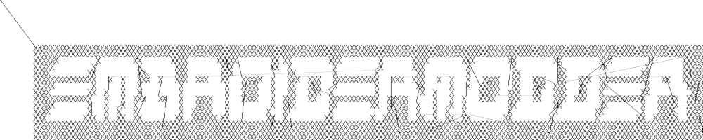

# Libembroidery v1.0-alpha

Copyright (c) 2013-2022 The EmbroiderModder Team

https://www.libembroidery.org

(Under construction, please wait for v1.0 release.)

libembroidery is a low-level library for reading, writing, 
and altering digital embroidery files in C. It is part of the Embroidermodder Project
for open source machine embroidery.

libembroidery is the underlying library that is used by [Embroidermodder 2](http://embroidermodder.org)
and is developed by [The Embroidermodder Team](#the-embroidermodder-team).
A full list of contributors to the project is maintained in
[the Embroidermodder 2 github](https://github.com/Embroidermodder/embroidermodder)
in the file `CREDITS.md`.
It handles over 45 different embroidery specific formats as well
as several non-embroidery specific vector formats.

It also includes a CLI called `embroider` that allows for better automation of
changes to embroidery files and will be more up-to date than
the Embroidermodder 2 GUI.

A printer-friendly version of these docs are available on [our website](https://www.libembroidery.org/docs/libembroidery_1.0-alpha_manual.pdf).

####  License

Libembroidery is distributed under the permissive zlib licence, see the 
LICENCE file. This applies to all the source code in this directory.

## Demos

We're currently trying out some fill techniques which will be demonstrated here and in the script `qa_test.sh`.


Converts to:



### Build

libembroidery and EmbroiderModder 2 use CMake builds
so if you are building the project to use as a library we recommend
you run:

```sh
git clone https://github.com/Embroidermodder/libembroidery
cd libembroidery
cmake .
cmake --build .
cmake --install .
```

This builds both the static and shared versions of the library as well
as the command line program `embroider`.

### Development

#### Contributing

If you're interested in getting involved, here's some guidance
for new developers. Currently The Embroidermodder Team is all
hobbyists with an interest in making embroidery machines more
open and user friendly. If you'd like to support us in some other way
you can donate to our Open Collective page (click the Donate button) so
we can spend more time working on the project.

All code written for libembroidery should be ANSI C89 compliant
if it is C. Using other languages should only be used where
necessary to support bindings.

#### Debug

If you wish to help with development, run this debug script and send us the error log.

```bash
#!/bin/bash

rm -fr libembroidery-debug

git clone http://github.com/embroidermodder/libembroidery libembroidery-debug
cd libembroidery-debug

cmake -DCMAKE_BUILD_TYPE=DEBUG .
cmake --build . --config=DEBUG

valgrind ./embroider --full-test-suite
```

While we will attempt to maintain good results from this script as part of normal development it should be the first point of failure on any system we haven't tested or format we understand less.

#### Binary download

We need a current `embroider` command line program download, so people can update
without building.

#### Identify the meaning of these TODO items

* Saving CSV/SVG (rt) + CSV read/write UNKNOWN interpreted as COLOR bug \#179
* Lego Mindstorms NXT/EV3 ports and/or commands

#### Progress Chart

The chart of successful from-to conversions (previously a separate issue)
is something that should appear in the README.

####  Style

Rather than maintain our own standard for style, please defer to
the Python's PEP 7 ([12](\#12)) for C style.
If it passes the linters for that we consider it well styled
for a pull request.

As for other languages we have no house style other than whatever
``major`` styles exist, for example Java in
Google style ([13](\#13))
would be acceptable. We'll elect specific standards if it becomes
an issue.

#### Standard

The criteria for a good Pull Request from an outside developer has these properties, from most to least important:

* No regressions on testing.
* Add a feature, bug fix or documentation that is already agreed on through GitHub issues or some other way with a core developer.
* No GUI specific code should be in libembroidery, that's for Embroidermodder.
* Pedantic/ansi C unless there's a good reason to use another language.
* Meet the style above (i.e. [PEP 7, Code Lay-out](\url{https://peps.python.org/pep-0007/#code-lay-out})).
   We'll just fix the style if the code's good and it's not a lot of work.
* `embroider` should be in POSIX style as a command line program.
* No dependancies that aren't ``standard'', i.e. use only the C Standard Library.

#### Image Fitting

A currently unsolved problem in development that warrants further research is
the scenario where a user wants to feed embroider an image that can then be .

#### To Place

A _right-handed coordinate system_ is one where up is positive and right is
positive. Left-handed is up is positive, left is positive. Screens often use
down is positive, right is positive, including the OpenGL standard so when
switching between graphics formats and stitch formats we need to use a vertical
flip (`embPattern_flip`).

`0x20` is the space symbol, so when padding either 0 or space is preferred and in the case of space use the literal ' '.

#### To Do

We currently need help with:

* Thorough descriptions of each embroidery format.
* Finding resources for each of the branded thread libraries (along with a full citation for documentation).
* Finding resources for each geometric algorithm used (along with a full citation for documentation).
* Completing the full `--full-test-suite`  with no segfaults and at least a clear error message (for example ``not implemented yet``).
* Identifying ``best guesses`` for filling in missing information when going from, say `.csv` to a late `.pes` version. What should the default be when the data doesn't clarify?
* Improving the written documentation.
* Funding, see the Sponsor button above. We can treat this as ``work`` and put far more hours in with broad support in small donations from people who want specific features.

Beyond this the development targets are categories sorted into:

* Basic Features
* Code quality and user friendliness
* embroider CLI
* Documentation
* GUI
* electronics development

#### Basic features

* Incorporate `\#if 0`ed parts of `libembroidery.c`.
* Interpret how to write formats that have a read mode from the source code and vice versa.
* Document the specifics of the file formats here for embroidery machine specific formats. Find websites and other sources that break down the binary formats we currently don't understand.
* Find more and better documentation of the structure of the headers for the formats we do understand.

#### Code quality and user friendliness

* Document all structs, macros and functions (will contribute directly
   on the web version).
* Incorporate experimental code, improve support for language bindings.
* Make stitch x, y into an EmbVector.

#### embroider CLI

* Make `-circle` flag to add a circle to the current pattern.
* Make `-rect` flag to add a rectangle to the current pattern.
* Make `-fill` flag to set the current satin fill algorithm for the current geometry. (for example `-fill crosses -circle 11,13,10` fills a circle with center 11mm, 13mm with radius 10mm with crosses).
* Make `-ellipse` flag to add to ellipse to the current pattern.
* Make `-bezier` flag to add a bezier curve to the current pattern.

#### Embroider pipeline

Adjectives apply to every following noun so

```bash
embroider --satin 0.3,0.6 --thickness 2 --circle 10,20,5 \
    --border 3 --disc 30,40,10 --arc 30,50,10,60 output.pes
```

Creates:

* a circle with properties: thickness 2, satin 0.3,0.6
* a disc with properties: 
* an arc with properties:

in that order then writes them to the output file `output.pes`.

#### Documentation

1. Create csv data files for thread tables.
2. Convert tex to markdown, make tex an output of `build.bash`.
3. Run `sloccount` on `extern/` and `.` (and ) so we know the current scale of the project, aim to get this number low. Report the total as part of the documentation.
4. Try to get as much of the source code that we maintain into C as possible so new developers don't need to learn multiple languages to have an effect. This bars the embedded parts of the code. 

#### GUI

1. Make MobileViewer also backend to `libembroidery` with a Java wrapper.
2. Make iMobileViewer also backend to `libembroidery` with a Swift wrapper.
3. Share some of the MobileViewer and iMobileViewer layout with the main EM2. Perhaps combine those 3 into the Embroidermodder repository so there are 4 repositories total.
4. Convert layout data to JSON format and use cJSON for parsing.

### Electronics development

* Currently experimenting with Fritzing^[8](#8)^, upload netlists to embroiderbot when they can run simulations using the asm in `libembroidery`.
* Create a common assembly for data that is the same across chipsets `libembrodiery\_data\_internal.s`.
* Make the defines part of `embroidery.h` all systems and the function list `c code only`. That way we can share some development between assembly and C versions.

## Formats

### Overview

### Read/Write Support Levels

The table of read/write format support levels uses the status levels described here:

| Status Label | Score | Description |
|---|---|---|
| `rw-none` | Either the format produces no output, reporting an error. Or it produces a Tajima dst file as an alternative. |
| `rw-poor` | A file somewhat similar to our examples is produced. We don't know how well it runs on machines in practice as we don't have any user reports or personal tests. |
| `rw-basic` | Simple files in this format run well on machines that use this format. |
| `rw-standard` | Files with non-standard features work on machines and we have good documentation on the format. |
| `rw-reliable` | All known features don't cause crashes. Almost all work as expected. |
| `rw-complete` | All known features of the format work on machines that use this format. Translations from and to this format preserve all features present in both. |

These can be split into `r-basic w-none`, for example, if they don't match.

So all formats can, in principle, have good read and good write support, because it's defined in relation to files that we have described the formats for.

#### Test Support Levels

| Status Label | Description |
|---|---|
| `test-none` | No tests have been written to test the specifics of the format. |
| `test-basic` | Stitch Lists and/or colors have read/write tests. |
| `test-thorough` | All features of that format has at least one test. |
| `test-fuzz` | Can test the format for uses of features that we haven't thought of by feeding in nonsense that is designed to push possibly dangerous weaknesses to reveal themselves. |
| `test-complete` | Both thorough and fuzz testing is covered. |

So all formats can, in principle, have complete testing support, because it's defined in relation to files that we have described the formats for.

#### Documentation Support Levels

| Status Label | Description |
|---|---|---|
| `doc-none` | We haven't researched this beyond finding example files. |
| `doc-basic` | We have a rough sketch of the size and contents of the header if there is one. We know the basic stitch encoding (if there is one), but not necessarily all stitch features. |
| `doc-standard` | We know some good sources and/or have tested all the features that appear to exist. They mostly work the way we have described. |
| `doc-good` | All features that were described somewhere have been covered here or we have thoroughly tested our ideas against other softwares and hardwares and they work as expected. |
| `doc-complete` | There is a known official description and our description covers all the same features. |

Not all formats can have complete documentation because it's based on what 
information is publically available. So the total score is reported in the table
below based on what level we think is available.

#### Overall Support

Since the overall support level is the combination of these
4 factors, but rather than summing up their values it's an 
issue of the minimum support of the 4.

| Status Label(s) | Description |
|---|---|
| `read-only` | If write support is none and read support is not none. |
| `write-only` | If read support is none and write support is not none. |
| `unstable` | If both read and write support are not none but testing or documentation is none. |
| `basic` | If all ratings are better than none. |
| `reliable` | If all ratings are better than basic. |
| `complete` | If all ratings could not reasonably be better (for example any improvements rely on information that we may never have access to). This is the only status that can be revoked, since if the format changes or new documentation is released it is no longer complete. |
| `experimental` | For all other scenarios. |

#### Table of Format Support Levels

Overview of documentation support by format.

| Format | Ratings | Score |
|---|---|---|
| Toyota Embroidery Format (.100) | `rw-basic doc-none test-none` | `unstable` |
| Toyota Embroidery Format (.10o) | `rw-basic doc-none test-none` | `unstable` |
| Bernina Embroidery Format (.art) | `rw-none doc-none test-none` | `experimental` |
| Bitmap Cache Embroidery Format (.bmc) | `r-basic w-none doc-none test-none` | 1 |
| Bits and Volts Embroidery Format (.bro) | `rw-none doc-none test-none` | 0 |
| Melco Embroidery Format (.cnd) | `rw-none doc-none test-none` | `experimental` |
| Embroidery Thread Color Format (.col) | `rw-basic doc-none test-none` | `experimental` |
| Singer Embroidery Format (.csd) | `rw-none doc-none test-none` | `experimental` |
| Comma Separated Values (.csv) | `rw-none doc-none test-none` | `experimental` |
| Barudan Embroidery Format (.dat) | `rw-none doc-none test-none` | `experimental` |
| Melco Embroidery Format (.dem) | `rw-none doc-none test-none` | `experimental` |
| Barudan Embroidery Format (.dsb) | `rw-none doc-none test-none` | `experimental` |
| Tajima Embroidery Format (.dst) | `rw-none doc-none test-none` | `experimental` |
| ZSK USA Embroidery Format (.dsz) | `rw-none doc-none test-none` | `experimental` |
| Drawing Exchange Format (.dxf) | `rw-none doc-none test-none` | `experimental` |
| Embird Embroidery Format (.edr) | `rw-none doc-none test-none` | `experimental` |
| Elna Embroidery Format (.emd) | `rw-none doc-none test-none` | `experimental` |
| Melco Embroidery Format (.exp) | `rw-none doc-none test-none` | `experimental` |
| Eltac Embroidery Format (.exy) | `rw-none doc-none test-none` | `experimental` |
| Sierra Expanded Embroidery Format (.eys) | `rw-none doc-none test-none` | `experimental` |
| Fortron Embroidery Format (.fxy) | `rw-none doc-none test-none` | `experimental` |
| Smoothie G-Code Embroidery Format (.gc) | `rw-none doc-none test-none` | `experimental` |
| Great Notions Embroidery Format (.gnc) | `rw-none doc-none test-none` | `experimental` |
| Gold Thread Embroidery Format (.gt) | `rw-none doc-none test-none` | `experimental` |
| Husqvarna Viking Embroidery Format (.hus) | `rw-none doc-none test-none` | `experimental` |
| Inbro Embroidery Format (.inb) | `rw-none doc-none test-none` | `experimental` |
| Embroidery Color Format (.inf) | `rw-none doc-none test-none` | `experimental` |
| Janome Embroidery Format (.jef) | `rw-none doc-none test-none` | `experimental` |
| Pfaff Embroidery Format (.ksm) | `rw-none doc-none test-none` | `experimental` |
| Pfaff Embroidery Format (.max) | `rw-none doc-none test-none` | `experimental` |
| Mitsubishi Embroidery Format (.mit) | `rw-none doc-none test-none` | `experimental` |
| Ameco Embroidery Format (.new) | `rw-none doc-none test-none` | `experimental` |
| Melco Embroidery Format (.ofm) | `rw-none doc-none test-none` | `experimental` |
| Pfaff Embroidery Format (.pcd) |  `rw-none doc-none test-none` | `experimental` |
| Pfaff Embroidery Format (.pcm) | `rw-none doc-none test-none` | `experimental` |
| Pfaff Embroidery Format (.pcq) | `rw-none doc-none test-none` | `experimental` |
| Pfaff Embroidery Format (.pcs) | `rw-none doc-none test-none` | `experimental` |
| Brother Embroidery Format (.pec) | `rw-none doc-none test-none` | `experimental` |
| Brother Embroidery Format (.pel) | `rw-none doc-none test-none` | `experimental` |
| Brother Embroidery Format (.pem) | `rw-none doc-none test-none` | `experimental` |
| Brother Embroidery Format (.pes) | `rw-none doc-none test-none` | `experimental` |
| Brother Embroidery Format (.phb) | `rw-none doc-none test-none` | `experimental` |
| Brother Embroidery Format (.phc) | `rw-none doc-none test-none` | `experimental` |
| AutoCAD Embroidery Format (.plt) | `rw-none doc-none test-none` | `experimental` |
| RGB Embroidery Format (.rgb) | `rw-none doc-none test-none` | `experimental` |
| Janome Embroidery Format (.sew) | `rw-none doc-none test-none` | `experimental` |
| Husqvarna Viking Embroidery Format (.shv) | `rw-none doc-none test-none` | `experimental` |
| Sunstar Embroidery Format (.sst) | `rw-none doc-none test-none` | `experimental` |
| Data Stitch Embroidery Format (.stx) | `rw-none doc-none test-none` | `experimental` |
| Scalable Vector Graphics (.svg) | `rw-none doc-none test-none` | `experimental` |
| Pfaff Embroidery Format (.t01) | `rw-none doc-none test-none` | `experimental` |
| Pfaff Embroidery Format (.t09) | `rw-none doc-none test-none` | `experimental` |
| Happy Embroidery Format (.tap) | `rw-none doc-none test-none` | `experimental` |
| ThredWorks Embroidery Format (.thr) | `rw-none doc-none test-none` | `experimental` |
Text File (.txt) | `rw-none doc-none test-none` | `experimental` |
| Barudan Embroidery Format (.u00) | `rw-none doc-none test-none` | `experimental` |
| Barudan Embroidery Format (.u01) | `rw-none doc-none test-none` | `experimental` |
| Pfaff Embroidery Format (.vip) | `rw-none doc-none test-none` | `experimental` |
| Pfaff Embroidery Format (.vp3) | `rw-none doc-none test-none` | `experimental` |
| Singer Embroidery Format (.xxx) | `rw-none doc-none test-none` | `experimental` |
| [ZSK USA Embroidery Format (.zsk)](#zsk-usa-embroidery-format-zsk) | `rw-none doc-none test-none` | `experimental` |

#### Toyota Embroidery Format (.100)

The Toyota 100 format is a stitch-only format that uses an external color file.

The stitch encoding is in 4 byte chunks.

#### Toyota Embroidery Format (.10o)

The Toyota 10o format is a stitch-only format that uses an external color file.

The stitch encoding is in 3 byte chunks.

#### Bernina Embroidery Format (.art)

We don't know much about this format. TODO: Find a source.

#### Bitmap Cache Embroidery Format (.bmc)

We don't know much about this format. TODO: Find a source.

#### Bits and Volts Embroidery Format (.bro)

The Bits and Volts bro format is a stitch-only format that uses an external color file.

The header is 256 bytes. There's a series of unknown variables in the header.

The stitch list uses a variable length encoding which is 2 bytes for any stitch

### Melco Embroidery Format (.cnd)

The Melco cnd format is a stitch-only format.

We don't know much about this format. TODO: Find a source.

### Embroidery Thread Color Format (.col)

An external color file format for formats that do not record their own colors. 

It is a human-readable format that has a header that is a single line containing only the number of threads in decimal followed by the windows line break `\r\n`.

Then the rest of the file is a comma seperated value list of all threads with 4 values per line: the index of the thread then the red, green and blue channels of the color in that order.

#### Example

If we had a pattern called "example" with four colors: black, red, magenta and cyan in that order then the file is (with the white space written out):

example.col

```dat
4\r\n
0,0,0,0\r\n
1,255,0,0\r\n
2,0,255,0\r\n
3,0,0,255\r\n
```

### Singer Embroidery Format (.csd)

Stitch Only Format

### Comma Separated Values (.csv)

Comma Seperated Values files aren't a universal system, here we aim to
offer a broad support.

| Control Symbol | Type | Description |
|---|---|---|
| `#` | COMMENT | |
| `>` | VARIABLE | To store records of a pattern's width, height etc. This means that data stored in the header of say a `.dst` file is preserved. |
| `\$` | THREAD | |
| `*` | STITCH | |
| `*` | JUMP | |
| `*` | COLOR | To change a color: used for trim as well |
| `*` | END | To end a pattern. |
| `*` | UNKNOWN | For any feature that we can't identify. |

### Barudan Embroidery Format (.dat)

Stitch Only Format

### Melco Embroidery Format (.dem)

Stitch Only Format

### Barudan Embroidery Format (.dsb)

* Stitch Only Format.
* [X] Basic Read Support
* [ ] Basic Write Support
* [ ] Well Tested Read
* [ ] Well Tested Write

### Tajima Embroidery Format (.dst)

* Stitch Only Format.
* [X] Basic Read Support
* [X] Basic Write Support
* [ ] Well Tested Read
* [ ] Well Tested Write

.DST (Tajima) embroidery file read/write routines
Format comments are thanks to \url{tspilman@dalcoathletic.com} who's
notes appeared at [http://www.wotsit.org](http://www.wotsit.org) under Tajima Format.

### Header

The header seems to contain information about the design.
Seems to be ASCII text delimited by 0x0D (carriage returns).
This must be in the file for most new software or hardware
to consider it a good file! This is much more important
than I originally believed. The header is 125 bytes in
length and padded out by 0x20 to 512 bytes total.
All entries in the header seem to be 2 ASCII characters
followed by a colon, then it's value trailed by a carriage return.

| *C memory* | *Description* |
|---|---|
| `char LA[16+1];` | First is the 'LA' entry, which is the design name with no path or extension information. The blank is 16 characters in total, but the name must not be longer that 8 characters and padded out with spaces (0x20). |
| `char ST[7+1];` | Next is the stitch count ST, this is a 7 digit number padded by leading zeros. This is the total stitch count including color changes, jumps, nups, and special records. |
| `char CO[3+1];` | Next, is CO or colors, a 3 digit number padded by leading zeros. This is the number of color change records in the file. |
| `char POSX[5+1];` | Next is +X or the positive X extent in centimeters, a 5 digit non-decimal number padded by leading zeros. |
| `char NEGX[5+1];` | Following is the -X or the negative X extent in millimeters, a 5 digit non-decimal number padded by leading zeros. |
| `char POSY[5+1];` | Again, the +Y extents. |
| `char NEGY[5+1];` | Again, the -Y extents. |
| `char AX[6+1]; char AY[6+1];` | AX and AY should express the relative coordinates of the last point from the start point in 0.1 mm. If the start and last points are the same, the coordinates are (0,0). |
| `char MX[6+1];` `char MY[6+1];` | MX and MY should express coordinates of the last point of the previous file for a multi-volume design. A multi-volume design means a design consisted of two or more files. This was used for huge designs that can not be stored in a single paper tape roll. It is not used so much (almost never) nowadays. |
| `char PD[9+1];` | PD is also storing some information for multi-volume design. |
\end{longtable

Uses 3 byte per stitch encoding with the format as follows:

The 3 byte encoding for the dxf format.

| *Bit* | *7* | *6* | *5* | *4* | *3* | *2* | *1* | *0* |
|----|----|----|----|----|----|----|----|----|
| Byte 0 | y+1 | y-1 | y+9 | y-9 | x-9 | x+9 | x-1 | x+1 |
| Byte 1 | y+3 | y-3 | y+27 | y-27 | x-27 | x+27 | x-3 | x+3 |
| Byte 2 | jump | color change | y+81 | y-81 | x-81 | x+81 | set | set |

T01 and Tap appear to use Tajima Ternary.
 
Where the stitch type is determined as:

* Normal Stitch `00000011 0x03`
* Jump Stitch `10000011 0x83`
* Stop/Change Color `11000011 0xC3`
* End Design `11110011 0xF3`

Inclusive or'ed with the last byte.

Note that:

  1. The max stitch length is the largest sum of `1+3+9+27+81=121` where the unit length is 0.1mm so 12.1mm.
  2. The coordinate system is right handed.

### ZSK USA Embroidery Format (.dsz)

The ZSK USA dsz format is stitch-only.

### Drawing Exchange Format (.dxf)

Graphics format.

### Embird Embroidery Format (.edr)

Stitch Only Format

### Elna Embroidery Format (.emd)

Stitch Only Format.

### Melco Embroidery Format (.exp)

Stitch Only Format.

### Eltac Embroidery Format (.exy)

Stitch Only Format.

### Sierra Expanded Embroidery Format (.eys)

Stitch Only Format.

Smoothie G-Code Embroidery Format (.fxy)?

### Fortron Embroidery Format (.fxy)

Stitch Only Format.

### Great Notions Embroidery Format (.gnc)

Stitch Only Format.

### Gold Thread Embroidery Format (.gt)

Stitch Only Format.

### Husqvarna Viking Embroidery Format (.hus)

Stitch Only Format.

### Inbro Embroidery Format (.inb)

Stitch Only Format.

### Embroidery Color Format (.inf)

Stitch Only Format.

### Janome Embroidery Format (.jef)

Stitch Only Format.

### Pfaff professional Design format (.ksm)

Stitch Only Format.

### Pfaff Embroidery Format (.max)

Stitch Only Format.

### Mitsubishi Embroidery Format (.mit)

Stitch Only Format.

### Ameco Embroidery Format (.new)

Stitch Only Format.

### Melco Embroidery Format (.ofm)

Stitch Only Format.

### Pfaff PCD File Format

Stitch Only Format.

The format uses a signed 3 byte-length number type.

See the description here ([5](#5)) for the overview of the format.

For an example of the format see ([11](#11)).

### Pfaff Embroidery Format (.pcm)

The Pfaff pcm format is stitch-only.

### Pfaff Embroidery Format (.pcq)

The Pfaff pcq format is stitch-only.

### Pfaff Embroidery Format (.pcs)

The Pfaff pcs format is stitch-only.

### Brother Embroidery Format (.pec)

The Brother pec format is stitch-only.

### Brother Embroidery Format (.pel)

The Brother pel format is stitch-only.

### Brother Embroidery Format (.pem)

The Brother pem format is stitch-only.

### Brother Embroidery Format (.pes)

The Brother pes format is stitch-only.

### Brother Embroidery Format (.phb)

The Brother phb format is stitch-only.

### Brother Embroidery Format (.phc)

The Brother phc format is stitch-only.

### AutoCAD Embroidery Format (.plt)

The AutoCAD plt format is stitch-only.

### RGB Embroidery Format (.rgb)

The RGB format is a color-only format to act as an external color file for other formats.

### Janome Embroidery Format (.sew)

The Janome sew format is stitch-only.

### Husqvarna Viking Embroidery Format (.shv)

The Husqvarna Viking shv format is stitch-only.

### Sunstar Embroidery Format (.sst)

The Sunstar sst format is stitch-only.

### Data Stitch Embroidery Format (.stx)

The Data Stitch stx format is stitch-only.

### Scalable Vector Graphics (.svg)

The scalable vector graphics (SVG) format is a graphics format
maintained by ...

### Pfaff Embroidery Format (.t01)

The Pfaff t01 format is stitch-only.

\subsection Pfaff Embroidery Format (.t09)

The Pfaff t09 format is stitch-only.

### Happy Embroidery Format (.tap)

The Happy tap format is stitch-only.

### ThredWorks Embroidery Format (.thr)

The ThreadWorks thr format is stitch-only.

### Text File (.txt)

The txt format is stitch-only and isn't associated with a specific company.

### Barudan Embroidery Format (.u00)

The Barudan u00 format is stitch-only.

### Barudan Embroidery Format (.u01)

The Barudan u01 format is stitch-only.

### Pfaff Embroidery Format (.vip)

The Pfaff vip format is stitch-only.

### Pfaff Embroidery Format (.vp3)

The Pfaff vp3 format is stitch-only.

### Singer Embroidery Format (.xxx)

The Singer xxx format is stitch-only.

### ZSK USA Embroidery Format (.zsk)

The ZSK USA zsk format is stitch-only.
  
### On Embedded Systems

The library is designed to support embedded environments, so it can
be used in CNC applications.

### Compatible Boards

We recommend using an Arduino Mega 2560 or another board with equal or
greater specs. That being said, we have had success using an Arduino Uno
R3 but this will likely require further optimization and other
improvements to ensure continued compatibility with the Uno. See below
for more information.

### Arduino Considerations

There are two main concerns here: Flash Storage and SRAM.

libembroidery continually outgrows the 32KB of Flash storage on the
Arduino Uno and every time this occurs, a decision has to be made as to
what capabilities should be included or omitted. While reading files is
the main focus on arduino, writing files may also play a bigger role in
the future. Long term, it would be most practical to handle the
inclusion or omission of any feature via a single configuration header
file that the user can modify to suit their needs.

SRAM is in extremely limited supply and it will deplete quickly so any
dynamic allocation should occur early during the setup phase of the
sketch and sparingly or not at all later in the sketch. To help minimize
SRAM consumption on Arduino and ensure libembroidery can be used in any
way the sketch creator desires, it is required that any sketch using
libembroidery must implement event handlers. See the ino-event source
and header files for more information.

There is also an excellent article by Bill Earl on the Adafruit Learning
System which covers these topics in more depth:
[http://learn.adafruit.com/memories-of-an-arduino?view=all](http://learn.adafruit.com/memories-of-an-arduino?view=all).

### Space

Since a stitch takes 3 bytes of storage and many patterns use more than
10k stitches, we can't assume that the pattern will fit in memory. Therefore
we will need to buffer the current pattern on and off storage in small
chunks. By the same reasoning, we can't load all of one struct beore
looping so we will need functions similar to binaryReadInt16 for each
struct.

This means the EmbArray approach won't work since we need to load
each element and dynamic memory management is unnecessary because
the arrays lie in storage.

TODO: Replace EmbArray functions with embPattern load functions.

### Tables

All thread tables and large text blocks are too big to compile directly
into the source code. Instead we can package the library with a data packet
that is compiled from an assembly program in raw format so the specific
padding can be controlled.

In the user section above we will make it clear that this file
needs to be loaded on the pattern USB/SD card or the program won't function.

TODO: Start file with a list of offsets to data with a corresponding table
to load into with macro constants for each label needed.

### Current Pattern Memory Management

It will be simpler to make one file per EmbArray so we keep an EmbFile*
and a length, so no malloc call is necessary. So there needs to be a consistent
tmpfile naming scheme.

TODO: For each pattern generate a random string of hexadecimal and append it
to the filenames like `stitchList_A16F.dat`. Need to check for a file
which indicates that this string has been used already.

### Special Notes

Due to historical reasons and to remain compatible with the Arduino 1.0
IDE, this folder must be called ``utility''. Refer to the arduino build
process for more info:
[https://arduino.github.io/arduino-cli/0.19/sketch-build-process/](https://arduino.github.io/arduino-cli/0.19/sketch-build-process/).

libembroidery relies on the Arduino SD library for reading files. See
the ino-file source and header files for more information.

### The Assembly Split

One problem to the problem of supporting both systems with abundant memory
(such as a 2010s or later desktop) and with scarce memory (such as embedded
systems) is that they don't share the same assembly language. To deal with
this: there will be two equivalent software which are hand engineered to be
similar but one will be in C and the other in the assembly dialects we support.

All assembly will be intended for embedded systems only, since a slightly
smaller set of features will be supported. However, we will write a
`x86` version since that can be tested.

That way the work that has been done to simplify the C code can be applied to
the assembly versions.

### Build

To build the documentation run `make`. This should run no problem on a normal Unix-like environment
assuming pandoc is available.

* Pandoc creates the content of the page by converting the markdown to html.
* Pandoc also creates the printer-friendly documentation from the same markdown.
* Markdown acts as a go-between because it is easy to alter directly in the GH editor.

This way:

* We write one set of documents for all projects.
* The website can be simple and static, supporting machines that don't run javascript.
* We control the styling of each version independently of our editing (Markdown) version
* The printer-friendly documentation can have nicely rendered fonts and well placed figures.

### Features

### Bindings

Bindings for libembroidery are maintained for the languages we use internally in the project, for other languages we consider that the responsibility of other teams using the library.

So libembroidery is going to be supported on:

  * C (by default)
  * C++ (also by default)
  * Java (for the Android application MobileViewer)
  * Swift (for the iOS application iMobileViewer)

For C\# we recommend directly calling the function directly
using the DllImport feature:

```
[DllImport("libembroidery.so", EntryPoint="readCsv")]
```

see this StackOverflow discussion [for help](\url{https://stackoverflow.com/questions/11425202/is-it-possible-to-call-a-c-function-from-c-net}).

For Python you can do the same using [ctypes](\url{https://www.geeksforgeeks.org/how-to-call-a-c-function-in-python/}).

### Other Supported Thread Brands

The thread lists that aren't preprogrammed into formats but
are indexed in the data file for the purpose of conversion
or fitting to images/graphics.

* Arc Polyester
* Arc Rayon
* Coats and Clark Rayon
* Exquisite Polyester
* Fufu Polyester
* Fufu Rayon
* Hemingworth Polyester
* Isacord Polyester
* Isafil Rayon
* Marathon Polyester
* Marathon Rayon
* Madeira Polyester
* Madeira Rayon
* Metro Polyester
* Pantone
* Robison Anton Polyester
* Robison Anton Rayon
* Sigma Polyester
* Sulky Rayon
* ThreadArt Rayon
* ThreadArt Polyester
* ThreaDelight Polyester
* Z102 Isacord Polyester

### Bibliography

1. Rudolf _Technical Info_ [http://www.achatina.de/sewing/main/TECHNICL.HTM](http://www.achatina.de/sewing/main/TECHNICL.HTM)
(Accessed 25 November 2021)
2. fineEmbStudio2021
3. Edutech format description (eduTechWikiDST)
4. KDE Liberty Description (libertyTajima)
5. The Sewing Witch _PCD2FMT_ [http://www.sewingwitch.com/sewing/bin/pcd2fmt.html](http://www.sewingwitch.com/sewing/bin/pcd2fmt.html) (Accessed November 2021)
6. [http://steve-jansen.github.io/guides/windows-batch-scripting/part-7-functions.html](http://steve-jansen.github.io/guides/windows-batch-scripting/part-7-functions.html)
7. [https://stackoverflow.com/questions/16286134/imagemagick-how-can-i-work-with-histogram-result](https://stackoverflow.com/questions/16286134/imagemagick-how-can-i-work-with-histogram-result)
8. Fritzing [https://github.com/fritzing/fritzing-app](https://github.com/fritzing/fritzing-app)
9. Sahoo, P., Wilkins, C., and Yeager, J., “Threshold selection using Renyi's entropy”, _Pattern Recognition_, vol. 30, no. 1, pp. 71–84, 1997. doi:10.1016/S0031-3203(96)00065-9.
10. [http://www.fmwconcepts.com/imagemagick/sahoothresh/index.php](http://www.fmwconcepts.com/imagemagick/sahoothresh/index.php) (Accessed 12 Dec 2021)
11. FINDME
12. G. van Rossum and B. Warsaw "Python PEP 7" [https://peps.python.org/pep-0007/](https://peps.python.org/pep-0007/) (Accessed April 2020)
13. Google et al. "Google Java Style Guide" [https://google.github.io/styleguide/javaguide.html](https://google.github.io/styleguide/javaguide.html) (Accessed April 2022)

