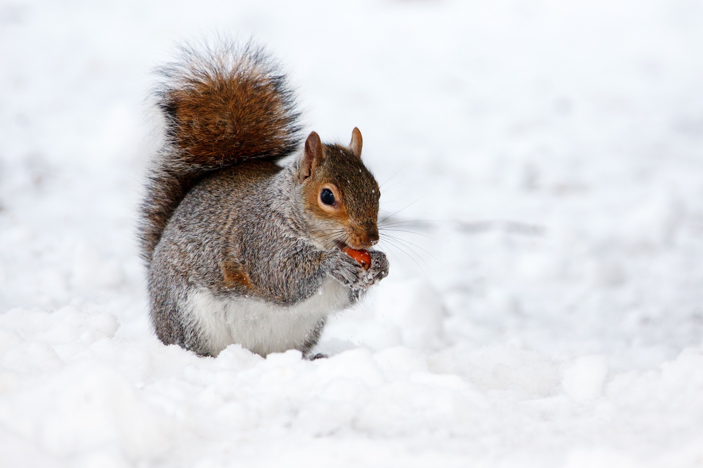
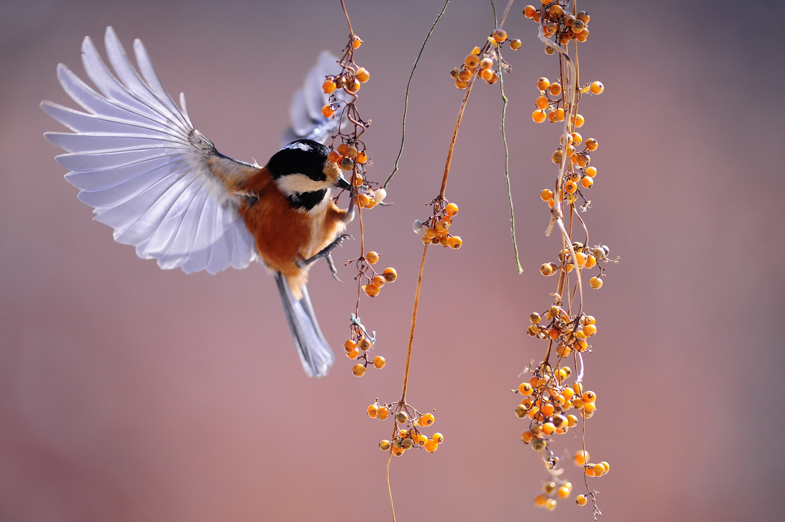

# Source Images

## Photographs

The following photographs are public domain images from pixabay:

<table>
<tr>
  <td></td>
  <td>Source: https://pixabay.com/photos/snow-animal-squirrel-rodent-mammal-17854/</td>
</tr>
<tr>
  <td></td>
  <td>Source: https://pixabay.com/photos/bird-fluttering-berries-wings-tit-1045954/</td>
</tr>
<tr>
  <td></td>
  <td>Source: https://pixabay.com/photos/owl-bird-animal-bird-of-prey-50267/</td>
</tr>
<tr>
  <td></td>
  <td>Source: https://pixabay.com/photos/berries-fruits-food-blackberries-2277/</td>
</tr>
</table>

They have been converted to png files to aid further processing.
