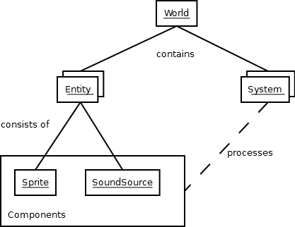
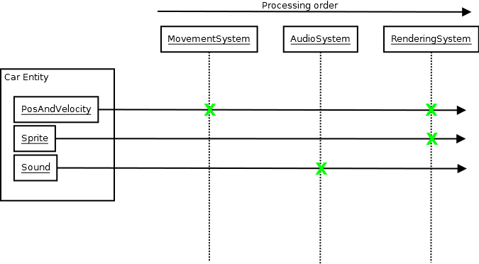

.. currentmodule:: sdl2.ext
.. _ref-ebs:

Working with component-based entities
=====================================
:mod:`sdl2.ext` supports a component oriented programming pattern to separate
object instances, carried data and processing logic within applications
or games. It uses an entity based approach, in which object instances are
unique identifiers, while their data is managed within components, which
are stored separately. For each individual component type a processing
system will take care of all necessary updates on running the application.

Component-based patterns
------------------------
Component-based means that - instead of a traditional OOP approach - object
information are split up into separate data bags for reusability and that those
data bags are separated from any application logic.

Behavioural design
^^^^^^^^^^^^^^^^^^
Imagine a car class in traditional OOP, which might look like ::

   class Car:
       def __init__(self):
           self.color = "red"
           self.position = 0, 0
           self.velocity = 0, 0
           self.sprite = get_some_car_image()
           ...
       def drive(self, timedelta):
           self.position[0] = self.velocity[0] * timedelta
           self.position[1] = self.velocity[1] * timedelta
           ...
       def stop(self):
           self.velocity = 0, 0
           ...
       def render(self, screen):
           screen.display(self.sprite)

   mycar = new Car()
   mycar.color = "green"
   mycar.velocity = 10, 0

The car features information stored in attributes (``color``, ``position``,
...) and behaviour (application logic, ``drive()``, ``stop()`` ...).

A component-based approach aims to split and reduce the car to a set of
information and external systems providing the application logic. ::

   class Car:
       def __init__(self):
           self.color = "red"
           self.position = 0, 0
           self.velocity = 0, 0
           self.sprite = get_some_car_image()

   class CarMovement:
       def drive(self, car, timedelta):
           car.position[0] = car.velocity[0] * timedelta
           car.position[1] = car.velocity[1] * timedelta
           ...
       def stop(self):
           car.velocity = 0, 0

   class CarRenderer:
       def render(self, car, screen):
           screen.display(car.sprite)

At this point of time, there is no notable difference between both approaches,
except that the latter one adds additional overhead.

The benefit comes in, when you

* use subclassing in your OOP design
* want to change behavioural patterns on a global scale or based on states
* want to refactor code logic in central locations
* want to cascade application behaviours

The initial ``Car`` class from above defines, how it should be displayed
on the screen. If you now want to add a feature for rescaling the screen
size after the user activates the magnifier mode, you need to refactor
the ``Car`` and all other classes that render things on the screen, have
to consider all subclasses that override the method and so on.
Refactoring the ``CarRenderer`` code by adding a check for the magnifier
mode sounds quite simple in contrast to that, not?

The same applies to the movement logic - inverting the movement logic
requires you to refactor all your classes instead of a single piece of
application code.

Information design
^^^^^^^^^^^^^^^^^^
Subclassing with traditional OOP for behavioural changes also might
bloat your classes with unnecessary information, causing the memory
footprint for your application to rise without any need. Let's assume
you have a ``Truck`` class that inherits from ``Car``. Let's further
assume that all trucks in your application look the same. Why should any
of those carry a ``sprite`` or ``color`` attribute? You would need to
refactor your ``Car`` class to get rid of those superfluous information,
adding another level of subclassing. If at a later point of time you
decide to give your trucks different colors, you need to refactor
everything again.

Wouldn't it be easier to deal with colors, if they are available on the
truck and leave them out, if they are not? We initially stated that the
component-based approach aims to separate data (information) from code
logic.  That said, if the truck has a color, we can handle it easily, if
it has not, we will do as usual.

Also, checking for the color of an object (regardless, if it is a truck,
car, aeroplane or death star) allows us to apply the same or similar
behaviour for every object. If the information is available, we will
process it, if it is not, we will not do anything.

All in all
^^^^^^^^^^
Once we split up the previously OOP-style classes into pure data containers and
some separate processing code for the behaviour, we are talking about components
and (processing) systems. A component is a data container, ideally grouping
related information on a granular level, so that it is easy to (re)use.
When you combine different components to build your in-application objects and
instantiate those, we are talking about entities.

*Component*
   provides information (data bag)

*Entity*
   In-application instance that consists of *component* items

*System*
   Application logic for working with *Entity* items and their
   *component* data

*World*
   The environment that contains the different *System* instances and
   all *Entity* items with their *component* data

Within a strict COP design, the application logic (ideally) only knows about
data to process. It does not know anything about entities or complex classes
and only operates on the data.

To keep things simple, modular and easy to maintain and change, you usually
create small processing systems, which perform the necessary operations on the
data they shall handle. That said, a ``MovementSystem`` for our car entity would
only operate on the position and velocity component of the car entity. It does
not know anything about the the car's sprite or sounds that the car makes,
since *this is nothing it has to deal with*.

To display the car on the screen, a ``RenderingSystem`` might pick up the
sprite component of the car, maybe along with the position information (so it
knows, where to place the sprite) and render it on the screen.

If you want the car to play sounds, you would add an audio playback system,
that can perform the task. Afterwards you can add the necessary audio
information via a sound component to the car and it will make noise.

Component-based design with sdl2.ext
------------------------------------

.. note::

   This section will deal with the specialities of COP patterns and
   provide the bare minimum of information. If you are just starting with
   such a design, it is recommended to read through the :ref:`pong-tutorial`
   tutorial.

:mod:`sdl2.ext` provides a :class:`World` class in which all other objects
will reside. The :class:`World` will maintain both, :class:`Entity` and
component items, and allows you to set up the processing logic via
the :class:`System` and :class:`Applicator` classes. ::

   >>> appworld = World()

Components can be created from any class that inherits from the
:class:`object` type and represent the data bag of information for the
entity and application world. Ideally, they should avoid any
application logic (except from getter and setter properties). ::

   class Position2D(object):
       def __init__(self, x=0, y=0):
           self.x = x
           self.y = y

:class:`Entity` objects define the in-application objects and only consist of
component-based attributes. They also require a :class:`World` at
object instantiation time. ::

   class CarEntity(Entity):
       def __init__(self, world, x=0, y=0):
           self.position2d = Position2D(x, y)

.. note::

   The *world* argument in ``__init__()`` is necessary. It will be
   passed to the internal ``__new__()`` constructor of the
   :class:`Entity` and stores a reference to the :class:`World` and also
   allows the :class:`Entity` to store its information in the
   :class:`World`.

The :class:`Entity` also requries its attributes to be named exactly as
their component class name, but in lowercase letters. If you name a
component ``MyAbsolutelyAwesomeDataContainer``, an :class:`Entity` will
force you to write the following: ::

   class SomeEntity(Entity):
       def __init__(self, world):
           self.myabsolutelyawesomedatacontainer = MyAbsolutelyAwesomeDataContainer()

.. note::

   This is not entirely true. A reference of the object will be stored on a
   per-class-in-mro basis. This means that if ``MyAbsolutelyAwesomeDataContainer``
   inherits from ``ShortName``, you can also do: ::

     class SomeEntity(Entity):
         def __init__(self, world):
             self.shortname = MyAbsolutelyAwesomeDataContainer()

Components should be as atomic as possible and avoid complex
inheritance. Since each value of an :class:`Entity` is stored per class
in its mro list, components inheriting from the same class(es) will
overwrite each other on conflicting classes: ::

  class Vector(Position2D):
      def __init__(self, x=0, y=0, z=0):
          super(Vector, self).__init__(x, y)

  class SomeEntity(Entity):
      def __init__(self, world):
          # This will associate self.position2d with the new Position2D
          # value, while the previous Vector association is overwritten
          self.position2d = Position2D(4, 4)

          # self.vector will also associate a self.position2d attribute
          # with the Entity, since Vector inherits from Position2D. The
          # original association will vanish, and each call to
          # entity.position2d will effectively manipulate the vector!
          self.vector = Vector(1,2,3)

API
---

.. class:: Entity(world : World)

    An entity is a specific object living in the application world. It
    does not carry any data or application logic, but merely acts as
    identifier label for data that is maintained in the application
    world itself.

    As such, it is a composition of components, which would not exist
    without the entity identifier. The entity itself is non-existent to
    the application world as long as it does not carry any data that can
    be processed by a system within the application world.

   .. attribute:: id

      The id of the Entity. Every Entity has a unique id, that is
      represented by a :class:`uuid.UUID` instance.

   .. attribute:: world

      The :class:`World` the entity resides in.

   .. method:: delete() -> None

      Deletes the :class:`Entity` from its :class:`World`. This
      basically calls :meth:`World.delete()` with the :class:`Entity`.

.. class:: Applicator()

   A processing system for combined data sets. The :class:`Applicator`
   is an enhanced :class:`System` that receives combined data sets based
   on its set :attr:`System.componenttypes`

   .. attribute:: is_applicator

      A boolean flag indicating that this class operates on combined data sets.

   .. attribute:: componenttypes

      A tuple of class identifiers that shall be processed by the
      :class:`Applicator`.

   .. function:: process(world : World, componentsets : iterable)

      Processes tuples of component items. *componentsets* will
      contain object tuples, that match the :attr:`componenttypes`
      of the :class:`Applicator`. If, for example, the :class:`Applicator`
      is defined as ::

          class MyApplicator(Applicator):
              def __init__(self):
                  self.componenttypes = (Foo, Bar)

      its process method will receive ``(Foo, Bar)`` tuples ::

          def process(self, world, componentsets):
              for foo_item, bar_item in componentsets:
                  ...

      Additionally, the :class:`Applicator` will not process all possible
      combinations of valid components, but only those, which are associated
      with the same :class:`Entity`. That said, an :class:`Entity` *must*
      contain a ``Foo`` as well as a ``Bar`` component in order to
      have them both processed by the :class:`Applicator` (while a
      :class:`System` with the same ``componenttypes`` would pick either of
      them, depending on their availability).

.. class:: System()

   A processing system within an application world consumes the
   components of all entities, for which it was set up. At time of
   processing, the system does not know about any other component type
   that might be bound to any entity.

   Also, the processing system does not know about any specific entity,
   but only is aware of the data carried by all entities.

   .. attribute:: componenttypes

      A tuple of class identifiers that shall be processed by the
      :class:`System`

   .. method:: process(world : World, components : iterable)

      Processes component items.

      This method has to be implemented by inheriting classes.

.. class:: World()

   An application world defines the combination of application data and
   processing logic and how the data will be processed. As such, it is a
   container object in which the application is defined.

   The application world maintains a set of entities and their related
   components as well as a set of systems that process the data of the
   entities. Each processing system within the application world only
   operates on a certain set of components, but not all components of an
   entity at once.

   The order in which data is processed depends on the order of the
   added systems.

   .. attribute:: systems

      The processing system objects bound to the world.

   .. method:: add_system(system : object)

      Adds a processing system to the world. The system will be
      added as last item in the processing order.

      The passed system does not have to inherit from :class:`System`, but
      must feature a ``componenttypes`` attribute and a ``process()`` method,
      which match the signatures of the :class:`System` class ::

        class MySystem(object):
            def __init__(self):
                # componenttypes can be any iterable as long as it
                # contains the classes the system should take care of
                self.componenttypes = [AClass, AnotherClass, ...]

            def process(self, world, components):
                ...

      If the system shall operate on combined component sets as specified
      by the :class:`Applicator`, the class instance must contain a
      ``is_applicator`` property, that evaluates to ``True`` ::

        class MyApplicator(object):
            def __init__(self):
                self.is_applicator = True
                self.componenttypes = [...]

            def process(self, world, components):
                pass

      The behaviour can be changed at run-time. The ``is_applicator`` attribute
      is evaluated for every call to :meth:`World.process()`.

   .. method:: delete(entity : Entity)

      Removes an :class:`Entity` from the World, including all its
      component data.

   .. method:: delete_entities(entities : iterable)

      Removes a set of :class:`Entity` instances from the World,
      including all their component data.

   .. method:: insert_system(index : int, system : System)

      Adds a processing :class:`System` to the world. The system will be
      added at the specified position in the processing order.

   .. method:: get_entities(component : object) -> [Entity, ...]

      Gets the entities using the passed component.

      .. note::

         This will not perform an identity check on the component
         but rely on its ``__eq__`` implementation instead.

   .. method:: process()

      Processes all component items within their corresponding
      :class:`System` instances.

   .. method:: remove_system(system : System)

      Removes a processing :class:`System` from the world.
